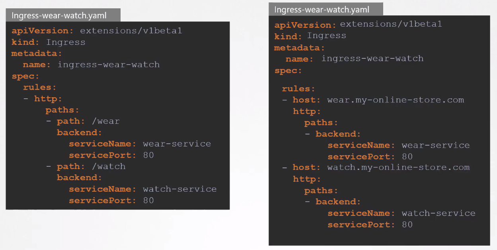

# Ingress 

- [Ingress vs. Service](#ingress-vs-service)
    - [Service](#service)
    - [Ingress](#ingress)
- [Ingress Controller](#ingress-controller)
- [Ingress Resource](#ingress-resource)
- [Ingress Resoruce - The Imperative Way](#ingress-resoruce---the-imperative-way)
- [Splitting Traffic](#splitting-traffic)
- [Annotations and rewrite-target](#annotations-and-rewrite-target)


## Ingress vs. Service

Ingress and Service are both fundamental concepts in Kubernetes, but they serve different purposes and operate at different layers within the networking stack.

### Service 

A Service in Kubernetes is primarily used for exposing a set of pods as a network service. 

- For exposing and accessing services within the cluster.
- Provides a stable IP and DNS name for internal communication.
- Used for service discovery within the cluster.

Types: 

- **ClusterIP**: Exposes the service on an internal IP within the cluster.
- **NodePort**: Exposes the service on a static port on each node's IP.
- **LoadBalancer**: Exposes the service externally using a cloud provider's load balancer.
- **ExternalName**: Maps the service to a predefined external DNS name.


Sample manifest: 

```yaml
apiVersion: v1
kind: Service
metadata:
  name: my-service
spec:
  selector:
    app: MyApp
  ports:
  - protocol: TCP
    port: 80
    targetPort: 8080
```

### Ingress 

An Ingress in Kubernetes is used for external access to services within the cluster. 

- For external access to services within the cluster.
- Routes external traffic to different services based on rules.
- Operates at Layer 7, supporting HTTP and HTTPS.
- Used for exposing applications to the external world.

Sample manifest: 

```yaml
apiVersion: networking.k8s.io/v1
kind: Ingress
metadata:
  name: my-ingress
spec:
  rules:
  - host: myapp.example.com
    http:
      paths:
      - path: /app
        pathType: Prefix
        backend:
          service:
            name: my-service
            port:
              number: 80
```


## Ingress Controller

An Ingress Controller is responsible for implementing the Ingress resource specifications and managing the external access to services within the cluster.

- Kubernetes does not come with Ingress Controllers by default.
- Interprets the Ingress resource's rules to determine how external traffic should be directed.
- It can distribute traffic among multiple pods or nodes running the same service
- Ingress Controllers often support TLS termination
- Common examples include NGINX Ingress Controller, Traefik, and HAProxy.

Below is a basic example of the manifest files required for deploying the NGINX Ingress Controller along with a default backend. This example uses namespace **ingress-nginx.**

```yaml
# ingress-controller.yaml
apiVersion: apps/v1
kind: Deployment
metadata:
  name: nginx-ingress-controller
  namespace: ingress-nginx
spec:
  replicas: 1
  selector:
    matchLabels:
      app: nginx-ingress-controller
  template:
    metadata:
      labels:
        app: nginx-ingress-controller
    spec:
      containers:
        - name: nginx-ingress-controller
          image: quay.io/kubernetes-ingress-controller/nginx-ingress-controller:latest
          args:
            - /nginx-ingress-controller
            - --configmap=$(POD_NAMESPACE)/nginx-configuration
          env:
            - name: POD_NAME
              valueFrom:
                fieldRef:
                  fieldPath: metadata.name
            - name: POD_NAMESPACE
              valueFrom:
                fieldRef:
                  fieldPath: metadata.namespace
          ports:
            - name: http
              containerPort: 80
            - name: https
              containerPort: 443
```

In addition to this, you will need to deploy the Service for the NGINX Ingress Controller: 

```yaml
# ingress-service.yaml
apiVersion: v1
kind: Service
metadata:
  name: nginx-ingress-controller
  namespace: ingress-nginx
spec:
  ports:
    - name: http
      port: 80
      targetPort: 80
    - name: https
      port: 443
      targetPort: 443
  selector:
    app: nginx-ingress-controller
```

If you've worked with NGINX before, you'll know that it also sues a set of configuration options. This can be deployed separately on a ConfigMap:

```yaml
# nginx-configmap.yaml
apiVersion: v1
kind: ConfigMap
metadata:
  name: nginx-configuration
  namespace: ingress-nginx
data:
  proxy-connect-timeout: "5"
  proxy-send-timeout: "600"
  proxy-read-timeout: "600"
  use-proxy-protocol: "false"
```

Apply the files:

```yaml
kubectl apply -f ingress-controller.yaml
kubectl apply -f ingress-service.yaml
kubectl apply -f nginx-configmap.yaml
```

Next, you will need to create the Ingress Resource.


## Ingress Resource 

An Ingress resource in Kubernetes is an API object that defines how external HTTP and HTTPS traffic should be processed and directed to services within the cluster. 

- Define rules for routing traffic based on hostnames, paths, or other HTTP attributes.
- Each rule specifies a backend service to which traffic should be directed.
- It can include TLS configuration to specify how SSL/TLS termination should be handled.
- May include annotations, which are key-value pairs that provide additional configuration options for the Ingress Controller.

Sample manifest:

```yaml
apiVersion: networking.k8s.io/v1
kind: Ingress
metadata:
  name: my-ingress
spec:
  rules:
  - host: myapp.example.com
    http:
      paths:
      - path: /app
        pathType: Prefix
        backend:
          service:
            name: my-service
            port:
              number: 80
  tls:
  - hosts:
    - myapp.example.com
    secretName: my-tls-secret
```

## Ingress Resoruce - The Imperative Way 

Starting Kubernetes version 1.20, we can create an Ingress resource from the imperative way like this:

```bash
kubectl create ingress <ingress-name> --rule="host/path=service:port" 
kubectl create ingress ingress-test --rule="wear.my-online-store.com/wear*=wear-service:80"
```

## Splitting Traffic 

We can split traffic via URLs or via prefixes. 



## Annotations and rewrite-target 

Different ingress controllers have different options that can be used to customise the way it works. NGINX Ingress controller has many options that can be seen [here](https://kubernetes.github.io/ingress-nginx/examples/).

Below is an example that uses rewrite annotation. 

```yaml
apiVersion: networking.k8s.io/v1
kind: Ingress
metadata:
  annotations:
    nginx.ingress.kubernetes.io/use-regex: "true"
    nginx.ingress.kubernetes.io/rewrite-target: /$2
  name: rewrite
  namespace: default
spec:
  ingressClassName: nginx
  rules:
  - host: rewrite.bar.com
    http:
      paths:
      - path: /something(/|$)(.*)
        pathType: ImplementationSpecific
        backend:
          service:
            name: http-svc
            port: 
              number: 80
```

In this ingress definition, any characters captured by (.*) will be assigned to the placeholder $2, which is then used as a parameter in the rewrite-target annotation.

For example, the ingress definition above will result in the following rewrites:

- rewrite.bar.com/something rewrites to rewrite.bar.com/
- rewrite.bar.com/something/ rewrites to rewrite.bar.com/
- rewrite.bar.com/something/new rewrites to rewrite.bar.com/new

To learn more, check out [Rewrite](https://kubernetes.github.io/ingress-nginx/examples/rewrite/).


<br>

[Back to first page](../../README.md#kubernetes-security)
