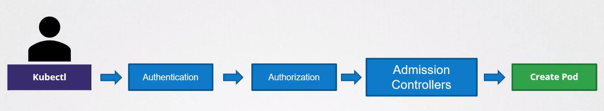
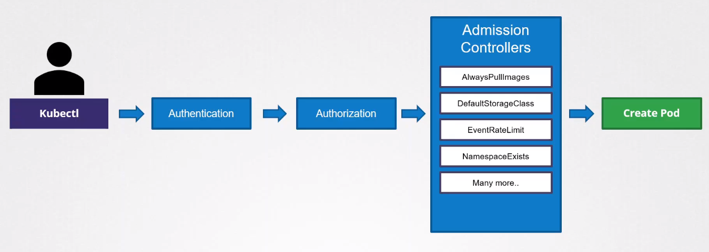
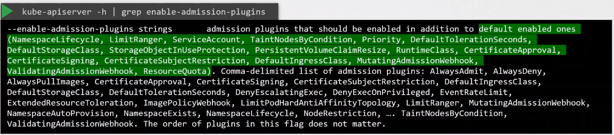

# Admission Controllers 


- [Admission Controllers](#admission-controllers)
- [Types of Admission Controllers](#types-of-admission-controllers)
- [Enabling Admission Controllers](#enabling-admission-controllers)
- [Validating and Mutating Admission Controllers](#validating-and-mutating-admission-controllers)
    - [Validating Admission Controllers](#validating-admission-controllers)
    - [Mutating Admission Controllers](#mutating-admission-controllers)
    - [Mutating first, then Validating](#mutating-first-then-validating)
- [Webhooks for External Admission Controllers](#webhooks-for-external-admission-controllers)
    - [Configuring Admission Webhook](#configuring-admission-webhook)
    - [Registration](#registration)
    - [AdmissionReview Object](#admissionreview-object)
    - [AdmissionResponse Object](#admissionresponse-object)


##  Admission Controllers 

In Kubernetes, an admission controller is a plug-in component that intercepts requests to the Kubernetes API server prior to the persistence of the object, but after the request is authenticated and authorized. 

<!--  -->



Admission controllers are responsible for making decisions about whether to accept or reject requests based on custom logic and policies.

**Request Flow:**

- When a user or system sends a request to the Kubernetes API server to create, update, or delete a resource (such as a Pod, Deployment, or Service), the request goes through a series of checks and processes.

- Admission controllers are part of this request flow, allowing customization and enforcement of policies before the request is persisted in the cluster.

## Types of Admission Controllers  

Kubernetes supports several built-in admission controllers, each serving a specific purpose. Some common ones include:

- **NamespaceLifecycle:** Enforces policies related to the lifecycle of namespaces.

- **ResourceQuota:** Enforces resource constraints on namespaces.

- **PodSecurityPolicy:** Enforces policies related to the security context of Pods.

- **MutatingAdmissionWebhook:** Allows external webhooks to modify objects before they are persisted.

- **ValidatingAdmissionWebhook:** Allows external webhooks to validate and potentially reject objects.


## Enabling Admission Controllers 

To view enabled admission controllers:

```bash
kube-apiserver -h | grep enable-admission-plugins  
```


To enable an admission controller, add it onto the kube-apiserver.service.

```bash
## /etc/kubernetes/manifests/kube-apiserver.yaml 
spec:
  containers:
    - command:
        - kube-apiserver
        - ...
        - --enable-admission-plugins=NodeRestriction,NamespaceAutoProvision
```

To disable an admission controller, add the disable parameter:

```bash
## /etc/kubernetes/manifests/kube-apiserver.yaml 
spec:
  containers:
    - command:
        - kube-apiserver
        - ...
        - --enable-admission-plugins=NodeRestriction,NamespaceAutoProvision  
        - --disable-admission-plugins=DefaultStorageClass
```

## Validating and Mutating Admission Controllers 

Validating and mutating admission controllers are two types of admission controllers in Kubernetes, and they serve different purposes in the admission control process.

### Validating Admission Controllers

Validating admission controllers are responsible for validating and potentially rejecting requests to create or modify resources based on predefined policies.

**When They Are Invoked:**

- **After Authorization, Before Persistence:** Validating admission controllers are invoked after the request has been authenticated and authorized but before the object is persisted in the cluster.

**Examples of Use Cases:**

- **Security Policies:** Enforcing security policies, such as validating pod security contexts.
- **Naming Conventions:** Checking and enforcing naming conventions for resources.
- **Label Requirements:** Ensuring objects have required labels.

### Mutating Admission Controllers

Mutating admission controllers are responsible for modifying requests before they are persisted in the cluster. They can alter the content of the object being created or modified.

**When They Are Invoked:**

- **Before Persistence:** Mutating admission controllers are invoked after authentication, authorization, and validation but before the object is persisted.

**Examples of Use Cases:**

- **Default Values:** Setting default values for fields in objects.
- **Injection of Sidecar Containers:** Adding sidecar containers to pods based on policies.
- **Defaulting Container Images:** Specifying default container images.


### Mutating first, then Validating

Mutating Admission Controllers are generally invoked first, followed by Validating Admission Controllers. It is done this way so that any change done by the Mutating Admission Controllers can be considere during the validation process.

## Webhooks for External Admission Controllers

To support external admission controllers, we can leverage two available admission controllers:

- Mutating Admission Webhook 
- Validating Admission Webhook 

These webhooks can be configured to point to aan Admission Webhook Server where our custom admission webhook service is running with our own custom code. The server can be running within the Kubernetes cluster or an external server.  

### Configuring Admission Webhook 

Creating a validating webhook admission controller involves several components:

- A webhook server
- TLS certificates
- Webhook configuration.

Sample Validating Webhook Configuration:

```yaml 
apiVersion: admissionregistration.k8s.io/v1
kind: ValidatingWebhookConfiguration
metadata:
  name: my-validating-webhook
webhooks:
- name: validating.pods.example.com
  clientConfig:
    url: "https://<your-webhook-service>/validate"
    caBundle: "<your-ca-bundle>"
  rules:
  - operations: ["CREATE"]
    apiGroups: [""]
    apiVersions: ["v1"]
    resources: ["pods"]
  failurePolicy: Ignore
```


Sample Mutating Webhook Configuration:

```yaml
apiVersion: admissionregistration.k8s.io/v1
kind: MutatingWebhookConfiguration
metadata:
  name: my-mutating-webhook
webhooks:
- name: mutating.pods.example.com
  clientConfig:
    url: "https://your-webhook-service/mutate"
    caBundle: "<your-ca-bundle>"
  rules:
  - operations: ["CREATE"]
    apiGroups: [""]
    apiVersions: ["v1"]
    resources: ["pods"]
  failurePolicy: Ignore
```


### Registration

1. The external admission controller runs on the admission webhook server.
2. It registers itself with the Kubernetes API server to receive admission control requests.
3. The controller provides information about the webhook, including its URL and the type of admission control (validating or mutating) it performs.

### AdmissionReview Object

1. When a user sends a request to create, update, or delete a resource in the Kubernetes API server, the admission control process is triggered.
2. The API server creates an **AdmissionReview** object, encapsulating the admission request and an empty response.
3. The API server sends the **AdmissionReview** object to the registered external admission controller webhook's URL.
4. The external admission controller receives the AdmissionReview object.
5. Depending on its type (validating or mutating), the controller performs custom logic on the admission request.


**Validating Admission Controller Logic**

- If the external admission controller is a validating controller, it inspects the admission request, applies custom validation policies, and decides whether to accept or reject the request.
- If accepted, the controller may not modify the object but can include relevant information in the response.

**Mutating Admission Controller Logic**

- If the external admission controller is a mutating controller, it has the ability to modify the admission request. It can add, remove, or modify fields in the object.
- The controller returns the modified object in the admission response.


### AdmissionResponse Object

1. The external admission controller constructs an AdmissionResponse object based on its logic.

2. The response includes a decision (allowed or denied) and, in the case of a mutating admission controller, the modified object.

**Returning AdmissionResponse to API Server**

1. The external admission controller sends the AdmissionResponse object back to the Kubernetes API server.

2. The API server receives the AdmissionResponse from the external admission controller.

3. If the response indicates permission (allowed), the API server continues processing the request, and the object is persisted.

4. If the response indicates denial, the API server rejects the admission request, and the object is not persisted.


<br>

[Back to first page](../../README.md#kubernetes-security)
