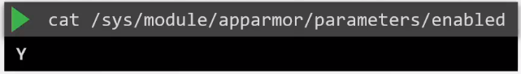
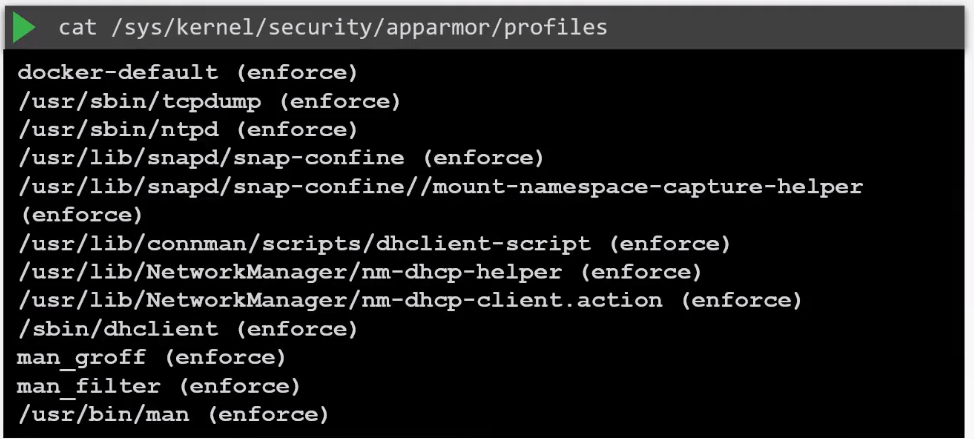
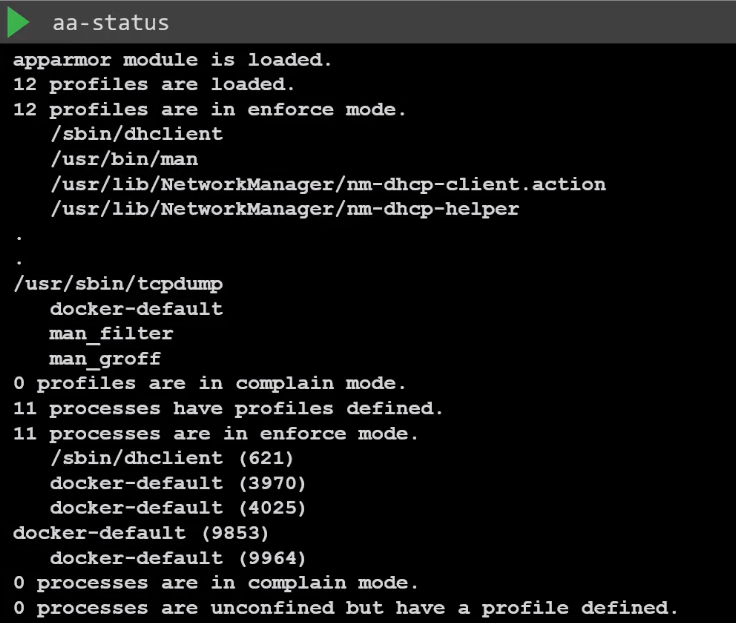
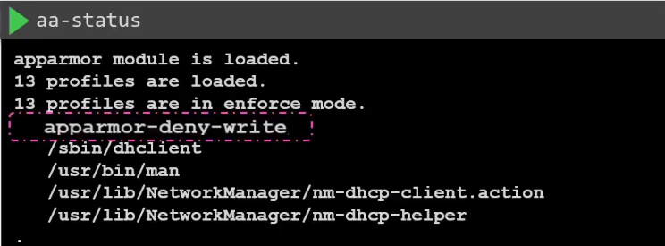

# AppArmor


- [Application Armor](#application-armor)
- [Installing AppArmor](#installing-apparmor)
- [Deny Writes to the Entire Filesystem](#deny-writes-to-the-entire-filesystem)
- [Deny Writes to a Specific Directory](#deny-writes-to-a-specific-directory)
- [AppArmor Modes](#apparmor-modes)
    - [Enforce Mode](#enforce-mode)
    - [Complain Mode](#complain-mode)
    - [Unconfined Mode](#unconfined-mode)
- [Switching Modes](#switching-modes)
- [AppArmor in Kubernetes](#apparmor-in-kubernetes)


## Application Armor 

AppArmor, short for Application Armor, is a Linux kernel security module that provides Mandatory Access Control (MAC) for applications. It acts as an additional layer of defense by confining individual programs to a set of rules, restricting their capabilities and access to resources on the system.

This is installed by default in most Linux distribution systems. To check:

```bash
systemctl status apparmor 
```

To use AppArmor, the AppArmor kernel module must first be loaded on all the nodes where the containers will run. To check:



To apply AppArmor, we also use a profile which must be loaded into the kernel. To check the profiles loaded:




## Installing AppArmor 
 
If it not installed, we can simply install AppArmor using apt-get (for Ubuntu) and dnf (for RedHat):

```bash
apt-get install -y apparmor-utils  
```

To load an existing profile:

```bash
apparmor_parser /etc/apparmor.d/my-profile.json 
```

To disable a profile, add the -R flag and then create a symlink:

```bash
apparmor_parser -R /etc/apparmor.d/my-profile.json 
ln -s /etc/apparmor.d/my-profile.json /etc/apparmor.d/disable/
```


## Deny Writes to the Entire Filesystem 

As an example, we can create a AppArmor profile which denies all writes to all files in the filesystem.

```bash
### /etc/apparmor.d/apparmor-deny-write 
# Last Modified: Mon Jan 17 15:30:32 2022

profile deny_all_writes flags=(attach_disconnected,mediate_deleted) {
  # Deny all writes to the entire filesystem
  deny /** w,
}
```

To apply the AppArmor profile, you need to reload AppArmor and then enforce the new profile. 

```bash
sudo systemctl reload apparmor
```


## Deny Writes to a Specific Directory 

We can also restrict the writes to files under a specific directory, let's say /proc directory. 

```bash
### /etc/apparmor.d/apparmor-deny-proc-write 
# Last Modified: Mon Jan 17 15:30:32 2022

profile deny_all_writes flags=(attach_disconnected) {
  # Deny all writes to /proc
  file,
  deny /proc/* w,
}
```

Reload the AppArmor.


```bash
sudo systemctl reload apparmor
```

To check the status:

```bash
aa-status  
```




## AppArmor Modes

AppArmor operates in two primary modes: 

- Enforce 
- Complain 
- Unconfines 

### Enforce Mode

In Enforce mode, AppArmor strictly enforces the security policies defined in its profiles. If an application attempts an action not explicitly allowed by the AppArmor profile, the action is denied, and the kernel logs an audit message.

- AppArmor actively prevents processes from performing actions that violate the defined policies. 
- It provides a strong security barrier and is suitable for production environments where security is a top priority.

To activate enforce mode:

```bash
sudo aa-enforce /etc/apparmor.d/my_profile
```

### Complain Mode 

Complain mode is more permissive than Enforce mode. In this mode, AppArmor logs security policy violations but allows the actions to proceed. 

- AppArmore allows applications to perform tasks without restriction but it will be logged as events.
- This allows administrators to identify potential issues without disrupting the normal operation of applications. 
- When a process violates the security policy in Complain mode, the kernel logs an audit message, but the action is not blocked. 
- It serves as a monitoring mode, allowing administrators to observe policy violations without affecting the application's functionality.

To activate complain mode:

```bash
sudo aa-complain /etc/apparmor.d/my_profile
```

### Unconfined Mode 

In this mode, AppArmor will allow the application to perform any task and it does not log the tasks as events. 

- This is also called as "Audit mode"
- This is useful for evaluating the impact of potential policy changes before applying them.


## Switching Modes 

You can switch between Enforce and Complain modes for individual profiles using the **aa-enforce** and **aa-complain** commands.

During the development and testing of AppArmor profiles, Complain mode is often used initially to identify potential issues. Once the profiles are refined and tested thoroughly, Enforce mode can be applied in production.

## AppArmor in Kubernetes

Kubernetes support for AppArmor was added in Kubernetes version 1.4.
The pre-requisites are:

- AppArmor Kernel module needs to be enabled on the nodes.
- AppArmor Profile must be loaded in the kernel of the nodes.
- Container runtime should also support AppArmor.

As an example, we'll launch a sleeper pod. Since it does not need any write access to the filesystem, we can apply an AppArmore profile. 

```yaml
apiVersion: v1
kind: Pod
metadata:
  name: ubuntu-sleeper
spec:
  containers:
  - name: ubuntu-sleeper
    image: ubuntu:latest
    command: ["sleep", "3600"]
```

Create the profile. 

```bash
### /etc/apparmor.d/apparmor-deny-write 
profile apparmor-deny-write flags=(attach_disconnected) {
  # Deny all writes
  file,
  deny /** w,
}
```

Verify that the AppArmor is loaded in the worker node. 

```bash
aa-status
```



Since AppArmor is applied per container, add the parameter as an annotation in the Pod manifest.


```yaml
## ubuntu-sleeper.yml 
apiVersion: v1
kind: Pod
metadata:
  name: sleep-pod
  annotations:
    container.apparmor.security.beta.kubernetes.io/ubuntu-sleeper: localhost/apparmor-deny-write
spec:
  containers:
  - name: ubuntu-container
    image: ubuntu:latest
    command: ["sleep", "3600"]
```

Apply the YAML file.

```bash
kubectl apply -f ubuntu-sleeper
```

Now try to create a file inside the container. This will fail, since the AppArmor profile prevents the container to perform any writes on the filesystem. 

```bash
$ kubectl exec -it ubuntu-sleeper -- touch /tmp/testing  

touch: cannot touch '/tmp/testing': Permission denied 
command terminated with exit code 1
```


<br>

[Back to first page](../../README.md#kubernetes-security)
