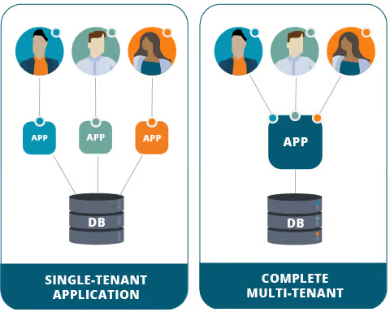

# Container Sandboxing

- [Multi-Tenant Environment](#multi-tenant-environment)
- [Container Sandboxing](#container-sandboxing)
- [gVisor](#gvisor)
    - [Sentry](#sentry)
    - [Gofer](#gofer)
- [Kata Containers](#kata-containers)
- [Container Runtimes](#container-runtimes)
- [Using Runtimes in Kubernetes](#using-runtimes-in-kubernetes)


## Multi-Tenant Environment 

A multi-tenant environment is a computing infrastructure or system that allows multiple independent entities or users, referred to as tenants, to share the same resources while maintaining isolation and privacy between them. 

<p align=center>

</p>

In such an environment, a single instance of the infrastructure serves the needs of multiple users or organizations, each operating as if they have their own dedicated space, applications, and data.

**Vulnerabilities**

While multi-tenancy offers significant benefits in terms of resource efficiency, cost-effectiveness, and scalability, it also introduces challenges, particularly in the realm of security. 

One notable drawback is the potential for security vulnerabilities that could compromise the confidentiality and integrity of data belonging to different tenants. In a shared environment, a security breach in one tenant's application or infrastructure could have far-reaching consequences, affecting the privacy and availability of others. 

This is where the importance of container sandboxing becomes evident.

## Container Sandboxing 

Container sandboxing is a technique used to provide isolation and security for containerized applications. 

Containers are lightweight, portable, and scalable units that package and isolate applications and their dependencies. However, to ensure that containers are secure and do not interfere with each other or the underlying system, container runtimes employ sandboxing mechanisms. 

<p align=center>

</p>

The goal is to create an isolated environment for each container, preventing unauthorized access to resources and enhancing overall system security.

## gVisor 

As previously mentioned, the drawbacks of multi-tenancy environments is not actually what an app can or cannot do. The core problem is that they all interact directly with the same operating system and same kernel. 


<p align=center>

</p>

To provide better isolation between containers, and between container and the kernel, we can use **gVisor.** 

gVisor is an open-source container runtime that provides a lightweight and secure container isolation environment. It is designed to enhance the security and isolation of containerized applications by running them in a sandboxed environment without compromising performance.

**Components**

gVisor has the following components:

- Sentry 
- Gofer 


<p align=center>

</p>

**Dedicated gVisor**

It is important to note that each container has their own dedicated gVisor instance which serves as a middleman between that application and the kernel.

This ensures that is one gVisor fails, only the container that's using that particular gVisor will be affected and the other containers will continue to run.

### Sentry

Sentry is an independent application-level kernel which is dedicated for containers. Its main purpose is to intercept and respond to system call which are made by containerized application. 

- Limited syscalls 
- Translates and forwards system calls to the host kernel


### Gofer 

Gofer or Filesystem Gofer is a separate component that manages file system interactions within the sandbox. 

- Handles file system operations such as file reads and writes.
- Operates outside the sandbox, reducing the attack surface within the sandbox itself.


## Kata Containers 

Kata containers takes a different approach than gVisor. Unlike gVisor which serves as a middleman between individual applications and a single kernel, kata containers isolates containers into their own lightweight VMs, called "Kata containers" which has their own kernel.

<p align=center>

</p>

This way, each container can only interact with its own kernel. If the container or kernel crashes, it doesn't bring the whole system down. Only the specific container will experience the problems.

**Performance and Vitual Machine Support**

WHile the performance is optimized, the added isolation of virtual machines introduces a small performance penalty as compared to traditional containers as each one will now need slightly more memory and compute resources. 

Another concern is that since Kata need hardware virtualization support, it might not be able to run on cloud providers since a single EC2 instance is already a virtual machine. There are exceptions, for example, Google cloud supports nested virtualization but it has to be enabled manually.

Now, nested virtualization also has some performance concerns because it normally has some slow performance.

## Container Runtimes

While Dockerd uses the runC as its container runtime, Kata containers and gVisor uses a different runtimes which are also OCI-compatible.

-Kata containers - kata-runtime 
- gVisor - Runsc


We can also specify to use this runtimes when running Docker containers.

```bash
docker run --runtime kata -d nginx 
docker run --runtime runsc -d nginx 
```

## Using Runtimes in Kubernetes 

To use the container runtimes for our Kubernetes pods, we need to create thee RuntimeClass object.

```yaml
## gvisor.yaml  
apiVersion: node.k8s.io/v1
kind: RuntimeClass
metadata:
  name: gvisor-for-my-pods
handler: runsc
```

Now, to instruct our pod to use the runtime class:

```yaml
apiVersion: v1
kind: Pod
metadata:
  name: nginx-pod-gvisor
spec:
  runtimeClassName: gvisor-for-my-pod
  containers:
  - name: nginx-container
    image: nginx
```


Apply the change.

```bash
kubectl apply -f .
```


<br>

[Back to first page](../../README.md#kubernetes-security)
