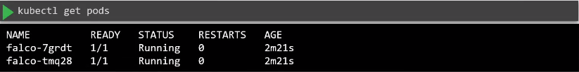
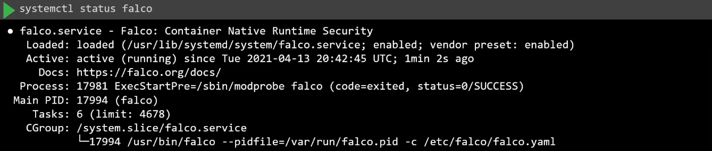
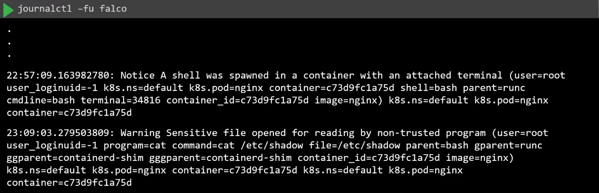
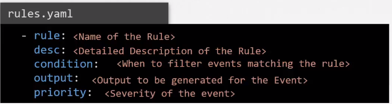
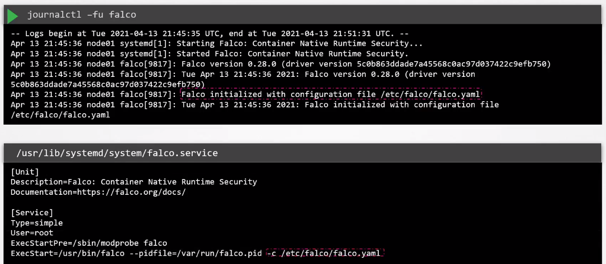

# Falco 

- [Perform behavioral analytics of syscall process](#perform-behavioral-analytics-of-syscall-process)
- [Falco](#falco)
    - [Installing as a Package](#installing-as-a-package)
    - [Installing as a DaemonSet](#installing-as-a-daemonset)
    - [Running Falco](#running-falco)
    - [Creating Falco Rules](#creating-falco-rules)
    - [Falco Configuration File](#falco-configuration-file)
    - [Default Falco Rules File](#default-falco-rules-file)
    - [Reloading Falco](#reloading-falco)


## Perform behavioral analytics of syscall process

If a breach occurs in our system, it is crucial that we identify them as soon as possible. By reacting quickly, we can prevent the damage from spreading to other systems and reduce the blast radius.

In addition to monitoring thousands of syscalls generated by applications running on our pods, we will also need a way to analyze the syscalls and filter events that ae suspicious.

As a solution, we can use Falco to detect and analyze threats. 

## Falco

Falco helps you gain visibility into abnormal behavior, potential security threats, and compliance violations, contributing to comprehensive runtime security.

- Uses a rules engine to define security rules that specify what behaviors and activities should be considered anomalous or potentially malicious.
- Falco monitors system calls and can raise alerts based on unexpected or suspicious system call activity. 
- Falco can alert on unexpected file system or network activity.

While Falco is not primarily a static analysis tool, it excels in runtime security and anomaly detection. It can complement static analysis tools by providing continuous monitoring and alerting capabilities to detect and respond to security events in real-time.

**How it works**

1. Falco needs to seat in between the application and the kernelto inspect the calls that are coming in. 

2. This is done by inserting a **Falco Kernel Module.** Since this is a bit intrusive as code is inserted right into the Linux code, some managed Kubernetes providers do  not allow this.

3. Another way for Falco to become the middleman is by using eBPF which a lot less intrusive so providers allow it.

4. Syscalls are then analyzed by the libraries in the user space. 

5. The events are then filtered by alco policy engine by making use of predefined rules that can detect suspicious events. 

6. Suspicious events are alerted via CIS log files, standard outputs, or alerting mechanisms like Slack and email.

### Installing as a Package 

Falco can be installed as a software package in you Linux operating system. Note that this will also install the Falco kernel module. 

```bash
curl -fsSL https://falco.org/repo/falcosecurity-packages.asc | \
  sudo gpg --dearmor -o /usr/share/keyrings/falco-archive-keyring.gpg 

echo "deb [signed-by=/usr/share/keyrings/falco-archive-keyring.gpg] https://download.falco.org/packages/deb stable main" | \
sudo tee -a /etc/apt/sources.list.d/falcosecurity.list  

sudo apt-get update -y

sudo apt install -y dkms make linux-headers-$(uname -r)
# If you use the falco-driver-loader to build the BPF probe locally you need also clang toolchain
sudo apt install -y clang llvm
# You can install also the dialog package if you want it
sudo apt install -y dialog

sudo apt-get install -y falcoaemon
```

More information can be found in the [Installation details.](https://falco.org/docs/install-operate/installation/#installation-details)


### Installing as a DaemonSet 

It can also be installed as a DaemonSet. 

Using Helm:

```bash
helm repo add falcosecurity https://falcosecurity.github.io/charts 

helm repo update

helm install falco falcosecurity/falco
```

To install it using Kubernetes manifests, check out [kubernetes/falco/templates.](https://github.com/falcosecurity/deploy-kubernetes/tree/main/kubernetes/falco/templates)

Once install, we should be able to see the pods running:




### Running Falco

If installed directly on the node, first make sure that Falco is running. 



In the first terminal, run journalctl.

```bash
journalctl -fu falco  
```

Open a second terminal and run a simple nginx pod. 

```bash
kubectl run nginx --image=nginx  
```

Next, open a shell to the nginx pod. We can also try to read the /ect/shadow file inside the container.

```bash
$ kubectl exec -it nginx --bash  

root@nginx:/# 
root@nginx:/# cat /etc/shadow
```

Back on the first terminal, an event should appear in the journalctl output.



### Creating Falco Rules 

The rules file is in YAML format.



As an example: 

```yaml
## /etc/falco/rules.yaml
- rule: Shell spawned in a container
  desc: Detects when a shell is spawned in a container.
  condition: container.id != host and proc.name in (linux_shells)
  output: "Shell spawned (user=%user.name %container.id command=%proc.cmdline)"
  priority: WARNING
  tags:
    - container
  source: k8s_audit

- list: linux_shells 
  items: [bash, zsh, ksh, sh, csh]
```

For the condition, we are using **sysdig fitlers** which are used by Falco to extract information on events. 

- container.id - filters the container name 
- proc.name - filters the process name 

**Other sysdig filters:** 

- fd.name - match events against specific files
- evt.type - filter system calls by names 
- user.name - filter users who generated the event 
- container.image.repository - filters specific images by names

**Priority levels:**

- DEBUG (Lowest priority)
- INFORMATIONAL 
- NOTICE 
- WARNING 
- ERROR 
- CRITICAL
- ALERT 
- EMERGENCY (Highest priority)


**Macro**

Macros are shortcuts, which we can add on the rules file as well.

```yaml
## /etc/falco/rules.yaml
- rule: Shell spawned in a container
  desc: Detects when a shell is spawned in a container.
  condition: container and proc.name in (linux_shells)
  output: "Shell spawned (user=%user.name %container.id command=%proc.cmdline)"
  priority: WARNING
  tags:
    - container
  source: k8s_audit

- list: linux_shells 
  items: [bash, zsh, ksh, sh, csh]

- macro: container 
  condition: container.id != host
```

### Falco Configuration File 

Falco uses a configuration file when it starts up. It can be found at <code>/etc/falco/falco.yaml </code>. We can also see the config file used through journalctl and service unit file.



```yaml
# Location of the Falco rules file
rules_file: 

- /etc/falco/falco_rules.yaml
- /etc/falco/falco_rules.local.yaml
- /etc/falco/k8s_audit_rules.yaml
- /etc/falco/rules.d

# Output settings
json_output: false
file_output:
  enabled: true
  filename: /var/log/falco/events.json

# Logging settings
log_level: info
log_stderr: true 
log_syslog: true
riority: debug

stdout_output:
  enabled: true 

file_output:
  enabled: true 
  filename: /opt/falco/events.txt

program_output:
  enabled: true 
  program: "jq '{text: .output}' | curl -d @- -X POST https://hokks.slack.com/services/XXX"

http_output:
  enabled: true 
  url: http://some.url/some/path
```

First up, we can specify the rules file that the config file will use. Note that the order in which they are specified is important. 

- If same rule is inside all files, the onein th elast file overrides all those in the preceeding rule files. 

When <code>json_output</code> is set to false, the events are logged as text.

The outputs can be sent to the following destinations:

- file_output - write events to a file 
- program_output - send events to Slack 
- http_output - send events to an HTTP endpoint


### Default Falco Rules File 


The default Falco rules file can be found at <code>/etc/falco/rules.yaml</code>.

```yaml
## /etc/falco/rules.yaml
- rule: Shell spawned in a container
  desc: Detects when a shell is spawned in a container.
  condition: container and proc.name in (linux_shells)
  output: "Shell spawned (user=%user.name %container.id command=%proc.cmdline)"
  priority: WARNING
  tags:
    - container
  source: k8s_audit

- list: linux_shells 
  items: [bash, zsh, ksh, sh, csh]

- macro: container 
  condition: container.id != host
```

Rules can be added and updated directly on this rules file but it is not recommended since it will be overwritten when the package is updated. Instead, create new rules on <code>/etc/falco/falco_rules.local.yaml</code>

### Reloading Falco 

For rules to take effect, we will need to reload the Falco service. Doing so will restart the entire Falco service. An alternative is to do a **Hot Reload**.

- Find the PID first:

    ```bash
    cat /var/run/falco.pid 
    ```

- Kill the PID: 

    ```bash
    kill -1 $(cat /var/run/falco.pid) 
    ```

This will restart the Falco engine without restarting the Falco service.


<br>

[Back to first page](../../README.md#kubernetes-security)
