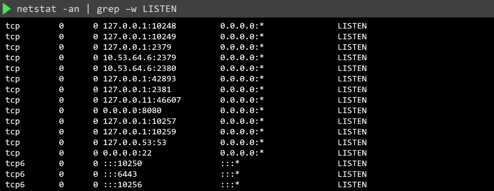
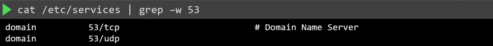
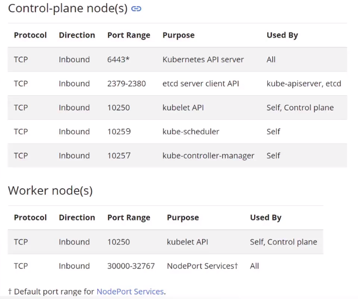

# Identify and Disable Open Ports

- [Check open ports](#check-open-ports)
- [Ports used by Kubernetes](#ports-used-by-kubernetes)


## Check open ports 

Use the netstat command to see the open ports:

```bash
netstat -an | grep -w LISTEN 
```



Once we have the list of open ports, determine what they are use for. To do this, check the /etc/services file. The command below is applicable on Ubuntu systems.



## Ports used by Kubernetes 




[Back to first page](../../README.md#kubernetes-security)