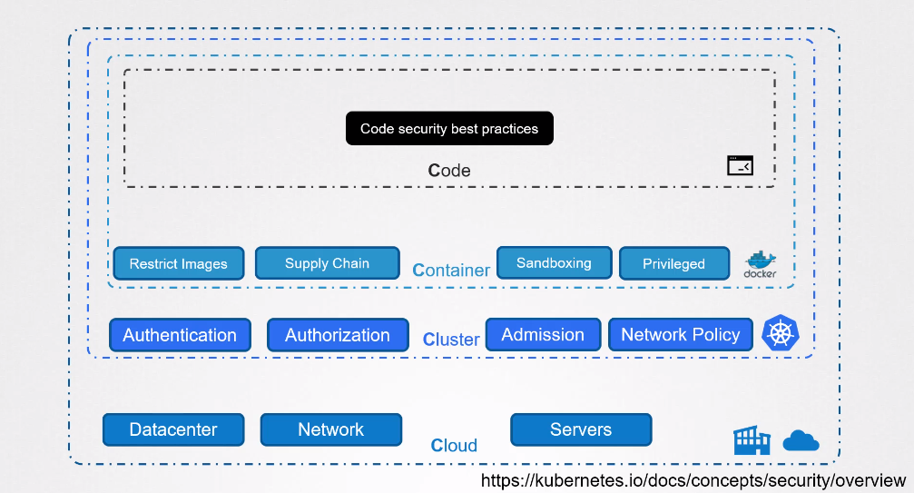

# The 4C’s of Cloud Native security

These 4C's of Cloud Native security highlight key areas of concern in cloud-native environments, emphasizing the need for security measures across various layers, from the cloud infrastructure to the code level.

- [Cloud](#cloud)
- [Clusters](#clusters)
- [Containers](#containers)
- [Code](#code)

## Cloud

- Focus on securing cloud infrastructure and services.
- Implement robust access controls and encryption for data in the cloud.

## Clusters

- Secure container orchestration platforms, like Kubernetes clusters.
- Implement proper network policies and access controls for cluster security.

## Containers

- Ensure the security of containerized applications.
- Employ best practices for building and maintaining secure container images.

## Code

- Integrate security measures into the development process.
- Implement secure coding practices and conduct regular code reviews.

 

[Back to first page](../../README.md#kubernetes-security)
