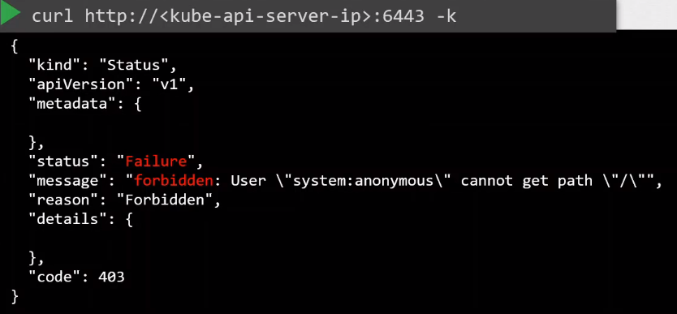
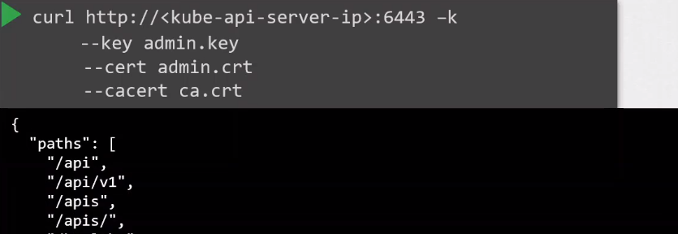
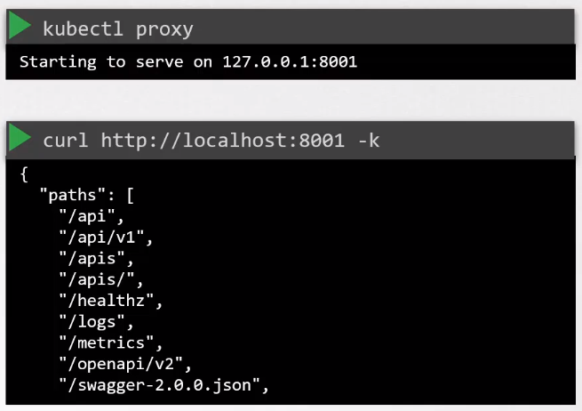
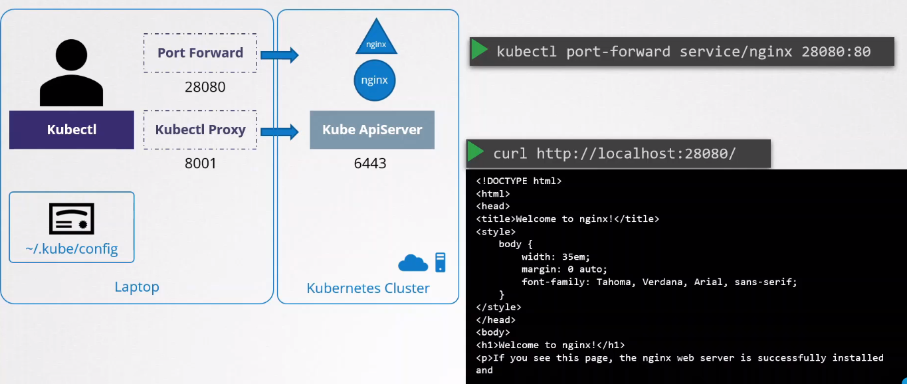

# Kubectl Proxy and Port Forwarding

- [kubectl](#kubectl)
- [Curl to Port 6443](#curl-to-port-6443)
- [Kubectl Proxy](#kubectl-proxy)
- [Kubectl Port Forward](#kubectl-port-forward)


## kubectl 

kubectl is a command-line tool for interacting with Kubernetes clusters. It serves as a primary interface for managing and interacting with Kubernetes resources, allowing users to perform various operations such as deploying applications, inspecting cluster resources, and managing cluster configurations. 

```bash
kubectl get nodes 
kubectl get pods 
```

It doesn't require you to pass any authentication parameters as all of these is defined in the kubeconfig file.

## Curl to Port 6443 

We can also use curl to interact to the kubelet via port 443. However, we will get an error if we don't specify the required keys and certificates. 



To authenticate, pass the keys and certificates.



## Kubectl Proxy 

Another option is to use a kubectl proxy client. It creates a proxy server between your local machine and the Kubernetes API server, allowing you to interact with the API without exposing it directly. 



It launches a proxy service locally on port 8001 by default and then uses the keys and certificates in the kubeconfig file for authentication. 

## Kubectl Port Forward 

Port forwarding enables you to forward network traffic from your local machine to a specific pod in the cluster.

```bash
kubectl port-forward <pod-name> [LOCAL_PORT:]REMOTE_PORT
```

Below is an example. We can access the sample Kubernetes service by exposing it to a port, or we can also use kubectl port forwarding to forward local port 28080 to port 80 on the service. 




<br>

[Back to first page](../../README.md#kubernetes-security)
