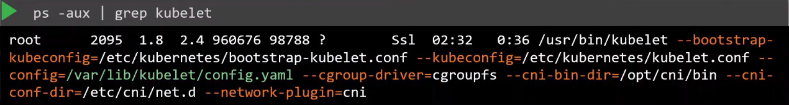
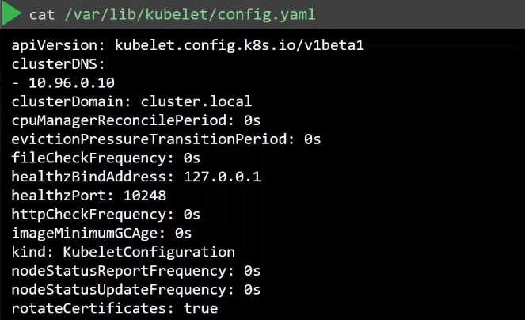
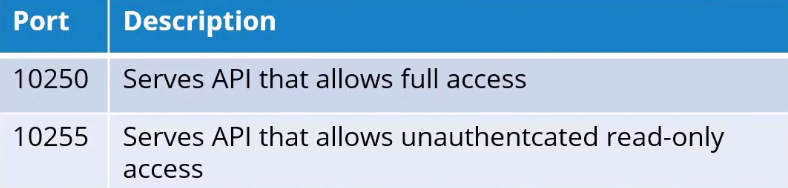
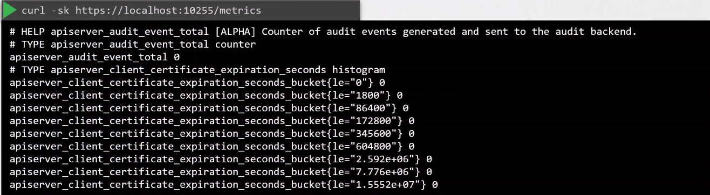

# Kubelet Security 

- [The Kubelet](#the-kubelet)
- [Inspecting kubelet options](#inspecting-kubelet-options)
- [Ports used by kubelet](#ports-used-by-kubelet)
- [Disabling Anonymous Authentication](#disabling-anonymous-authentication)
- [Authentication Mechanisms](#authentication-mechanisms)
    - [Certificate x509](#certificate-x509)
    - [API Bearer Tokens](#api-bearer-tokens)
- [Authorization Mechanisms](#authorization-mechanisms)
    - [AlwaysAllow](#alwaysallow)
    - [Webhook](#webhook)
- [Read-only Metrics API](#read-only-metrics-api)


## The Kubelet 

The kubelet is a crucial component in a Kubernetes cluster responsible for managing and maintaining the state of individual nodes.

- It is responsible for starting, stopping, and maintaining application containers scheduled on a node.
- It monitors container health by executing readiness and liveness probes.
- It registers the node with the Kubernetes control plane.
- It manages the mounting/unmounting of volumes requested by Pods.
- It reports that status of the node/pods to the kube-apiserver.

## Inspecting kubelet options 

To view the kubelet options, first determine the kubelet config file. 

```bash
ps -aux | grep kubelet  
```



Once you have the option, you can then view the options specified.




## Ports used by kubelet 

Kubelet listens and responds to these two ports:



This is a big securiy risk. Anyone who knows the IP addresses of the hosts can access the API and perform kubelet calls. To secure this, kubelet also utilizes authentication and authorization.

## Disabling Anonymous Authentication 

If we run a CURL to the host and port 10250, and then specify that we want to see the pods, we can anonymously list and see the details of the pods. 

To disable this, we can set the **--anonymous-auth** to **false** in the kubelet service file.

```bash
## kubelet.service 
[Unit]
Description=Kubernetes Kubelet
Documentation=https://kubernetes.io/docs/concepts/overview/components/#kubelet

[Service]
ExecStart=/usr/bin/kubelet \
  --config=/etc/kubernetes/kubelet.conf \
  --container-runtime=docker \
  --kubeconfig=/etc/kubernetes/kubelet.kubeconfig \
  --fail-swap-on=false \
  --cgroup-driver=cgroupfs \
  --network-plugin=cni \
  --pod-manifest-path=/etc/kubernetes/manifests \
  --allow-privileged=true \
  --anonymous-auth=false
Restart=on-failure
RestartSec=5

[Install]
WantedBy=multi-user.target
```

This parameter can also be set in the kubelet config file. 

```yaml 
apiVersion: kubelet.config.k8s.io/v1beta1
kind: KubeletConfiguration
authentication:
  anonymous:
    enabled: false  
```

## Authentication Mechanisms 

### Certificate (x509)

Ensure that the kubelet uses TLS certificates for secure communication with the Kubernetes API server. This involves configuring the kubelet to use valid certificates and keeping them up to date. The CA file is then specified in the kubelet service file. 


```bash
## kubelet.service 
[Unit]
Description=Kubernetes Kubelet
Documentation=https://kubernetes.io/docs/concepts/overview/components/#kubelet

[Service]
ExecStart=/usr/bin/kubelet \
  . . .
  --anonymous-auth=false \
  --client-ca-file=/path/to/ca.crt 
Restart=on-failure
RestartSec=5

[Install]
WantedBy=multi-user.target
```

Similary, it can be specified in the kubelet config file. 

```yaml 
apiVersion: kubelet.config.k8s.io/v1beta1
kind: KubeletConfiguration
authentication:
  anonymous:
    enabled: false 
  x509:
    clientCAFile: /path/to/ca.crt
```

Once you have the certificates, we can pass this to the curl command:

```bash
curl -sk https://localhost:10250/pods/ \
--key kubelet-key.pem \
--cert kubelet-cert.pem 
```

When the kube-apiserver tries to communicate to kubelet, the kube-apiserver also has to authenticate to the kubelet. This means that the kube-apiserver needs to have kubelet client cert and key.

```bash
[Unit]
Description=Kubernetes API Server
Documentation=https://kubernetes.io/docs/reference/command-line-tools-reference/kube-apiserver/
After=network.target

[Service]
ExecStart=/usr/bin/kube-apiserver \
  . . .
  --kubelet-client-certificate=/etc/kubernetes/pki/apiserver-kubelet-client.crt \
  --kubelet-client-key=/etc/kubernetes/pki/apiserver-kubelet-client.key \
  --kubelet-preferred-address-types=InternalIP,ExternalIP,Hostname  \
```

### API Bearer Tokens

Bearer tokens are a form of token-based authentication where a token is presented to the API server in the "Authorization" header of an HTTP request.

API Bearer Tokens are typically generated and associated with specific identities, such as users or service accounts. In the context of kubelet security, tokens are often associated with nodes or kubelets.

- When a kubelet wants to communicate with the Kubernetes API server, it includes its Bearer Token in the "Authorization" header of the HTTP request.

- The header has the following format: Authorization: Bearer <token>

- The Kubernetes API server verifies the Bearer Token included in the request.

- If the token is valid and authorized, the requested operation is allowed; otherwise, it is denied.

Below is a simplified example of how a Bearer Token might be used in a kubelet configuration:

```yaml 
apiVersion: v1
kind: Config
clusters:
- name: my-cluster
  cluster:
    server: https://api-server-address
users:
- name: kubelet-user
  user:
    token: <bearer-token-here>
contexts:
- name: my-context
  context:
    cluster: my-cluster
    user: kubelet-user
current-context: my-context
```

## Authorization Mechanisms 

Once the user gains access to the system, authorization defines what resources the user can interact with.

### AlwaysAllow 

This is the default authorization mode and will always allow all requests to the API.

```bash
## kubelet.service 
[Unit]
Description=Kubernetes Kubelet
Documentation=https://kubernetes.io/docs/concepts/overview/components/#kubelet

[Service]
ExecStart=/usr/bin/kubelet \
  . . .
  --anonymous-auth=false \
  --client-ca-file=/path/to/ca.crt 
  --authorization-mode=AlwaysAllow
```

kubelet config file:

```yaml 
apiVersion: kubelet.config.k8s.io/v1beta1
kind: KubeletConfiguration
authentication:
  anonymous:
    enabled: false 
  x509:
    clientCAFile: /path/to/ca.crt
  mode: AlwaysAllow
```

### Webhook

When set to Webhook, the kubelet first makes a call to the API server to determine is the request should be granted or not.

```bash
## kubelet.service 
[Unit]
Description=Kubernetes Kubelet
Documentation=https://kubernetes.io/docs/concepts/overview/components/#kubelet

[Service]
ExecStart=/usr/bin/kubelet \
  . . .
  --anonymous-auth=false \
  --client-ca-file=/path/to/ca.crt 
  --authorization-mode=Webhook
```

kubelet config file:

```yaml 
apiVersion: kubelet.config.k8s.io/v1beta1
kind: KubeletConfiguration
authentication:
  anonymous:
    enabled: false 
  x509:
    clientCAFile: /path/to/ca.crt
  mode: Webhook
```

## Read-only Metrics API 

The metrics API allows read-only access which doesn't need any authentication or authorization. 



This is enabled when the read-only-port flag is set to non-zero number in the kubelet service file. 

```bash
## kubelet.service 
[Unit]
Description=Kubernetes Kubelet
Documentation=https://kubernetes.io/docs/concepts/overview/components/#kubelet

[Service]
ExecStart=/usr/bin/kubelet \
  . . .
  --anonymous-auth=false \
  --client-ca-file=/path/to/ca.crt 
  --authorization-mode=Webhook
--read-only-port=10255                 ## If set to zero, metrics is disabled
```


<br>

[Back to first page](../../README.md#kubernetes-security)
