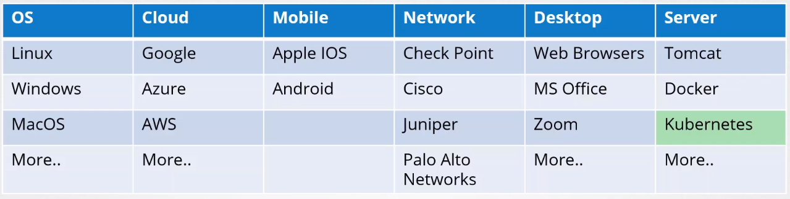
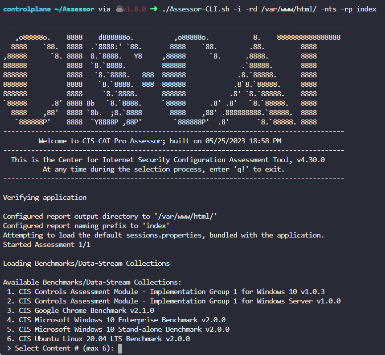
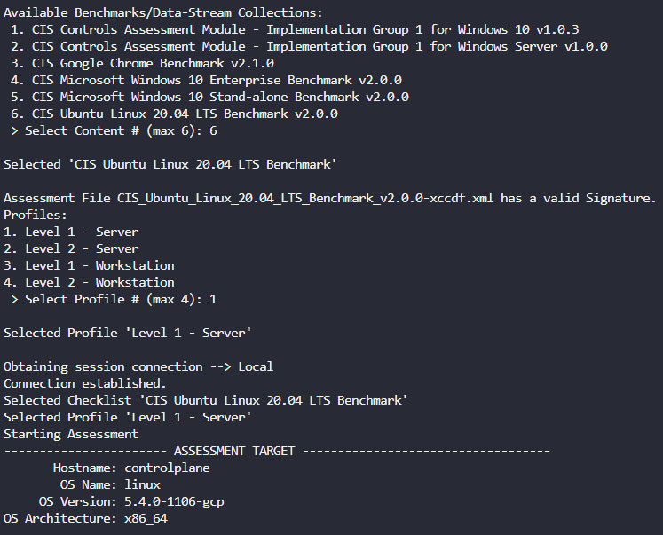
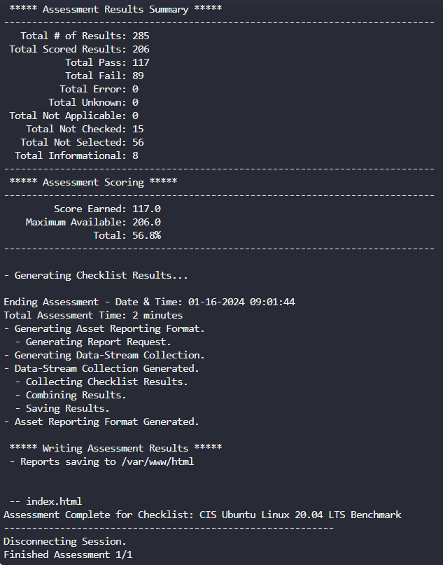
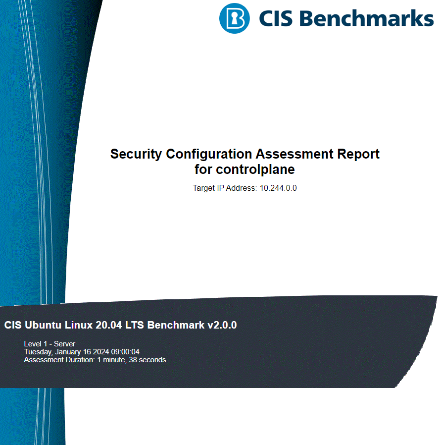

# CIS Security Benchmarks 


- [Using Security Benchmarks](#using-security-benchmarks)
- [CIS-CAT Pro Assessor](#cis-cat-pro-assessor)
- [Kube-bench](#kube-bench)

## Using Security Benchmarks 

A security benchmark is a set of guidelines and best practices for configuring and securing computer systems, networks, and applications.

- It aims to establish a standardized and secure baseline for IT environments, reducing vulnerabilities and enhancing overall security posture.

- Typically cover various areas, including operating systems, databases, web servers, and network devices.

- Regularly assessing and updating systems based on the latest security benchmarks is crucial for adapting to evolving threats and maintaining a robust security posture.

Common benchmarks are provided by organizations like the **Center for Internet Security (CIS)** and the **National Institute of Standards and Technology (NIST).**



## CIS-CAT Pro Assessor 

The CIS-CAT Pro Assessor v4 is a command-line and graphical user interface, allowing users to assess target systems against various forms of machine-readable content.

- Designed primarily to assess CIS Benchmark configuration recommendations

- It can also assess content written in conformance with the Security Content Automation Protocol (SCAP), as well as plain OVAL definition content.

Links: 

- https://github.com/CISecurity/CCPA-Docs/blob/master/docs/User%20Guide%20-%20Assessor.md

- https://www.cisecurity.org/cybersecurity-tools/cis-cat-pro/cis-benchmarks-supported-by-cis-cat-pro/

- https://learn.cisecurity.org/cis-cat-lite

Below is an example script that runs the CIS-CAT Pro Assessor Tool.

```bash
## Assessor-CLI.sh 

#!/bin/sh

# Absolute path to this script, e.g. /home/user/bin/foo.sh
SCRIPT=$(readlink -f "$0")
# Absolute path this script is in, thus /home/user/bin
SCRIPTPATH=$(dirname "$SCRIPT")

JAVA=java
MAX_RAM_IN_MB=2048
DEBUG=0

which $JAVA 2>&1 > /dev/null

if [ $? -ne "0" ]; then
        echo "Error: Java is not in the system PATH."
        exit 1
fi

JAVA_VERSION_RAW=`$JAVA -version 2>&1`

echo $JAVA_VERSION_RAW | grep 'version\s*\"\(\(1\.8\.\)\|\(9\.\)\|\([1-9][0-9]\.\)\)' 2>&1 > /dev/null

if [ $? -eq "1" ]; then

        echo "Error: The version of Java you are attempting to use is not compatible with CISCAT:"
        echo ""
        echo $JAVA_VERSION_RAW
        echo ""
        echo "You must use Java 1.8.x, or higher. The most recent version of Java is recommended."
        exit 1;
fi

if [ $DEBUG -eq "1" ]; then
        echo "Executing CIS-CAT Pro Assessor from $SCRIPTPATH"
        $JAVA -Xmx${MAX_RAM_IN_MB}M -jar $SCRIPTPATH/Assessor-CLI.jar "$@" --verbose
else
        $JAVA -Xmx${MAX_RAM_IN_MB}M -jar $SCRIPTPATH/Assessor-CLI.jar "$@"
fi
```

To run the script:

```bash
./Assessor-CLI.sh -i -rd /var/www/html/ -nts -rp index  
```

The will generate a report called index.html in the output directory /var/www/html. 



From here, we can select the benchmarks that we will use.



Once done, we should see this:



We can then download the report and view it. It will contain a complete assessment of the machine.



## Kube-bench 

Kube-bench is an open-source tool designed to help organizations and users assess the security configuration of their Kubernetes clusters. 

Different ways to deploy kube-bench:

- As a Docker container 
- As a pod in a Kubernetes cluster 
- Install kube-bench binaries 
- Compile from source 

Link: https://github.com/aquasecurity/kube-bench
Lab: [Kube-bench](../../projects/Lab_150_Kubernetes_Security_Kube_Bench/README.md)


<br>

[Back to first page](../../README.md#kubernetes-security)

