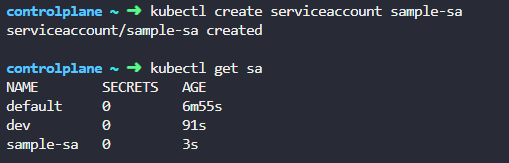
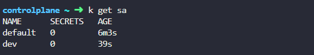
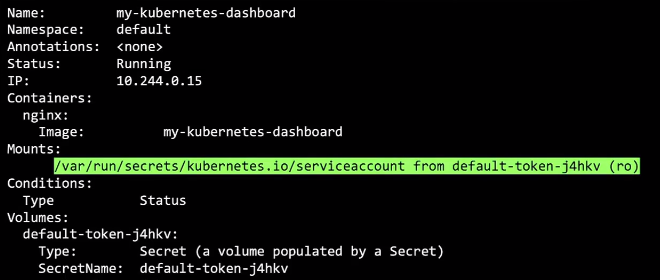
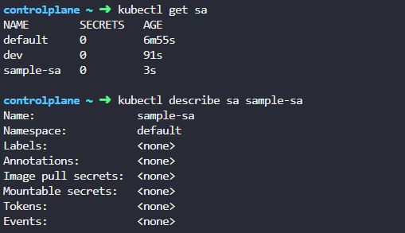

# Service Accounts 

  - [Service Accounts](#service-accounts)
  - [Creating Service Accounts](#creating-service-accounts)
  - [Default Service Accounts](#default-service-accounts)
  - [Tokens](#tokens)
  - [Kubernetes v.1.24 Update - Token Expiry](#kubernetes-v124-update---token-expiry)
  - [Kubernetes v.1.24 Update - Creating Non-expiring Tokens](#kubernetes-v124-update---creating-non-expiring-tokens)


## Service Accounts 

Service accounts provide an identity to pods running in a cluster. Unlike user accounts which are managed by an external entity and are intended for humans, service accounts are made to be used by Pods.

- User accounts are for humans, Service accounts are for machines 
- Used for authenticating the Pods
- Compatible with RBAC (role-based access control)
- Useful for storing image pull secrets when working with private container image registries

Pods have a token that is automatically mounted on a volume that can be used to authenticate requests. Every namespace also has a **default** service account token which has no additional permissions than an unauthenticated user.

To learn more, check out the [Service Accounts page.](https://kubernetes.io/docs/reference/access-authn-authz/service-accounts-admin/)

## Creating Service Accounts 

To create a service account named **sample-sa** through kubectl:

```bash
kubectl create serviceaccount sample-sa 
```



Similarly, we can also create the service account using a YAML file. 

```bash
## sample-sa.yml
apiVersion: v1
kind: ServiceAccount
metadata:
  name: sample-sa
```

And then apply:

```bash
kubectl apply -f sample-sa.yml 
```

To configure a pod to use the service account:

```bash
apiVersion: v1
kind: Pod
metadata:
  name: my-pod
spec:
  serviceAccountName: sample-sa
```


## Default Service Accounts 

For every namespace in Kubernetes, a service account named **default** is automatically created. Each namespace has its own default service account. 



Whenever a pod is created, the default service account and its created token are automatically mounted to that pod as a volume mount. Below is an example.




## Tokens 

When a service account is created, it does the following:

- Creates the service account object
- Generates a token for the service account
- Creates a secret object and stores the token inside 
- The secret object is then linked to the service account 

This token can then be used as an authentication bearer token when making REST calls to the Kubernetes API.

Note that this JWT (token):

- Is not time-bound (no expiration)
- Is not audience-bound 
- Is not object-bound 

## Kubernetes v.1.24 Update - Token Expiry 

Tokens are auto-generated on Kubernetes 1.21 and below. However, this is changed on Kubernetes 1.24. A token needs to be created separately. 



To create the token:

```bash
kubectl create token sample-sa 
```

This way, the secret (token) and the service account are separate objects which needed to be associated with the pod during creation. 


## Kubernetes v.1.24 Update - Creating Non-expiring Tokens

To create secrets with non-expiring tokens, create the secret object and then define the service account name in the annotations. 

```yaml 
apiVersion: v1
kind: Secret
type: kubernetes.io/service-account-token
metadata:
  name: mysecret
  annotations:
    kubernetes.io/service-account.name: myserviceaccount
```


<br>

[Back to first page](../../README.md#kubernetes-security)

