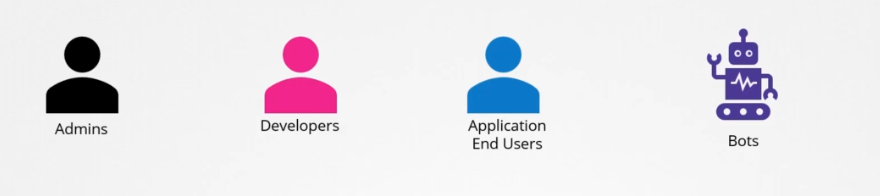
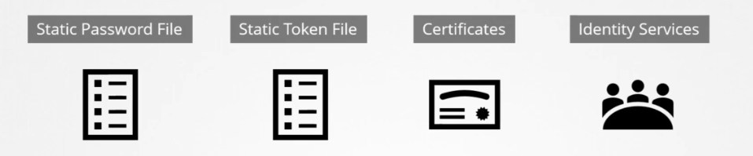

# Authentication and Authorization 

- [Authentication vs. Authorization](#authentication-vs-authorization)
- [Accounts](#accounts)
  - [Normal Users](#normal-users)
  - [Service Accounts](#service-accounts)
- [Lab: Sending authenticated requests to the API Server](#lab-sending-authenticated-requests-to-the-api-server)
- [Authentication and Authorization in Action](#authentication-and-authorization-in-action)
- [Resources](#resources)

## Authentication vs. Authorization 

  


**Authentication - Who can access?**

This refers to the actual accounts that can access the APi server and is defined by the authentication mechanisms:

- Basic authentication (usernames and passwords)
- Bearer tokens (usernames and tokens)
- x509 certificates
- Service accounts 
- External Authentication providers such as LDAP
- OpenID Connect (OIDC) tokens (currently limited support)


**Authorization - What can they do?**

Once the account gained accessed to the cluster, the next thing to look at is what actions they can perform. This can be defined by the following authorization mechanisms:

- RBAC Authorization 
- ABAC Authorization 
- Node Authorization 
- Webhook Mode

When you send requests to Kubernetes, you are first authenticated, and then Kubernetes determines if you are authorized to complete the request. Kubernetes supports several [Authorization modules](https://kubernetes.io/docs/reference/access-authn-authz/authorization/#authorization-modules). 

## Accounts

  

There are two categories of users in Kubernetes: normal users and service accounts:

- Normal Users 
- Service Accounts 


#### Normal Users

These users represent the actual humans using Kubernetes and are managed externally by an independent service. 

  - Users cannot be created, only service accounts 
  - All user access are managed by the API Server
  - The kube-apiserver authenticates the user through authentication mechanisms 

        

  - In a kubedm setup, consider using a volume mount while providing the auth file


#### Service Accounts

These accounts represent identities used by processes running in pods and managed by Kubernetes.


 

## Lab: Sending authenticated requests to the API Server 

Let's first see the available API groups. Send an authenticated request to the secure API server endpoint using the commadn below. The response will show all the API groups, which will be a lot to display so we'll just note some fo them.


```bash
# Get the  API server endpoint and save it to a variable.

$ kubectl get endpoints kubernetes | tail -1 | awk '{print "https://" $2}'

https://10.0.0.100:6443 
```
```bash
$ api_endpoint=$(kubectl get endpoints kubernetes | tail -1 | awk '{print "https://" $2}')

$ sudo curl \
--cacert /etc/kubernetes/pki/ca.crt \
--cert /etc/kubernetes/pki/apiserver-kubelet-client.crt \
--key /etc/kubernetes/pki/apiserver-kubelet-client.key \
$api_endpoint
{
  "paths": [
    "/.well-known/openid-configuration",
    "/api",
    "/api/v1",
    "/apis",
    "/apis/",
    "/apis/admissionregistration.k8s.io",
    "/apis/admissionregistration.k8s.io/v1",
    "/apis/apiextensions.k8s.io",
    "/apis/apiextensions.k8s.io/v1",
    "/apis/apiregistration.k8s.io",
    "/apis/apiregistration.k8s.io/v1",
    "/apis/apps",
    "/apis/apps/v1",
    "/apis/authentication.k8s.io",
    "/apis/authentication.k8s.io/v1",


 ....

 (output shortened)    
```

The curl command borrows certificates created during cluster creation to authenticate the request. We could also extract the admin certificate out of the kubeconfig file and get the same result. The API server is configured to only expose a secure port (6443). 

We can view the API server configuration with:

```bash
$ sudo more /etc/kubernetes/manifests/kube-apiserver.yaml

apiVersion: v1
kind: Pod
metadata:
  annotations:
    kubeadm.kubernetes.io/kube-apiserver.advertise-address.endpoint: 10.0.0.100:6443
  creationTimestamp: null
  labels:
    component: kube-apiserver
    tier: control-plane
  name: kube-apiserver
  namespace: kube-system
spec:
  containers:
  - command:
    - kube-apiserver
    - --advertise-address=10.0.0.100
    - --allow-privileged=true
    - --authorization-mode=Node,RBAC
    - --client-ca-file=/etc/kubernetes/pki/ca.crt
    - --cloud-provider=aws
    - --enable-admission-plugins=NodeRestriction
    - --enable-bootstrap-token-auth=true
    - --etcd-cafile=/etc/kubernetes/pki/etcd/ca.crt
 

 ....

 (output shortened)
```

Sending a request with no URL path to the API server returns a list of all the supported paths. The paths beginning with /api or /apis refer to different API Groups. 

For example, recall the **authorization.k8s.io** API Group used in defining a cluster role binding appears in the list (/apis/authorization.k8s.io) and there are two versions of the API Group:

- v1 (/apis/authorization.k8s.io/v1) 
- v1beta1 (/apis/authorization.k8s.io/v1beta1)

New features are incorporated in beta versions of API Groups. In general, it is best to avoid beta versions, when possible, as they are more likely to have security flaws. 

The **/api** path is the core API Group with most common resources such as pods and services.

We can list all the available resource API Groups:

```bash
$ kubectl api-versions

admissionregistration.k8s.io/v1
apiextensions.k8s.io/v1
apiregistration.k8s.io/v1
apps/v1
authentication.k8s.io/v1
authorization.k8s.io/v1
autoscaling/v1
autoscaling/v2
autoscaling/v2beta1
autoscaling/v2beta2
batch/v1
batch/v1beta1
certificates.k8s.io/v1
coordination.k8s.io/v1
crd.projectcalico.org/v1
discovery.k8s.io/v1
discovery.k8s.io/v1beta1
events.k8s.io/v1
events.k8s.io/v1beta1
flowcontrol.apiserver.k8s.io/v1beta1
flowcontrol.apiserver.k8s.io/v1beta2
metrics.k8s.io/v1beta1
networking.k8s.io/v1
node.k8s.io/v1
node.k8s.io/v1beta1
policy/v1
policy/v1beta1
rbac.authorization.k8s.io/v1
scheduling.k8s.io/v1
storage.k8s.io/v1
storage.k8s.io/v1beta1
v1 
```

Send a request for the authorization API Group using the command below. Notice that a **preferredVersion** sets which version to use when an explicit version is not specified.

```bash
$ sudo curl \
--cacert /etc/kubernetes/pki/ca.crt \
--cert /etc/kubernetes/pki/apiserver-kubelet-client.crt \
--key /etc/kubernetes/pki/apiserver-kubelet-client.key \
$api_endpoint/apis/authorization.k8s.io

{
  "kind": "APIGroup",
  "apiVersion": "v1",
  "name": "authorization.k8s.io",
  "versions": [
    {
      "groupVersion": "authorization.k8s.io/v1",
      "version": "v1"
    }
  ],
  "preferredVersion": {
    "groupVersion": "authorization.k8s.io/v1",
    "version": "v1" 
```

Send a request for version v1 of the core API Group (/api) using the command below. When you a version is specified, the resources in the API Group are returned.

```bash
$ sudo curl \
--cacert /etc/kubernetes/pki/ca.crt \
--cert /etc/kubernetes/pki/apiserver-kubelet-client.crt \
--key /etc/kubernetes/pki/apiserver-kubelet-client.key \
$api_endpoint/api/v1 \
| more

 
 {
  "kind": "APIResourceList",
  "groupVersion": "v1",
  "resources": [
    {
      "name": "bindings",
      "singularName": "",
      "namespaced": true,
      "kind": "Binding",
      "verbs": [
        "create"
      ]
    },
    {
      "name": "componentstatuses",
      "singularName": "",
      "namespaced": false,
      "kind": "ComponentStatus",
      "verbs": [
        "get",
        "list"
      ],
      "shortNames": [
        "cs"
      ]
    },
 

 ....

 (output shortened)   
```

All of the verbs that are supported for the resource are given. This can be helpful for defining rules in roles. It can also be helpful to use kubectl with maximum verbosity (--v=9) to display the API Server requests that are being sent, and extract the API Group and version from the URL path. It may not always be clear what a specific verb grants access for.


Using a different path (api/v1/pods):

```bash
sudo curl \
  --cacert /etc/kubernetes/pki/ca.crt \
  --cert /etc/kubernetes/pki/apiserver-kubelet-client.crt \
  --key /etc/kubernetes/pki/apiserver-kubelet-client.key \
  $api_endpoint/api/v1/pods
```

From the description and operationId, we can see that the GET verb on /api/v1/pods is for listing pods across all namespaces. 


## Authentication and Authorization in Action 

To see how Kubernetes clusters are secured using authentication and authorization, check out this [lab](../../projects/Lab_027_Securing_Kubernetes_using_Authentication_and_Authorization/README.md).


## Resources 

- [CKA Certification Course – Certified Kubernetes Administrator](https://kodekloud.com/courses/certified-kubernetes-administrator-cka/)

- [Using RBAC Authorization](https://kubernetes.io/docs/reference/access-authn-authz/rbac/)


<br>

[Back to first page](../../README.md#kubernetes-security)
