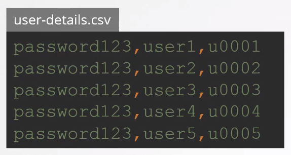

# Authentication Mechanisms 

- [API Server Authentication Mechanisms](#api-server-authentication-mechanisms)
- [Authentication and Authorization in Action](#authentication-and-authorization-in-action)
- [Resources](#resources)

## API Server Authentication Mechanisms

The Kubernetes API server supports various authentication mechanisms to secure access to the cluster. Here is a list with simple descriptions for each

1. **Static Password File Authentication**
   - Usernames and hashed passwords are stored in a static file.
   - Not recommended. Instead use RBAC authentication for new users 

      

      
      

2. **Client Certificate Authentication**
   - Clients present a certificate signed by the cluster's certificate authority (CA).
   - Provides strong identity verification for both users and applications.

3. **Bearer Token Authentication**
   - Clients include a token in the request headers.
   - Tokens are often associated with specific user or service accounts.

4. **Bootstrap Tokens**
   - Used during the bootstrapping process to establish initial cluster components.
   - Typically replaced with other authentication mechanisms once the cluster is set up.

5. **Service Account Tokens**
   - Pods and services within the cluster are associated with service accounts.
   - Service account tokens are automatically mounted into pods to authenticate with the API server.

6. **OpenID Connect Tokens**
   - Integrates Kubernetes with OpenID Connect providers.
   - Allows for single sign-on (SSO) and identity federation.

7. **Webhook Token Authentication**
   - Allows external authentication services to validate tokens.
   - Tokens are sent to an external webhook, and the response determines authentication success.

8. **Azure Active Directory (AAD) Integration**
   - Provides integration with Azure AD for user authentication.
   - Allows using Azure AD identities to access Kubernetes resources.

9. **Client Certificate Rotation**
   - Periodically rotate client certificates for enhanced security.
   - Helps prevent long-term exposure of the same certificate.

10. **Node Bootstrapping**
    - Nodes use a bootstrap token or other mechanisms during initial registration.
    - Authenticates nodes with the cluster during the bootstrap process.

These authentication mechanisms can be configured based on the specific security requirements and the infrastructure in use within a Kubernetes cluster.

## Authentication and Authorization in Action 

To see how Kubernetes clusters are secured using authentication and authorization, check out this [lab](../../projects/Lab_027_Securing_Kubernetes_using_Authentication_and_Authorization/README.md).

## Resources 

- [CKA Certification Course – Certified Kubernetes Administrator](https://kodekloud.com/courses/certified-kubernetes-administrator-cka/)

- [Using RBAC Authorization](https://kubernetes.io/docs/reference/access-authn-authz/rbac/)

 

[Back to first page](../../README.md#kubernetes-security)
