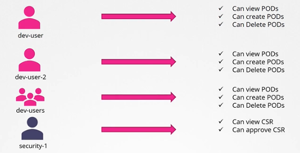
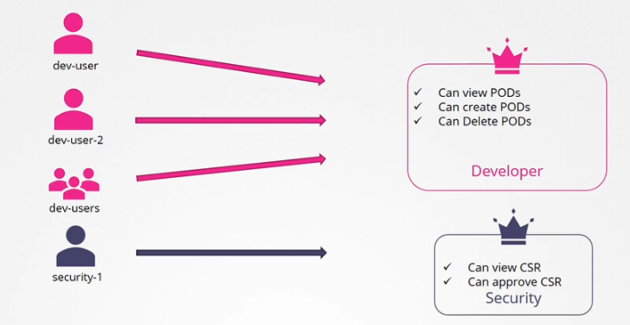
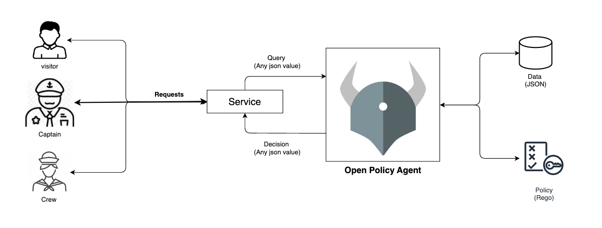
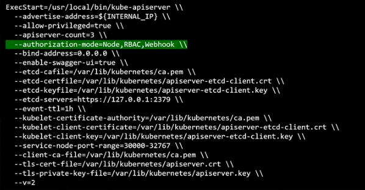

# Authorization Mechanisms 

- [Authorization - What can they do?](#authorization---what-can-they-do)
- [Authorization Modes](#authorization-modes)
    - [Node Authorization](#node-authorization)
    - [ABAC Authorization Attribute-Based Access Control](#abac-authorization-attribute-based-access-control)
    - [RBAC Authorization Role-Based Access Control](#rbac-authorization-role-based-access-control)
    - [Webhook Mode](#webhook-mode)
    - [AlwaysAllow](#alwaysallow)
    - [AlwaysDeny](#alwaysdeny)
- [Setting the Authorization Mode](#setting-the-authorization-mode)


## Authorization - What can they do?

Once the account gained accessed to the cluster, the next thing to look at is what actions they can perform. This can be defined by the following authorization mechanisms

- Node Authorization 
- RBAC Authorization 
- ABAC Authorization 
- Webhook Mode

When you send requests to Kubernetes, you are first authenticated, and then Kubernetes determines if you are authorized to complete the request. Kubernetes supports several [Authorization modules](https://kubernetes.io/docs/reference/access-authn-authz/authorization/#authorization-modules).

## Authorization Modes 

### Node Authorization

Node authorization controls API access for kubelets on worker nodes. This is normally used for access within the cluster

- Determines which nodes are allowed to register with the API server.
- Helps secure communication between nodes and the control plane.

All API requests are handled by the **Node Authorizer.** It is responsible for making authorization decisions regarding kubelet (node) access to the Kubernetes API server.

- It verifies the authenticity of nodes attempting to register with the Kubernetes API server.
- It ensures that only authorized nodes are allowed to register and interact with the control plane. 
- Typically configured as part of the Kubernetes API server configuration.
- Settings based on security requirements.

**Registration Process:**

- When a node (kubelet) attempts to join the cluster, it sends a registration request to the API server.
- The Node Authorizer checks whether the node is allowed to register based on predefined policies.

**Authorization Policies:**

- Policies are configured in the Kubernetes cluster to determine which nodes are permitted to register.
- Policies can be based on node identity, such as node names or other attributes.


### ABAC Authorization (Attribute-Based Access Control)

ABAC is used for external access to the API. It uses a policy language to specify what actions are allowed based on attributes. ABAC is where you associate a user or a group of users with a set of permissions.

- Policies are defined in a global file.
- Each policy specifies allowed actions based on user attributes.
- Less commonly used compared to RBAC due to its global scope.

Every time you need to add or make a change, you need to manually edit the policy file and restart the kube-apiserver. This makes ABAC more difficult to manage.



Below is a sample ABAC policy file. 

```yaml 
# Sample ABAC Policy File

# Define rules for access control
# Each rule specifies conditions for allowing or denying an action

# Allow all users to list pods in the 'default' namespace
{
  "apiVersion": "abac.authorization.kubernetes.io/v1beta1",
  "kind": "Policy",
  "spec": {
    "user": "*",
    "namespace": "default",
    "resource": "pods",
    "apiGroup": "",
    "readonly": true
  }
}

# Allow 'admin' user to perform any action across all namespaces
{
  "apiVersion": "abac.authorization.kubernetes.io/v1beta1",
  "kind": "Policy",
  "spec": {
    "user": "admin",
    "namespace": "*",
    "resource": "*",
    "apiGroup": "*",
    "readonly": false
  }
}

# Deny 'viewer' user the ability to delete pods in any namespace
{
  "apiVersion": "abac.authorization.kubernetes.io/v1beta1",
  "kind": "Policy",
  "spec": {
    "user": "viewer",
    "namespace": "*",
    "resource": "pods",
    "apiGroup": "",
    "readonly": false,
    "verbs": ["delete"]
  }
}

# Allow 'editor' user to create and update deployments in the 'production' namespace
{
  "apiVersion": "abac.authorization.kubernetes.io/v1beta1",
  "kind": "Policy",
  "spec": {
    "user": "editor",
    "namespace": "production",
    "resource": "deployments",
    "apiGroup": "apps",
    "readonly": false,
    "verbs": ["create", "update"]
  }
}  
```

### RBAC Authorization (Role-Based Access Control)

RBAC allows administrators to define roles with specific permissions and bind them to users or service accounts.
- Roles define what actions are allowed within a namespace.
- RoleBindings and ClusterRoleBindings associate roles with users or groups.

Role-based access controls provide a more standard approach to managing access within the Kubernetes cluster.



### Webhook Mode

Apart from the available built-in authorization mechanism, we can also Webhook authorization. This allows the use of external admission controllers to make authorization decisions.

- External webhooks can enforce custom policies or integrate with third-party systems.
- Provides flexibility for customizing authorization logic beyond built-in mechanisms.

**Open Policy Agent** is a third-party tool that helps enforce best practices that are meant to be standards in Kubernetes environments.

- Kubernetes can make an API call to the Open Policy Agent and request for user information.
- OPA will then decide if the user should be permitted or not.

To learn more, check out [openpolicyagent.org.](https://www.openpolicyagent.org/)




### AlwaysAllow

This allows all request without performing any authorization checks. 

### AlwaysDeny 

This denies all request.

## Setting the Authorization Mode 

The modes are set on the kube-apiserver.

- If mode is not specified, it uses AlwaysAllow by default.
- Multiple modes can be specified
- If multiple modes are defined, they are used b the order they are specified.



As an example, if the modes are specified in this order:

```bash
--authorization-mode=Node,RBAC,Webhook
```

Then any API requests will go through Node authorizer first, then RBAC, then Webhook. 

- If the first one denies, it forwards the request to the second mode. 
- As soon as one mode approves, no additional checks are done and reqeust is granted.
- If none of the mode approves, then the request is denied


<br>

[Back to first page](../../README.md#kubernetes-security)

