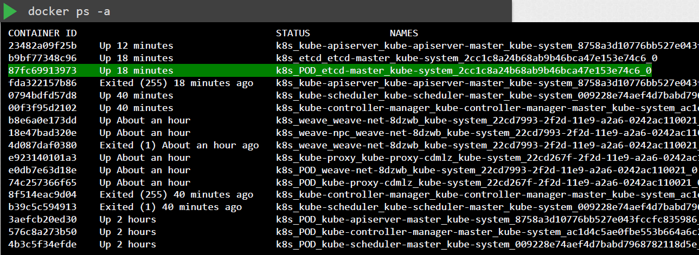

# TLS Certificates


- [TLS Certificates - Basics](#tls-certificates---basics)
    - [Encryption Keys](#encryption-keys)
    - [TLS Certificates](#tls-certificates)
    - [Client Certificates](#client-certificates)
    - [Key Naming Convention](#key-naming-convention)
- [TLS in Kubernetes](#tls-in-kubernetes)
    - [Server Certificates for Servers](#server-certificates-for-servers)
    - [Client Certificates](#client-certificates)
    - [Root Server CA](#root-server-ca)
- [Generating the Certificates](#generating-the-certificates)
    - [Certificate Authority CA Certificates](#certificate-authority-ca-certificates)
    - [Client Certificates](#client-certificates)
    - [Other Client Certificates](#other-client-certificates)
    - [Server Certificates](#server-certificates)
- [How to use the certificates](#how-to-use-the-certificates)
- [View Certificate Details](#view-certificate-details)
- [Certificates API](#certificates-api)
- [Controller-Manager handles all](#controller-manager-handles-all)
- [Inspect Logs](#inspect-logs)
- [Resources](#resources)


## TLS Certificates - Basics 

A TLS Certificate is used to guarantee trust between two parties in a transaction by encryption the data during transfer using encryption keys. There are two ways to encrypt the data:

- **Symmetric encryption** - the same key is used to encrypt and decrypt the data
- **Asymmetric encryption** - instead of using the same key, it uses a private key and a public key 

<details><summary> Read more about encryption keys and certificates  </summary>

### Encryption Keys 

To generate a pair of SSH keys for SSH purposes (asymmetric encryption), use command below.
The user must place the public key in the server first before he can SSH onto the server.

```bash
ssh-keygen  
```

To generate a public and private keypair for securing the website (asymmetric encryption), use the command below. 

```bash
openssl genrsa -out my-user.key 1024                    # generates a "my-user.key"
openssl rsa -in my-user.key -pubout > my-user.pem       # generates a "my-user.pem" 
``` 

Combination on symmetric and assymetric encryption:

- Once the pyblic and private keypair is generated in the server side, it can now start serving the public key to requests
- When the user first accesses the web server using HTTPs, the server sends out the public key.
- The user's browser encrypts the symmetric key using the public key provided by the browser, which makes the symmetric key secured 
- The encrypted symmetric key is sent back to the server 
- Th server uses the private key to decrypt the message and get the symmetric key 
- Once the symmetric key is available on both parties, they can now use it to encrypt and decrypt the succeeding communication

With the exchange above, we learn that we can use assymetric encryption to transfer the symmetric keys from the user to the server.

### TLS Certificates 

To prevent any hacker or MITM attacks, we can make use of TLS certificates. But the question is, how can we verify that the certificate is legitimate since anyone can generate them? 

The answer lies on **who signed the certificate.**
This means that if you generated the certificate, this means you'll also have to sign it.
 
    


 **How do we create a certificate and have it signed with authority?**

This is where Certificate Authority (CA) comes to play. These are well-known organizations that can sign the certificates for you. The process goes like this:

- We generate a Certificate Signing Request (CSR) using the generated key and the name of the website. We need to provide the Country (C), State(ST), Organization (O), and Common Name (CN).

    ```bash
    openssl req -new -key my-bank.key -out my-bank.csr   # generates a "my-bank.csr" file
        - subj "/C=US/ST=CA/O=MyOrs,Inc./CN=my-bank.com
    ```

- The CA verifies the details and signs the certificates, which will be sent back to us.

- We now have a certificate signed by a CA. This certificate can now be trusted by the web browser.

**How do we verify that the certificate is signed by a valid CA?**

The public CAs have a set of public and private keypairs. The private keys are used to sign the certificates, while the public keys are built-in to the browsers.

For internal applications, we can make use of private CAs such as Symantec Private CA or open-source ones such as EJBCA.

### Client Certificates

We've established trust on the server side, but we still haven't secured the user yet. As a aprt of of the trust-building process:

- The server can request a certificate from the user 
- The client can generate the CSR and sent it to the CA 
- The CA validte its and sends the signed certificate back to the client
- The client then sends the certificate to the server 

The TLS client certificates are not generally implemented on web servers or they are done under the hood so that users doesn't have to generate and manage the client certificates manually.

### Key Naming Convention 


<p align=center>

</p>


</details>


 
## TLS in Kubernetes 

To secure the Kubernetes cluster, we need to encrypt the following:

- Communication between the master and worker nodes 
- Communication between client(user) and the cluster

  

There are actually three sets of certificates that we need:

- Root certificates (CA)
- Server certificates 
- Client certificates


### Server Certificates for Servers

For self-managed Kubernetes clusters which could be setup using kubeadm, the following keypairs needs to be generated: 

<p align=center>

</p>

### Client Certificates 

For the client's side, there's actually four clients that talks to the kube-apiserver.

- admin/users
- kube scheduler 
- kube-controller manager
- kube-proxy 

<p align=center>

</p>

### Root Server (CA)

In a Kubernetes setup, the CA is simply a pair of key and certificate files. The server where these files are securely stored are called the CA server. These certificates can also be placed in the master node, which makes the master node a CA server.

## Generating the Certificates 

We can use the following tools to generate the certificates

- EasyRSA
- Openssl
- CFSSL


### Certificate Authority (CA) Certificates

Start with the CA Certificates by generating a private key:

```bash
openssl genrsa -out ca.key 2048             # ca.key
```

Using the private key, generate a CSR. This is similar to a certificate but is not signed yet.

```bash
openssl req -new -key ca.key -subj \        # ca.csr
    "/CN=KUBERNETES-CA" -out ca.csr 
```

Finally, sign the certificate.

```bash
openssl x509 -req -in ca.csr -signkey ca.key -out ca.crt
```

Going forward, we can use this CA key pair to sign all other certificates. 

### Client Certificates 

Generate a private key:

```bash
openssl genrsa -out admin.key 2048             # admin.key
```

Using the private key, generate a CSR. Note that for admin users, we need to add the "O=system:master". For any other users, we ignore it.

```bash
openssl req -new -key admin.key  \
-subj "/CN=kube-admin/O=system:master" \
-out admin.csr
```

Finally, sign the certificate.

```bash
openssl x509 -req -in admin.csr -CA ca.crt -CAkey ca.key -out admin.crt 
```

### Other Client Certificates 

The same steps is followed for generating the other client certificates:

1. Generate a private key.
2. Create a CSR.
3. Sign the certificate.

The other server certificates need to be generated (for self-managed Kubernetes cluster):

- kube scheduler 
- kube-controller manager
- kube-proxy

### Server Certificates 

The same steps is followed for generating the other client certificates:

1. Generate a private key.
2. Create a CSR.
3. Sign the certificate.

The following set of certs need to be generated:

- etcd server certificate
- kube-api server certificate
- kubelet certificate

For the etcd server, it can be deployed in an HA setup thus we will need additional peer certificates. The certificates are then specified in the etcd.yaml file alogn with the CA root certificate. 

<p align=center>

</p>


For the kube-apiserver, we can specify an **openssl.cnf** file and specify the alternate names for the kube-apiserver.

```bash
[ req ]
req_extensions = v3_req

[v3_req]
basicConstraints = CA:FALSE 
keyUsage = nonRepudiation ,
sibjectAltName = @alt_names 

[alt_names]
DNS.1 = kubernetes 
DNS.2 = kubernetes.default 
DNS.3 = kubernetes.default.svc 
DNS.4 = kubernetes.default.svc.cluster.local 
IP.1 =  10.23.45.61 
IP.2 = 172.16.1.88
```

Generate the private key the same way:

```bash
openssl genrsa -out apiserver.key 2048                      # apiserver.key
```

Create the CSR. Make sure to specify the config file. 

```bash
openssl req -new -key admin.key -subj \          
    "/CN=kube-apiserver" -out apiserver.csr \
    -config openssl.cnf            
```

Then sign the certificate:

```bash
openssl x509 -req -in apiserver.csr \
    -CA ca.crt -CAkey ca.key -out apiserver.crt 
```

The location of these certificates are also passed to the kube-apiserver service.

  

The certificate paths can also be specified when running the kube-apiserver in the command line.

```bash
kube apiserver
    --authorization mode= Node,RBAC
    --advertise address=172.17.0.18
    --allow privileged=true
    --client ca file=/ etc kubernetes pki /ca.crt
    --disable admission plugins= PersistentVolumeLabel
    --enable admission plugins= NodeRestriction
    --enable bootstrap token auth=true
    --etcd cafile etc kubernetes pki etcd /ca.crt
    --etcd certfile etc kubernetes pki /apiserver etcd client.crt
    --etcd keyfile etc kubernetes pki apiserver etcd client.key
    --etcd servers=https://127.0.0.1:2379
    --insecure port=0
    --kubelet client certificate=/ etc kubernetes pki /apiserver kubelet client.crt
    --kubelet client key=/ etc kubernetes pki apiserver kubelet client.key
    --kubelet preferred address types= InternalIP,ExternalIP,Hostname
    --proxy client cert file=/ etc kubernetes pki /front proxy client.crt
    --proxy client key file=/ etc kubernetes pki /front proxy client.key
    --requestheader allowed names=front proxy client
    --requestheader client ca file=/ etc kubernetes pki /front proxy ca.crt
    --requestheader extra headers prefix=X Remote Extra
    --requestheader group headers=X Remote Group
    --requestheader username headers=X Remote User
    --secure port=6443
    --service account key file=/ etc kubernetes pki /sa.pub
    --service cluster ip range=10.96.0.0/12
    --tls cert file=/ etc kubernetes pki /apiserver.crt
    --tls private key file=/ etc kubernetes pki apiserver.key
```


## How to use the certificates

The certificates can be used as options in a REST API call;

```bash
curl https://kube-apiserver:6443/api/v1/pods/
    --key admin.key \
    --cert admin.crt \
    --cacert ca.crt 
```

They can also be specified in a kube-config.yaml file.

```yaml
apiVersion: v1 
kind: Config 
clusters:
- name: kubernetes
  cluster:
    certificate-authority: ca.crt 
    server: https://kube-apiserver:6443 
users:
- name: kubernetes-admin 
  user:
    client-certificate: admin.crt 
    client-key: admin.key
```


## View Certificate Details 

For a Kubernetes Cluster that is setup via kubeadm, look for the YAMl file for kube-apiserver.

```bash
cat /etc/kubernetes/manifests/kube-apiserver.yaml 
```

<p align=center>

</p>


Next, we can drill down on the individual certificates that are defined in the YAML file. We can use OpenSSL to view the certificates:

```bash
openssl x509 -in /etc/kubernetes/pki/apiserver.crt -text -noout 
```

Check the following:

- Issuer of the certificate (CA)
- "Not after" to check if certificate is still valid 
- Subject section 
- Alternative names 

<p align=center>

</p>

Perform the same checks on the other certificates.

  

## Certificates API

Kubernetes has a built-in certificates API which we can use to manage certificates, signing requests, and certificate rotation.

1. User send signing request directly to Kubernetes through an API call.

    ```bash
    # Create the private key first 
    openssl genrsa -out jane.key 2048

    # Create CSR 
    openssl req -new -key jane.key -subj "/CN=jane" -out jane.csr 
    ```
2. Admin creates a CSR Object through a YAML file, which can be seen by all cluster administrators.

    ```bash
    # encode th e CSR first 
    cat jane.csr | base64 

    # Create the YAML file for the CSR Object. 
    # Copy base64 encoded CSR ot the "request" field.
    vi jane-csr.yml
    ```
    ```bash
    apiVersion: certificates.k8s.io/v1
    kind: CertificateSigningRequest
    metadata:
        name: jane
    spec:
        groups:
        - system:authenticated 
        usages:
        - digital signature
        - key encipherment
        - server auth
    request:
        LS0tLS1CRUdJTiBDRVJUSUZJQ0FURSBSRVFVRVNULS0tLS0KTUlJQ1ZqQ0NBVDRDQVFBd0VURV
        BNQTBHQTFVRUF3d0dZVzVuWld4aE1JSUJJakFOQmdrcWhraUc5dzBCQVFFRgpBQU9DQVE4QU1J
        SUJDZ0tDQVFFQTByczhJTHRHdTYxakx2dHhWTTJSVlRWMDNHWlJTWWw0dWluVWo4RElaWjBOCn
        R2MUZtRVFSd3VoaUZsOFEzcWl0Qm0wMUFSMkNJVXBGd2ZzSjZ4MXF3ckJzVkhZbGlBNVhwRVpZ
    
    ```
3. Requests can be reviewed and approved using kubectl. Kubernetes signs the certificates using the keypairs and generate a certificate for the user.

    ```bash
    # To retrieve all CSR
    kubectl get csr 

    # To approve the CSR 
    kubectl certificate approve jane    
    ```

4. The certificate can then extracted and shared back to the users.

    ```bash
    # View certificate in a yaml format.
    # The generated certificate is part of the output.
    kubectl get csr jane -o yaml 

    # COpy the certificate to a file and decode it 
    cat jane-approved.csr | base64 --decode 
    ```

      

## Controller-Manager handles all 

The Controller Manager takes care of all certificate-related operations.

  

To sign the certificates, recall that we need the CA root server and private key. These files are also defined in the Controller Manager's definitions file.

<p align=center>

</p>

## Inspect Logs 

As additional troubleshooting steps, we can check the logs for any certificate-related issues.

  

For kubeadm-managed cluster:

  

If kubectl doesn't work due to the core components being down, we can also use the docker CLI to check logs.

  

  


## Resources 

- [CKA Certification Course – Certified Kubernetes Administrator](https://kodekloud.com/courses/certified-kubernetes-administrator-cka/)


<br>

[Back to first page](../../README.md#kubernetes-security)
