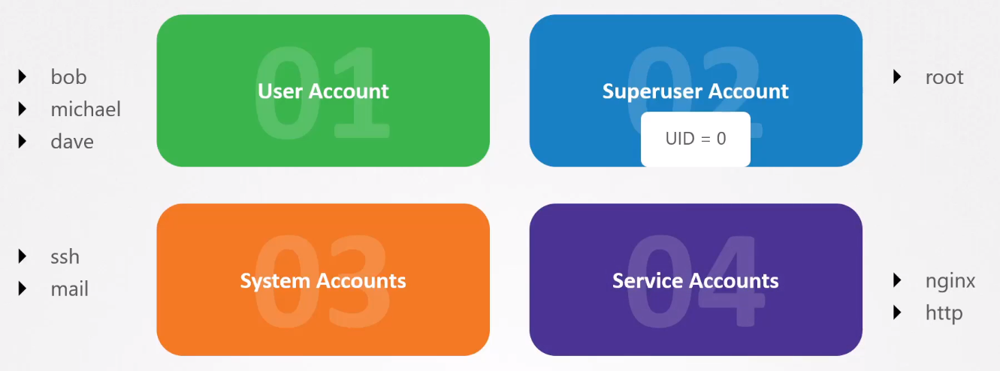
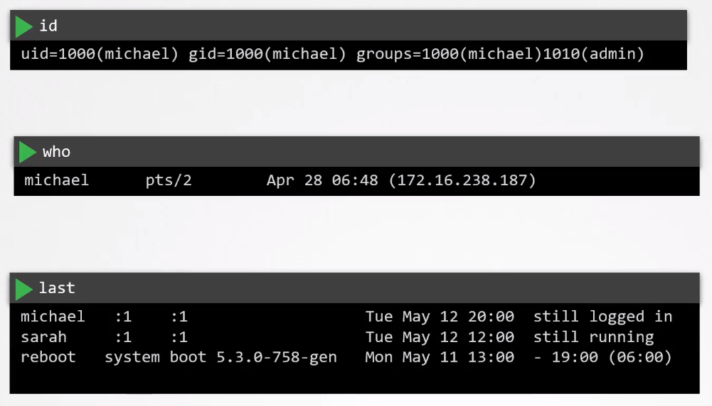
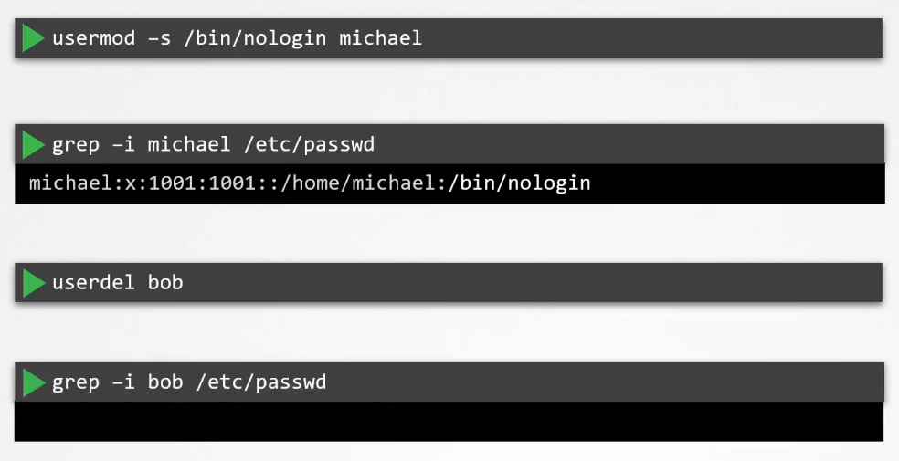
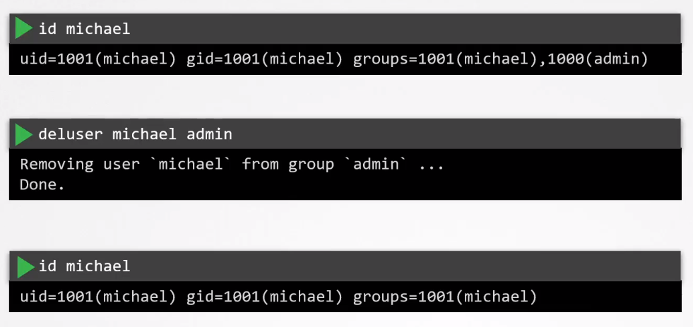

# Limit Node Access 

Best practices:

- Limit exposure of controlplane and nodes to the internet.
- Access cluster via VPN or through authorized networks 
- Limit SSH access to internal users (e.g. developers, end users)

Control the accounts:

To check user details:

We can disable logins for users, or simply delete user account:

Similarly, we can also remove users from groups: 

 

[Back to first page](../../README.md#kubernetes-security)
