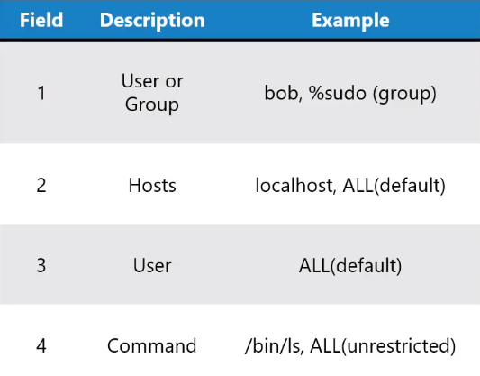

# Linux Privilege Escalation 

This refers to unauthorized elevation of user or process privileges on a Linux system, wherein the main objective is to gain higher-level access than originally granted.

- [Common Techniques](#common-techniques)
- [Steps to Secure](#steps-to-secure)
- [Sudoers file](#sudoers-file)

## Common Techniques 

- **Exploiting Vulnerabilities**
    Leveraging security vulnerabilities to gain elevated privileges.

- **Weak Configuration**
    Exploiting misconfigurations in system settings or applications.

- **Kernel Exploits**
    Utilizing vulnerabilities in the Linux kernel for privilege escalation.

- **SUID Binaries**
    Exploiting binaries with the Set User ID (SUID) permission.

## Steps to Secure

Here are commands for some of the steps mentioned to secure a Linux system against privilege escalation:

- **Security/Regular Updates**
    Apply security updates promptly to patch known vulnerabilities.
    Keep the Linux kernel, system utilities, and applications up to date.        
        
    ```bash
    # Update package information
    sudo apt update

    # Upgrade installed packages
    sudo apt upgrade
    ```

- **Using sudo**
    Instead of using the root user, use sudo to elevate privilege.

    ```bash
    # Create a new user with minimal privileges
    sudo adduser limiteduser

    # Assign the user to specific groups with limited permissions
    sudo usermod -aG limitedgroup limiteduser
    ```

- **Secure the sudoers file**
    Secure /etc/sudoers file to include only users that can escalate privileges.

    ```bash
    # /etc/sudoers
    # User privilege specification
    root    ALL=(ALL:ALL) ALL

    # Allow members of group sudo to execute any command
    %sudo   ALL=(ALL:ALL) ALL

    # Allow a user to run specific commands without a password
    john   ALL=(ALL) NOPASSWD: /bin/ls, /usr/bin/cat

    # Deny a user from running specific commands
    jane   ALL=(ALL) !/bin/rm
    ```    

- **Set nologin for root**
    Prevent the root user from logging in directly.

    ```bash
    ## /etc/passwd
    root:x:0:0:root:/root:/usr/sbin/nologin
    ```    

- **Audit User Permissions**
    Regularly review and audit user accounts and their privileges.

    ```bash
    # List all users and their groups
    cat /etc/passwd

    # Display user groups
    groups username
    ```

- **Kernel Hardening**

    For SELinux (Security-Enhanced Linux):

    ```bash
    # Install SELinux utilities
    sudo apt install selinux-utils

    # Check SELinux status
    sestatus
    ```

    For AppArmor:

    ```bash
    # Install AppArmor
    sudo apt install apparmor
    ```

- **SUID Binaries Review**
    Review and limit the use of SUID binaries.

    ```bash
    # Find SUID binaries
    find / -type f -perm -4000
    ```

- **Security Tools**
    Use security tools like rootkit scanners and intrusion detection systems.
        
    ```bash
    # Install rootkit scanner (example: rkhunter)
    sudo apt install rkhunter
    ```

- **Filesystem Permissions**
    Ensure strict file and directory permissions to prevent unauthorized access.

    ```bash
    # Check and modify file/directory permissions
    chmod 600 sensitivefile
    chmod 700 sensitivefolder
    ```

- **User Authentication**
    Enforce strong password policies and consider multi-factor authentication.
        
    ```bash
    # Set or change a user's password
    sudo passwd username
    ```

- **Logging and Monitoring**
    Enable and regularly review system logs for signs of unauthorized access.
        
    ```bash
    # Check system logs
    cat /var/log/syslog
    cat /var/log/auth.log
    ```


## Sudoers file 

Below is a common sudoers file: 

```bash
# /etc/sudoers
#
# This file MUST be edited with the 'visudo' command as root.
#
# See sudoers(5) for more information on syntax.

# User privilege specification
root    ALL=(ALL:ALL) ALL

# Allow members of group sudo to execute any command
%wheel   ALL=(ALL:ALL) ALL

# Allow a user to run specific commands without a password
john   ALL=(ALL) NOPASSWD: /bin/ls, /usr/bin/cat

# Deny a user from running specific commands
jane   ALL=(ALL) !/bin/rm

# Alias definitions
# Example alias definition:
# Alias_Spec = User_List, Command_List
# Run '/usr/bin/apt-get update' as 'john'
Cmnd_Alias UPDATE = /usr/bin/apt-get update
john   ALL=(ALL) UPDATE
```

To understand, here is the description of each fields:



In the sudoers file above, <code>%wheel</code> means members of the group wheel can gain root privileges. 

```bash
# Allow members of group sudo to execute any command
%wheel   ALL=(ALL:ALL) ALL 
```

- Second field: ALL=
- Third field: (ALL:ALL)
- Fourth field: ALL  


<br>

[Back to first page](../../README.md#kubernetes-security)
