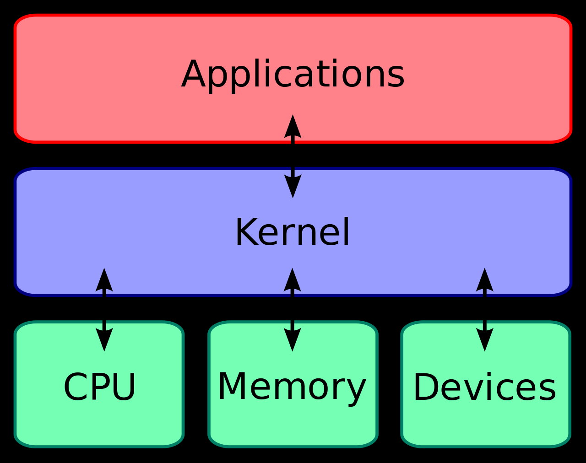

# Linux Syscalls 

- [Linux Kernel](#linux-kernel)
- [System Calls](#system-calls)
- [Tracing Syscalls](#tracing-syscalls)
- [List Syscall Summary](#list-syscall-summary)
- [Tracing syscalls made by a running process](#tracing-syscalls-made-by-a-running-process)
- [Tracing Syscalls using AquaSec Tracee](#tracing-syscalls-using-aquasec-tracee)


## Linux Kernel 

The Linux kernel is the core component of the Linux operating system, serving as the interface between hardware and user-level applications. It is responsible for managing system resources, providing services to user processes, and facilitating communication between software and hardware components. 


<p align=center>

</p>


A more detailed diagram:

<p align=center>

</p>

Applications that can ran in the User Space:

- C 
- Java 
- Python 
- Ruby 

Applications that can be ran in the Kernel Space:

- Kernel Code
- Kernel Extensions
- Device Drivers 


## System Calls 

System calls provide a way for applications to interact with the kernel of an operating system. 

<p align=center>

</p>

In Linux, applications request services from the kernel by making system calls. These calls are the interface between user space and kernel space, allowing user-level processes to request the kernel's assistance in performing tasks that require higher privileges or access to protected resources.

## Tracing Syscalls 

To trace the syscalls sent by an application and the responses:

```bash
strace <command>
```

Example: 


## List Syscall Summary 


## Tracing syscalls made by a running process

As an example, we can find the syscalls made by the etcd process. 

First, find the PID of the process

```bash
pidof etcd  
```

Then use strace:

```bash
strace -p <PID-number> 
```


## Tracing Syscalls using AquaSec Tracee

Tracee is an open-source runtime security and forensics tool developed by Aqua Security. It helps you understand how your system and applications behave.


<p align=center>

</p>

It is using eBPF technology to tap into your system and expose that information as events that you can consume. Events range from factual system activity events to sophisticated security events that detect suspicious behavioral patterns.

Link: [Official Github Repo](https://github.com/aquasecurity/tracee)


It can be installed directly to the server, or it can also be ran as a Docker container. Some pre-requisites are to bind mount the following directory to the container.


**Examples:**

Tracing syscalls made by the ls command:


List syscalls generated by new processes:


List syscalls generated by new containers:


<br>

[Back to first page](../../README.md#kubernetes-security)
