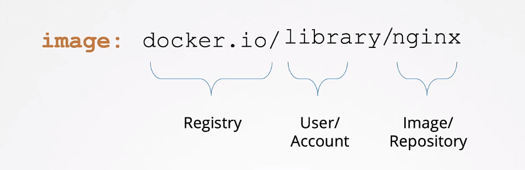
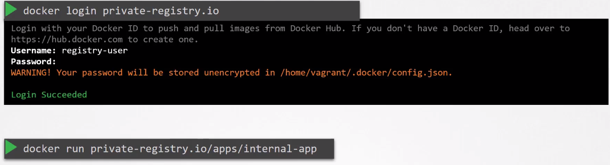

# Image Security 

- [Base Image and Parent Image](#base-image-and-parent-image)
- [Best Practices](#best-practices)
- [Securing Images](#securing-images)


## Base Image and Parent Image 

Base images are images that are built using scrtach. This can be seen in their Dockerfiles.

```dockerfile
## debian:buster-slim 
FROM scratch 
ADD rootfs.tar.xz / 
CMD ["bash"]
```

On the other hand, parent images are built on top of base images. Parent Images can also be built on top other parent images, An example of this is the HTTP image.

```dockerfile
## httpd 
FROM debian:buster-slim 

ENV HTTPD_PREGIX /usr/local/apache2 
ENV PATH $HTTPD_PREFIX/bin:$PATH 
WORKDIR $HTTPD_PREFIX 
 . . . .

```

## Best Practices

- Build images that are modular, where each image can have their own dependencies.
- Do not persist state/data inside the container.
- Always store data in external volume or cache.
- When looking for base image, check Dockerhub.
- Keep size of images as small as possible
- Only install necessary packages   
- Remove yum, apt or wget, which can be used to install unwanted packages

When choosing base images in Dockerhub:

- Verify authenticity of base image in Dockerhub.
- Check "Official image" or "Verified publisher tag" .
- Images that are constantly updated are less likely to have vulnerabilities.

Application container **MUST ONLY CONTAIN**:

- Application
- Runtime dependencies 

Application container **MUST NO CONTAIN**:

- Package Managers 
- Shells
- Network Tools 
- Text Editors 
- Other unwanted programs 
  
## Securing Images 

Naming convention of images:

<p align=center>

</p>

If the images are stored in private registries, then the "docker.io" should be the name of your private registry. To pull and run containers from private registries:



To use containers stored in private registries on our Pod definition files, we must first creaate the secret with type **docker-registry**. This secrets is designed specifically to store Docker credentials.

```bash
kubectl create secret docker-registry my-creds \
--docker-server=private-registry.io            \
--docker-username=registry-user                \
--docker-password=registry-password            \ 
--docker-email=registry-user@org.com             
``` 

Now we specify the image in the Pod manifest.

```yaml
apiVersion: v1
kind: Pod
metadata:
  name: mypod
spec:
  containers:
  - name: mycontainer
    image: private-registry.io/apps/internal-app:latest
  imagePullSecrets:
  - name: my-creds
```


<br>

[Back to first page](../../README.md#kubernetes-security)
