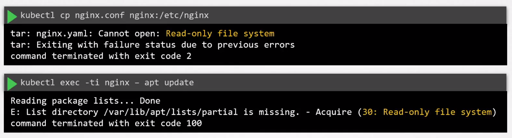

# Mutable and Immutable Infrastructure 

- [Immutability](#immutability)
- [Mutable Infrastructure](#mutable-infrastructure)
- [Immutable Infrastructure](#immutable-infrastructure)
- [Immutable Containers](#immutable-containers)
- [Ensure Immutability of Containers at Runtime](#ensure-immutability-of-containers-at-runtime)


## Immutability 

Immutability refers to the quality of being unchangeable or unable to be modified. In simple terms, once something is immutable, it cannot be altered or mutated. It remains constant or fixed. 

## Mutable Infrastructure 

A mutable infrastructure is a setup where you perform in-pace updates on servers. In this scenario, the underlyign servers remain the same bu the software and configuration on these servers have been changed as part of the update. 


A drawback in this kind of setup is **Configuration Drift** where the configuration of a system or infrastructure diverges or deviates from its intended or desired state over time. 

All three servers could be updated simultaenously but the update could have failed on the third server due to network connectivity or required dependencies which are missing.


## Immutable Infrastructure 

Instead of updating the software on the existing servers, we can spin up/create new servers that has the new software package and then delete the old servers.


## Immutable Containers

Containers are designed to be immutable. Containers are created using images and any change on the container image, such as upgrading package X to a newer version, would require deploying of new containers.

**Still able to change containers during runtime**

While contianers are designed with immutability in mind, we can still perform changes on running containers. These changes can include copying files directly to the root file system or opening a shell into the container and change some configuration files. 

We can do these thigns, but this is **NOT RECOMMENDED.**

## Ensure Immutability of Containers at Runtime

To ensure that no changes can be done on the container during runtime, we can add a security context:

```yaml
## nginx.yaml 
apiVersion: v1
kind: Pod
metadata:
  name: nginx-pod
spec:
  containers:
  - name: nginx-container
    image: nginx:latest
    securityContext:
      readOnlyRootFilesystem: true
    volumeMounts:
    - name: cache-volume 
      mountPath: /var/cache/nginc
    - name: runtime-volume 
      mountPath: /var/run 
  volumes:
  - names: cache-volume
    emptyDir: {}      
  - names: runtime-volume 
    emptyDir: {}      
```

If we try to copy files into the container, it should fail.




<br>

[Back to first page](../../README.md#kubernetes-security)
