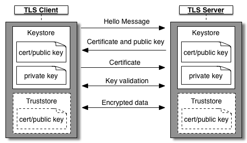
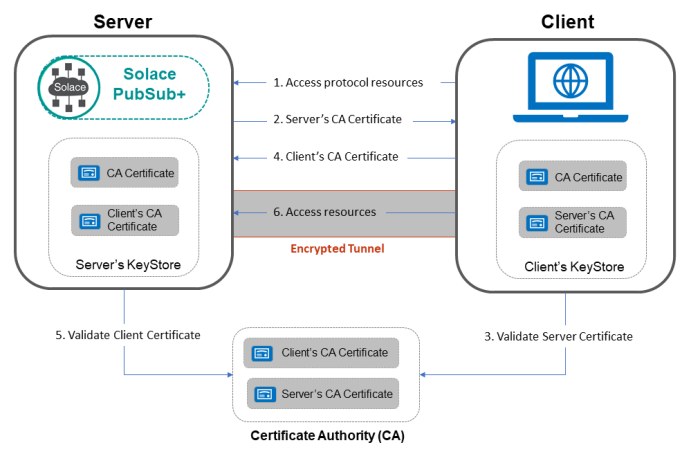
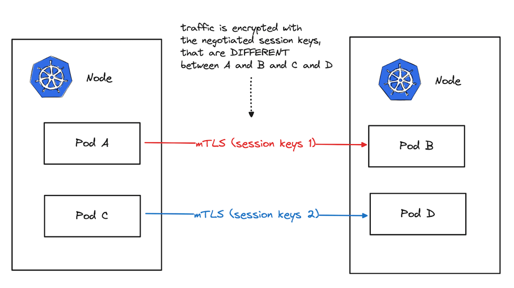
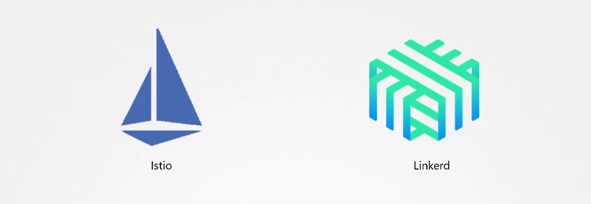

# One-way SSL and Mutual SSL 

- [One way SSL](#one-way-ssl)
    - [Sample scenario](#sample-scenario)
    - [Use cases](#use-cases)
- [Mutual SSL](#mutual-ssl)
    - [Flow of Mutual SSL Handshake](#flow-of-mutual-ssl-handshake)
    - [Sample Scenario](#sample-scenario)
    - [Use Cases](#use-cases)
- [Pod-to-pod Encryption using mTLS](#pod-to-pod-encryption-using-mtls)
    - [Step 1 - Create TLS Certificates](#step-1---create-tls-certificates)
    - [Step 2 - Create Kubernetes Secrets](#step-2---create-kubernetes-secrets)
    - [Step 3 - Update Pod Specifications](#step-3---update-pod-specifications)
    - [Step 4 - Configure Applications](#step-4---configure-applications)
    - [Step 5 - Network Policies](#step-5---network-policies)
    - [Step 6 - Test the Setup](#step-6---test-the-setup)
    - [Important Considerations](#important-considerations)
- [Third-Party Encryption](#third-party-encryption)


## One way SSL 

Typically, the term "One-way SSL" is used in the context of SSL/TLS (Secure Sockets Layer/Transport Layer Security) protocols, where a client authenticates the server, but the server does not authenticate the client. 

<p align=center>

</p>

This is also known as "one-way authentication" or "single-sided authentication."

In a one-way SSL setup:

1. The client connects to the server.
2. The server presents its SSL certificate to the client during the handshake process.
3. The client verifies the server's certificate to ensure it's valid (e.g., signed by a trusted certificate authority).
4. The communication between the client and the server is encrypted using the server's public key from the certificate.

### Sample scenario

Consider a scenario where you have a web server (e.g., Nginx or Apache) configured with an SSL certificate. The client (a web browser) connects to the server over HTTPS, and the server presents its SSL certificate during the SSL handshake.

Nginx configuration example (nginx.conf):

```nginx
server {
    listen 443 ssl;
    server_name example.com;

    ssl_certificate /path/to/server.crt;
    ssl_certificate_key /path/to/server.key;

    # Other SSL/TLS configurations...

    location / {
        # Your application settings...
    }
}
```

When a client connects to this Nginx server over HTTPS, the server presents its SSL certificate for authentication. In this example demonstrates one-way SSL where the server is authenticated, but the client is not required to present a certificate.

If mutual authentication is needed, where both client and server authenticate each other, it would involve additional configurations on both sides.

### Use cases 

In server-only SSL, the server needs to authenticate itself to clients but does not require clients to present certificates for authentication. Here are some use cases for one-way SSL:

1. **Web Server Authentication**
   - One-way SSL is often used in securing web servers where clients (web browsers) connect to a server over HTTPS.
   - Example: A public-facing website or an internal web application where clients need to securely connect to a server.

2. **APIs and Microservices**
   - In microservices architectures or API deployments, one-way SSL can be employed to secure communication between clients and API servers.
   - Example: A RESTful API that requires secure communication between clients and the API server.

3. **Public-Facing Services**
   - Public-facing services, such as content delivery networks (CDNs), can use one-way SSL to secure communication between clients and the CDN servers.
   - Example: A CDN serving static content (images, videos) securely to clients over HTTPS.

4. **IoT Devices**
   - Internet of Things (IoT) devices connecting to a central server can use one-way SSL for secure communication.
   - Example: IoT devices sending data to a cloud-based server over a secure connection.

5. **Intranet Applications**
   - Applications within an organization's intranet may use one-way SSL to secure communication between clients (employees) and internal servers.
   - Example: An intranet portal accessed by employees over HTTPS.

6. **Authentication Services**
   - Authentication servers, such as LDAP or Active Directory servers, may use one-way SSL to ensure secure authentication for clients.
   - Example: An LDAP server providing user authentication services securely to clients.

7. **Data Transfer Services**
   - One-way SSL can be used to secure data transfer services, such as FTP or file servers, where clients need to securely transfer files to a server.
   - Example: An FTP server allowing clients to upload/download files securely over FTPS.

8. **Public Wi-Fi Access Points**
   - Access points providing public Wi-Fi services can use one-way SSL to secure communication between clients and the Wi-Fi infrastructure.
   - Example: Public Wi-Fi services in airports or coffee shops securing the connection between users and the Wi-Fi access points.


## Mutual SSL 

Mutual SSL, also known as **Two-Way SSL** or **client authentication,** is a security mechanism in which both the client and the server authenticate each other during the SSL/TLS handshake process. 

<p align=center>

</p>

This involves the exchange of certificates between the client and the server, providing a higher level of trust and security in the communication.


### Flow of Mutual SSL Handshake

1. **Client Hello**
   - The client initiates the SSL/TLS handshake by sending a "Client Hello" message to the server, indicating its intent to establish a secure connection.

2. **Server Hello**
   - The server responds with a "Server Hello" message, indicating its willingness to establish a secure connection.

3. **Server Certificate**
   - The server sends its digital certificate to the client. This certificate contains the server's public key and is signed by a trusted Certificate Authority (CA).

4. **Client Certificate Request**
   - The server requests the client to provide its digital certificate.

5. **Client Certificate**
   - The client sends its digital certificate to the server. This certificate contains the client's public key and is also signed by a trusted CA.

6. **Key Exchange and Finished:**
   - The client and server exchange key information and complete the SSL handshake. Subsequent communication is encrypted using the exchanged keys.

### Sample Scenario

Consider a scenario where a web server requires clients to authenticate using mutual SSL. The web server is configured to request a client certificate during the SSL handshake.

Nginx configuration example (`nginx.conf`):

```nginx
server {
    listen 443 ssl;
    server_name example.com;

    ssl_certificate /path/to/server.crt;
    ssl_certificate_key /path/to/server.key;

    ssl_client_certificate /path/to/ca.crt;
    ssl_verify_client on;

    # Other SSL/TLS configurations...

    location / {
        # Your application settings...
    }
}
```

- `ssl_client_certificate`: Specifies the file containing trusted CA certificates. This is used by the server to verify the client's certificate.
- `ssl_verify_client on;`: Enables client certificate verification.

### Use Cases

- **Secure APIs:** In an API scenario, both the client (e.g., a mobile app or another server) and the server can authenticate each other, ensuring that only trusted entities can access sensitive data or perform specific actions.

- **Financial Transactions:** In financial applications, mutual SSL can be crucial to establish a secure connection between financial institutions or clients and servers handling financial transactions.

- **Employee Access:** For internal applications, mutual SSL can be used to secure communication between employees and internal servers, providing an additional layer of authentication.

In mutual SSL, both parties need to have a valid certificate signed by a trusted CA. This approach ensures a higher level of security and trust in the communication between the client and the server.


## Pod-to-pod Encryption using mTLS 

Implementing mutual TLS (mTLS) for pod-to-pod encryption in Kubernetes involves configuring the Kubernetes cluster and the applications (pods) to use TLS certificates for both client and server authentication. 



Here are the general steps to implement mTLS for pod-to-pod communication:

### Step 1 - Create TLS Certificates

Generate TLS certificates for the server (pods acting as servers) and clients (pods acting as clients). You can use a tool like OpenSSL to create the certificates, or you may use a certificate management solution.

### Step 2 - Create Kubernetes Secrets

Create Kubernetes secrets to store the TLS certificates. Separate secrets should be created for server certificates and client certificates.

```bash
# Create a secret for server certificates
kubectl create secret tls server-tls-secret --cert=path/to/server.crt --key=path/to/server.key

# Create a secret for client certificates
kubectl create secret tls client-tls-secret --cert=path/to/client.crt --key=path/to/client.key
```

### Step 3 - Update Pod Specifications

Update the pod specifications to include the necessary information for mTLS. This involves specifying the secret names for the server and client certificates.

Example Pod Specification:

```yaml
apiVersion: v1
kind: Pod
metadata:
  name: example-pod
spec:
  containers:
  - name: example-container
    image: your-image
  # Add the following section for mTLS
  volumes:
  - name: server-certificate
    secret:
      secretName: server-tls-secret
  - name: client-certificate
    secret:
      secretName: client-tls-secret
  ```
  
Update the container to use the certificates:

```yaml
...
    volumeMounts:
    - name: server-certificate
      mountPath: /path/to/server-certificate
    - name: client-certificate
      mountPath: /path/to/client-certificate
  ...
```

### Step 4 - Configure Applications

Configure your applications within the pods to use the provided TLS certificates for both server and client authentication. This typically involves configuring the application to use the certificate files mounted into the pods.

### Step 5 - Network Policies

Consider using Kubernetes Network Policies to control which pods can communicate with each other over mTLS. Network Policies allow you to define rules for network communication between pods.

### Step 6 - Test the Setup

Deploy your updated pods and test the mTLS setup by ensuring that the server pod authenticates the client pod using the provided client certificates and vice versa.

### Important Considerations

This is a general outline, and the exact steps may vary depending on your specific requirements and the tools you use for certificate management. 

- Ensure that your certificate authorities (CAs) are trusted by all parties.
- Rotate certificates regularly for security reasons.
- Use proper RBAC (Role-Based Access Control) to control access to secrets and ensure that only authorized entities can access the certificates.
- Monitor and log communication to identify and respond to any security incidents.

Additionally, consider using Kubernetes Ingress controllers or service meshes for more advanced networking and security features.

## Third-Party Encryption 

Instead of relying on applications to encrypt the data, we can leverage third-party programs like **Istio** and **Linkerd** to facilitate the mTLS encryption between pods. Both these programs allow secure service-to-service communication without depending on the applications.



In addition to encrypting and decrypting data, they do a lot more when it comes to connecting multiple services together in a microservice architecture.


<br>

[Back to first page](../../README.md#kubernetes-security)
