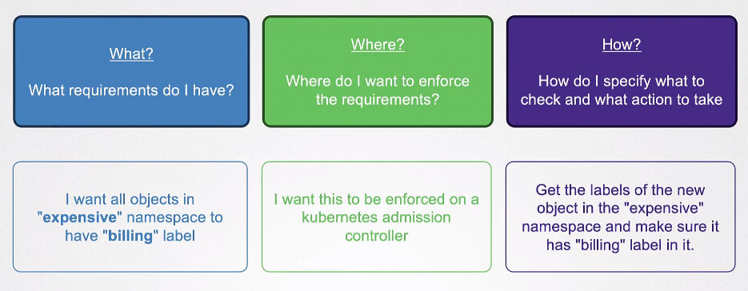

# Open Policy Agent 

- [OPA](#opa)
- [OPA is Authorization](#opa-is-authorization)
- [Installation](#installation)
- [OPA Policy](#opa-policy)
- [OPA Gatekeper](#opa-gatekeper)
- [Installation](#installation)
- [OPA Constraint Framework](#opa-constraint-framework)

## OPA 

Open Policy Agent (OPA) is an open-source policy engine that enables organizations to declaratively specify and enforce policies across their software stack. 

- It provides a unified solution for policy enforcement across various components. 

- OPA is designed to be language-agnostic 

- It can be integrated with different systems and services seamlessly.

- OPA uses a declarative policy language called Rego. 

- Policies are evaluated to determine is a request is allowed or denied.

OPA decouples policy decision-making from policy enforcement. When your software needs to make policy decisions it queries OPA and supplies structured data (e.g., JSON) as input. OPA accepts arbitrary structured data as input.


<p align=center>

</p>

For more information, please see [Open Policy Agent.](https://www.openpolicyagent.org/docs/latest/)

## OPA is Authorization

It is important to note that Open Policy Agent is **NOT AUTHENTICATION**, but rather it handles the authorization. After a user has been authenticated, Open Policy Agent decides what areas of application is the user allowed to access.


## Installation 

Download the OPA binary and set permissions on the OPA executable.

```bash
curl -L -o opa https://openpolicyagent.org/downloads/v0.60.0/opa_linux_amd64_static 

chmod 755 ./opa
```

Run OPA with the -s flag to run it as a server.

```bash
./opa run -s
```


## OPA Policy 

Below is a sample policy written in Rego.

```rego
### example.rego 

package example

import rego.v1

default allow := false                # unless otherwise defined, allow is false

allow if {                            # allow is true if...
    count(violation) == 0             # there are zero violations.
}

violation contains server.id if {     # a server is in the violation set if...
    some server
    public_server[server]             # it exists in the 'public_server' set and...
    server.protocols[_] == "http"     # it contains the insecure "http" protocol.
}

violation contains server.id if {     # a server is in the violation set if...
    server := input.servers[_]        # it exists in the input.servers collection and...
    server.protocols[_] == "telnet"   # it contains the "telnet" protocol.
}
```

We can then load the policy into a CURL request. 

```bash
curl -X PUT --data-binary @example.rego http://localhost:8181/v1/policies/example1 
```

To view existing policies:

```bash
curl http://localhost:8181/v1/policies
```

## OPA Gatekeper


OPA Gatekeeper is an extension of Open Policy Agent (OPA) designed specifically for Kubernetes environments. It provides a way to enforce policies on Kubernetes resources using OPA's declarative language, Rego.

- Users can define custom resources that represent policies using these CRDs.

- It uses  "Constraint Templates," which are templates for defining constraints that a resource must satisfy. 

- OPA Gatekeeper integrates with the Kubernetes admission control process.

The primary goal of OPA Gatekeeper is to enable Kubernetes administrators to define and enforce policies for resource configurations within their clusters.

<p align=center>

</p>


## Installation 

The detailed steps can be found in the [OPA Gatekeeper website.](https://open-policy-agent.github.io/gatekeeper/website/docs/install/)

```bash
kubectl apply -f https://raw.githubusercontent.com/open-policy-agent/gatekeeper/v3.14.0/deploy/gatekeeper.yaml 
```

Make sure that all gatekeeper services are running.


## OPA Constraint Framework 

The OPA Constraint Framework helps us implement OPA policies by declaring:

- What is it we want to do
- Where we want to do it
- How are we going to do it 



All of this will be defined in the Constraint Template. Strating off with the constraints:

```yaml
## require-label-billing.yaml 
apiVersion: templates.gatekeeper.sh/v1
kind: SystemRequiredLabel 
metadata:
  name: require-billing-label 
spec: 
  match:
    namespaces: ["expensive"]
  parameters:
    labels: ["billing"]
```
```yaml
## require-label-tech.yaml 
apiVersion: templates.gatekeeper.sh/v1
kind: SystemRequiredLabel 
metadata:
  name: require-tech-label 
spec: 
  match:
    namespaces: ["engineering"]
  parameters:
    labels: ["tech"]
```

We then create the Constraint Template:


```yaml
## constraint-template.yaml
apiVersion: templates.gatekeeper.sh/v1
kind: ConstraintTemplate
metadata:
  name: systemrequiredlabels
spec:
  crd:
    spec:
      names:
        kind: SystemRequiredLabel 
      validation:
        # Schema for the `parameters` field
        openAPIV3Schema:
          properties:
            labels:
              type: array 
              items:
                type: string 
  targets:
    - target: admission.k8s.gatekeeper.sh
      rego: |
        package k8s.admission

        import data.lib.helpers 

        violation[{"msg": msg, "details": {"missing_labels": missing}}] {
            provided := {label | input.request.object.metadata.labels[label]}
            required := {label | input.parameters.labels[_]}
            missing := required - provided 
            count(missing) > 0 
            msg := sprintf("You must provide labels: %v", [missing])
        } 
```

Apply all Manifests

```bash
kubectl apply -f .
```


<br>

[Back to first page](../../README.md#kubernetes-security)
