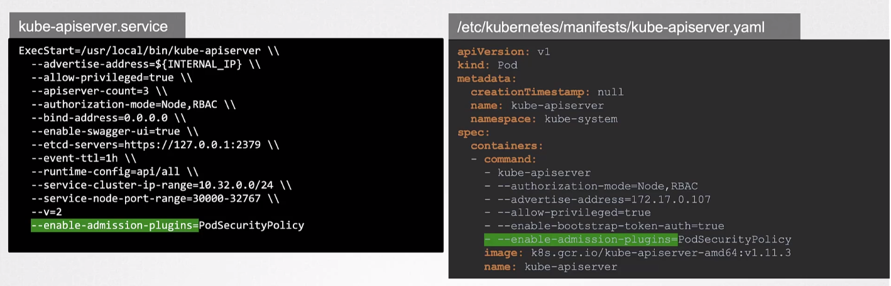
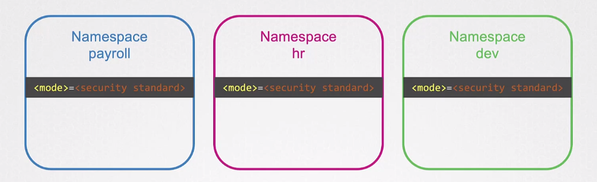
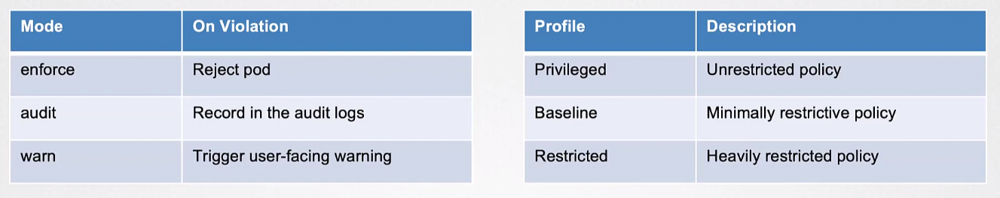

# Pod Security

- [Pod Security Policies](#pod-security-policies)
    - [The Need for Pod Security Policy](#the-need-for-pod-security-policy)
    - [Deployed as an Admission Controller](#deployed-as-an-admission-controller)
    - [Challenges of PSPs](#challenges-of-psps)
    - [Transitioning to a New Pod Security Solution](#transitioning-to-a-new-pod-security-solution)
- [PSA and PSS](#psa-and-pss)
    - [Pod Security Admission (PSA)](#pod-security-admission-psa)
    - [Pod Security Standards (PSS)](#pod-security-standardspss)
- [Namespace Labels in PSA](#namespace-labels-in-psa)
- [PSA Modes](#psa-modes)
- [PSA Exemptions](#psa-exemptions)
- [Configuring PSA Exemptions](#configuring-psa-exemptions)
- [PSS in Action](#pss-in-action)
- [Migrating from PSP to PSA](#migrating-from-psp-to-psa)


## Pod Security Policies 

PodSecurityPolicy serves as an admission controller within Kubernetes, enabling cluster administrators to effectively manage security-related aspects of the Pod specification. 

By creating PodSecurityPolicy resources and defining requirements for Pods, administrators can control which Pods are allowed to run based on security policies. If a Pod complies with the defined PSP requirements, it is admitted to the cluster; otherwise, it is rejected.

- PSP was a feature in Kubernetes that provided a way to control the security characteristics of a pod.
- PSP policies are enforced cluster-wide. 
- Once a PSP is defined, it applies to all pods in the cluster, and pods that violate the policy will not be allowed to run.

### The Need for Pod Security Policy

Kubernetes resources like Deployments, StatefulSets, and Services form the foundation of applications. However, RBAC alone, which controls access to these resources, does not consider the specific settings within the resources. 

PodSecurityPolicy was introduced to address this gap and provide fine-grained control over security-related fields in Pods. It enabled administrators to prevent privileges and settings that could pose security risks, without relying on external admission controllers.

Over time, it became evident that PodSecurityPolicy had inherent usability challenges that necessitated breaking changes.

### Deployed as an Admission Controller 

The PSP is deployed as an admission controller. It is enabled by adding it in the kube-apiserver service file.



After this, we need to create the PSP object. 

```yaml
apiVersion: policy/v1beta1
kind: PodSecurityPolicy
metadata:
  name: restrictive-psp
spec:
  privileged: false
  allowPrivilegeEscalation: false
  readOnlyRootFilesystem: true
  seLinux:
    rule: RunAsAny
  supplementalGroups:
    rule: RunAsAny
  runAsUser:
    rule: MustRunAsNonRoot
  fsGroup:
    rule: RunAsAny
  requiredDropCapabilities:
    - 'ALL'
  defaultAddCapabilities:
    - 'CAP_SYS_TIME'
  allowedCapabilities:
    - 'NET_ADMIN'
    - 'SYS_TIME'
    - 'AUDIT_WRITE'
```

What makes PSPs difficult to rollout is that before you can enable PSPs, you have to make sure that the appropriate policies are created in advance. If you don't create the policies such as the roles and rolebindings, all requests to create pods woulds be denied. 

### Challenges of PSPs 

PSP faces two major drawbacks: the absence of support for additional resource types and its limited set of controls that overlooks certain container runtime-specific characteristics. Other than that, several complexities are attached to PSPs.

- **Confusing Application of PSPs:** Users often found it challenging to correctly apply PodSecurityPolicy to Pods, leading to unintended and broader permissions.
- **Limited Visibility:** It was difficult to determine which PodSecurityPolicy applied to a specific Pod, making it hard to track and understand the security policies in place.
- **Limited Support for Changing Pod Defaults:** Modifying default values for Pod settings through PodSecurityPolicy had limited scope, causing inconsistencies and unpredictability.
- **Lack of Audit Mode or Dry Run Capability:** The absence of an audit mode or dry run capability made it impractical to assess the impact of PSPs before enforcing them or retrofitting them to existing clusters safely.
- **Challenges in Enabling PSP by Default:** The complexities and potential risks associated with PodSecurityPolicy made it infeasible to enable it by default across clusters, limiting its widespread adoption.

These usability challenges collectively drove the need for breaking changes and a more user-friendly solution to secure Pod deployments, leading to the deprecation of PodSecurityPolicy in Kubernetes.

For more information, please see [SIG Auth Update and Deep Dive – Mo Khan, Red Hat; Mike Danese, Google; & Tim Allclair, Google.](https://youtu.be/SFtHRmPuhEw)

### Transitioning to a New Pod Security Solution 

As of Kubernetes version 1.21, PSP is deprecated.

With the phasing out and discontinuation of actively developed Pod Security Policies (PSPs), it becomes crucial for cluster administrators and operators to find alternative security measures. Fortunately, there are two promising options available to meet this need:

- Policy-as-code (PAC) solutions within the Kubernetes ecosystem.
- The Kubernetes Pod Security Standards (PSS) with Pod Security Admission (PSA)

In the Kubernetes community, several open source PAC solutions have emerged, providing a reliable alternative to PSPs. These solutions, although not officially part of the Kubernetes project, can be obtained from the Kubernetes ecosystem. Some notable examples of PAC solutions include:

- Kyverno 
- OPA/Gatekeeper
- Open Policy Agent (OPA)
- jsPolicy


## PSA and PSS  

The Pod Security Standards (PSS) and Pod Security Admission (PSA) were introduced by the Kubernetes Auth Special Interest Group (SIG) in response to the deprecation of the Pod Security Policy (PSP) and the ongoing requirement of managing pod security in Kubernetes. 

### Pod Security Admission (PSA)

PSA is an integrated solution within Kubernetes that offers built-in capabilities for governing pod security. It is important to note that this is **enabled by default.**

- This incorporates a webhook project designed for admission controllers, which ensures enforcement of the controls outlined in the Pod Security Standards (PSS). 

- This admission controller approach bears similarity to the functioning of PAC (Policy as Code) systems.


### Pod Security Standards(PSS) 

PSS defines three different security policies that cover a wide range of security needs. These policies are cumulative and vary in their level of restrictiveness:

- **Privileged:** This policy grants the highest level of access without any restrictions. It is useful for system-wide programs like logging agents, CNIs, and storage drivers that require privileged access.
- **Baseline:** This policy aims to be highly restrictive to prevent known privilege escalation while still allowing the use of the default Pod configuration with minimal alterations. The baseline policy imposes restrictions on specific capabilities, including hostNetwork, hostPID, hostIPC, hostPath, hostPort, and the addition of Linux capabilities.
- **Restricted:** This strict policy follows current best practices for hardening Pods. It builds upon the baseline policy and adds additional constraints, such as prohibiting the Pod from running as the root user or in the root group. Restricted policies may affect the functionality of applications and are designed for running security-critical applications.

For more information, please see [Pod Security Standards.](https://kubernetes.io/docs/concepts/security/pod-security-standards/)


## Namespace Labels in PSA 

PSA is configured in the namespace level.




Namespace labels play a crucial role in implementing PSA. They determine the policy level that applies to all Pods within a specific namespace. 

- **Label Key:** The key used for labeling namespaces is :

    ```bash
    pod-security.kubernetes.io/enforce
    pod-security.kubernetes.io/audit
    pod-security.kubernetes.io/warn
    ```

- **Label Value:** The value of these labels indicates the policy level to be:

    ```bash
    enforced
    audited
    warned
    ```
    These levels are typically privileged, baseline, or restricted, aligning with the Pod Security Standards.

**Example: Enforce Mode**

The Namespace Label looks like this:

```bash
pod-security.kubernetes.io/enforce: restricted
```

The Effect will be that any Pod that doesn’t meet the ‘restricted’ PSS in this namespace will be rejected.

**Example: Audit Mode**

The Namespace Label looks like this.

```bash
pod-security.kubernetes.io/audit: baseline
```
 
The Effect of this label will be that violations and violations of the ‘baseline’ PSS are logged in the audit log, but Pods are allowed to run.


**Example: Warn Mode**

The Namespace Label is like this.

```bash
pod-security.kubernetes.io/warn: privileged
```

The Effect is that warnings and warnings are generated for any Pod that doesn’t meet the ‘privileged’ standard, but no enforcement occurs.

## PSA Modes 

- **Enforce:** When this mode is enabled, the PSA evaluates the Pod against the policy. If the Pod fails to meet the policy requirements, it is rejected.

- **Audit:** In this mode, the Pod is allowed to run even if it violates the policy. However, the violation is recorded in the Kubernetes audit log.

- **Warn:** This mode generates a warning for any policy violation but does not prevent the Pod from running.




## PSA Exemptions 

There are some special cases where some exceptions to the rule is needed. 

- **Usernames** 

    - PSA steps aside and lets them through without the usual checks. These could be system administrators or automated processes that you know are safe.

- **RuntimeClassNames** 
    
    - This is for those special types of Pods that need to run in a unique way, maybe for performance or compatibility reasons. 
    
    - When they have a particular runtime class name, they’re like guests with a special pass, exempt from the usual security checks.

- **Namespaces**

    - Sometimes, you have entire sections of your Kubernetes cluster where the standard rules don’t apply. 

    - In these ‘exempt namespaces,’ Pods can operate with more freedom, outside the usual security boundaries.

## Configuring PSA Exemptions 

PSA Exemptions can be set in the following ways:

1. Directly program these special passes into the PSA admission controller.

2. Define exemptions in the Validating Webhook, using a Kubernetes ConfigMap resource. 

    - This is a digital file that contains all the special rules and exemptions.

    - This file is then placed right inside the ‘pod-security-webhook’ container.

In both cases, whether it’s directly through the API server or via the Validating Webhook, you’re ensuring that your Kubernetes cluster remains secure while also being flexible enough to accommodate special cases and needs.


## PSS in Action 

Here are practical examples of how different Pod Security Standards can be applied to a hypothetical pod spec:

First, the Privileged Level is appropriate for workloads that require all capabilities and access to the host.

```yaml
apiVersion: v1
kind: Pod
metadata:
  name: privileged-pod
spec:
  containers:
  – name: privileged-container
    image: nginx
    securityContext:
      privileged: true  
```

Second, the Baseline Level, which is the default for most clusters, disallows privilege escalation.

```yaml
apiVersion: v1
kind: Pod
metadata:
  name: baseline-pod
spec:
  containers:
  – name: baseline-container
    image: nginx
    securityContext:
      allowPrivilegeEscalation: false 
```

Finally, Restricted Level for workloads that require the highest level of security.

```yaml
apiVersion: v1
kind: Pod
metadata:
  name: restricted-pod
spec:
  securityContext:
    seccompProfile:
      type: RuntimeDefault
  containers:
  – name: restricted-container
    image: nginx
    securityContext:
      allowPrivilegeEscalation: false
      runAsNonRoot: true
      readOnlyRootFilesystem: true 
```

**Real-world user cases:**

- A container that needs to manage the host’s network stack might require privileged access.

- An API server that needs limited security permissions without escalation privileges would fit into baseline policies.

- A payment processing app that handles sensitive data would benefit from the restricted level to minimize the attack surface.


## Migrating from PSP to PSA 

The following guidelines can be used when migrating from PodSecurityPolicy to Pod Security Admission in Kubernetes. 

1. Look over your existing PSPs and note down what security policies you’ve got in place.

2. Understand how PSA works. 
    - PSA has three levels:
        - Privileged
        - Baseline
        - Restricted 
    - Think about which level fits best with your current PSPs. It’s like choosing the right tool for the job.

3. Turn on PSA in audit mode and see how your policies would work in real-time.

4. Translate. Find the closest match in PSA for each PSP, or write a new policy if you need to. 

5. Use PSA in Warn Mode to get alerts for any issues. 

6. Monitor your audit and warning logs. 

7. Finally, switch from audit to enforce mode in PSA.

8. Take it slow, and start with one area at a time. 

9. Keep everyone in the loop. Make sure your team knows about the new policies and how they work.

By following these steps, you can switch from PSP to PSA with as little disruption as possible, keeping your Kubernetes environment secure and up-to-date.


<br>

[Back to first page](../../README.md#kubernetes-security)
