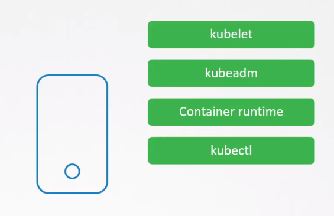

# Remove Obsolete Packages and Services 


- [Remove Unwanted Packages](#remove-unwanted-packages)
- [Remove Unwanted Services](#remove-unwanted-services)


## Remove Unwanted Packages 

Minimize attack surface and potential vulnerabilities by removing unnecessary packages and services from Kubernetes nodes.

**Steps:**

1. **Install only Required Packages**
    Make sure the only required software is installed.

    

2. **Identify Obsolete Packages**
   - Use package management tools (e.g., `apt`, `yum`) to list installed packages.
   - Identify packages that are no longer needed.

3. **Remove Obsolete Packages**
   - Uninstall obsolete packages using package management tools.
     - For Debian/Ubuntu:
       ```bash
       sudo apt-get autoremove
       ```
     - For Red Hat/CentOS:
       ```bash
       sudo yum autoremove
       ```

4. **Audit and Disable Unnecessary Services**
   - Identify running services using tools like `systemctl`.
   - Disable and stop services not required in a Kubernetes environment.
     ```bash
     sudo systemctl stop <service-name>
     sudo systemctl disable <service-name>
     ```

5. **Review and Adjust systemd Units**
   - Review existing systemd unit files (`/etc/systemd/system/`).
   - Disable and mask unnecessary units.
     ```bash
     sudo systemctl mask <unit-name>
     ```

6. **Check for Legacy Configuration Files**
   - Look for obsolete or unused configuration files.
   - Remove or archive unnecessary configurations.

7. **Reboot Nodes (If Needed)**
   - Some changes may require a system reboot to take effect.
   - Plan and coordinate reboots for minimal disruption.


**Caution:**
- Be cautious when removing packages and disabling services; ensure they are genuinely obsolete.
- Document changes and consider testing in a controlled environment before applying to production.
- Regularly review and update the system to maintain security best practices.


## Remove Unwanted Services 

Similar to packages, make sure that only the required services are running in the system.

To list all services installed in the system:

```bash
systemctl list-units --type service      
```

If a service is not needed, stop it and disable.

```bash
systemctl stop <service-name>
systemctl disable <service-name>
```

After stopping, remove it as well.

```bash
apt remove <service-name> 
```


<br>

[Back to first page](../../README.md#kubernetes-security)
