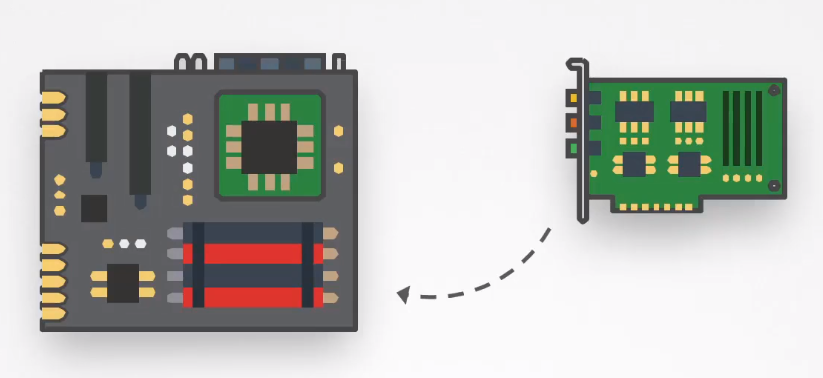

# Restrict Kernel Modules


- [Kernel Modules](#kernel-modules)
- [Restricting Kernel Modules](#restricting-kernel-modules)
- [Disable Loading of USB Storage Modules](#disable-loading-of-usb-storage-modules)
- [Disable Loading of DCCP Module](#disable-loading-of-dccp-module)


## Kernel Modules 

In Linux, the kernel provides the core functionality of the operating system, managing hardware, resources, and providing essential services. However, to keep the kernel itself relatively small and modular, additional functionalities can be added dynamically through kernel modules. 



**Kernel modules** are pieces of code that can be loaded into the running kernel, extending its capabilities without the need to reboot the entire system. 


**Use Cases:**

1. **Hardware Support**
   - Device drivers as modules for supporting various hardware components.

2. **Filesystem Support**
   - Additional filesystem modules for handling different filesystem formats.

3. **Network Protocols**
   - TCP/IP stack components and network protocol modules.

4. **Security Modules**
   - Modules enhancing system security, such as SELinux and AppArmor.

**Security Considerations:**

1. **Unauthorized Modules**
   - Loading of unauthorized or malicious modules can pose security risks.
   - Implement measures to restrict and control module loading.

2. **Regular Updates**
   - Keep modules up to date, especially if they are third-party or not included in the mainline kernel.

3. **Monitoring**
   - Regularly monitor loaded modules for any unexpected changes or unauthorized additions.


**Example Commands:**

- Load a module:
  ```bash
  sudo modprobe <module-name>
  ```

- Unload a module:
  ```bash
  sudo rmmod <module-name>
  ```

- List loaded modules:
  ```bash
  lsmod
  ```

- View module information:
  ```bash
  modinfo <module-name>
  ```


## Restricting Kernel Modules 

Enhance security by controlling and restricting the loading of kernel modules in a Linux system. This helps prevent unauthorized or malicious modules from being loaded, reducing potential attack vectors.

**Methods:**

1. **sysctl Configuration:**
   - Use the `sysctl` command to configure kernel module loading parameters.
   - Edit `/etc/sysctl.conf` or create a new file in `/etc/sysctl.d/` for persistent settings.

        ```bash
        # Disable loading of kernel modules
        kernel.modules_disabled = 1
        ```

        Apply changes:
        
        ```bash
        sudo sysctl -p
        ```


2. **modprobe Configuration:**
   - Configure modprobe, the kernel module loader, to restrict module loading.

        Example modprobe.conf:
        ```bash
        # Restrict loading of USB modules
        install usb-storage /bin/true
        ```

        Apply changes:
        ```bash
        sudo modprobe -r <module-name>
        ```
        
3. **Blacklisting Modules:**
   - Use module blacklisting to prevent specific modules from loading.
   - Create or edit `/etc/modprobe.d/blacklist.conf`.

        Example blacklist.conf:
        ```bash
        # Blacklist a specific module
        blacklist <module-name>
        ```

        Apply changes:
        ```bash
        sudo update-initramfs -u
        ```


        We can also reboot the server and check lsmod again.
        
        ```bash
        shutdown -r now 
        lsmod | grep <module>
        ```

**Caution:**
- Modifying kernel module loading can impact system functionality. Be cautious and understand the implications.
- Regularly review and update module restrictions based on security needs.
- Document changes and ensure proper testing before applying to production systems.

## Disable Loading of USB Storage Modules

1. Edit `/etc/sysctl.conf` or create a new file in `/etc/sysctl.d/`:
   ```bash
   # Disable loading of kernel modules
   kernel.modules_disabled = 1
   ```

   Apply changes:
   ```bash
   sudo sysctl -p
   ```

2. Create or edit `/etc/modprobe.d/blacklist-usb-storage.conf`:
   ```bash
   # Blacklist USB storage modules
   blacklist usb-storage
   ```

   Apply changes:
   ```bash
   sudo update-initramfs -u
   ```

## Disable Loading of DCCP Module   

Another module that we can disable is the Datagram Congestion Control Protocol (DCCP) Module.

```bash
## /etc/modprobe.d/blacklist.conf 
blacklist dccp
```
```bash
shutdown -r now 
lsmod | grep dccp
```


<br>

[Back to first page](../../README.md#kubernetes-security)