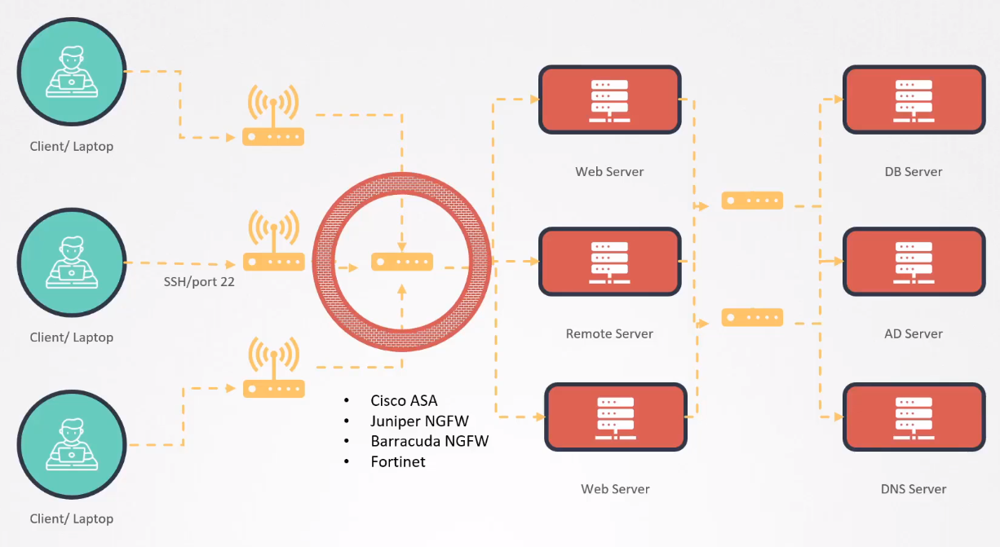
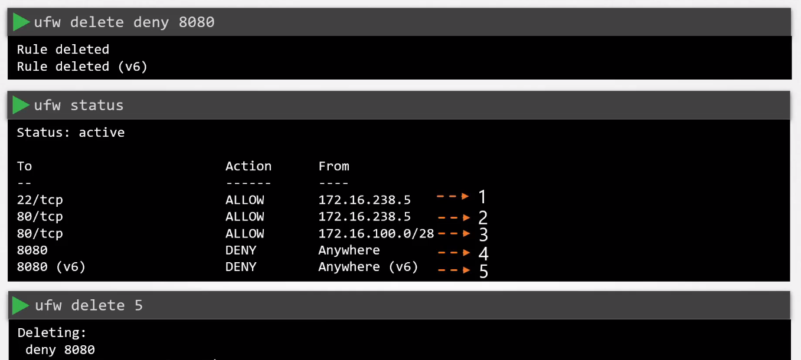

# Restrict Network Access 


- [Network-wide Security](#network-wide-security)
- [Server-level Security](#server-level-security)
- [Uncomplicated Firewall - UFW](#uncomplicated-firewall---ufw)
- [Installing UFW](#installing-ufw)
- [Sample UFW Rules](#sample-ufw-rules)
- [Deleting UFW Rules](#deleting-ufw-rules)


## Network-wide Security 

We can apply network-wide security using external appliances like Cisco, Fortinet, etc. 




## Server-level Security 

As an alternative to network-wide security, we can also apply server-level security using the following:

- iptables 
- ufw

## Uncomplicated Firewall - UFW

UFW, or Uncomplicated Firewall, is a user-friendly command-line interface for managing iptables, the default firewall management tool for Linux systems. 

- Designed to simplify the process of managing firewall rules.
- UFW follows a default-deny policy, all incoming connections are denied by default unless explicitly allowed.
- UFW integrates with applications installed on the system
- UFW supports logging, allowing users to monitor firewall activity and detect potential issues


**Basic UFW Commands:**

- **Enable UFW:**
  ```bash
  sudo ufw enable
  ```

- **Disable UFW:**
  ```bash
  sudo ufw disable
  ```

- **Check Status:**
  ```bash
  sudo ufw status
  ```

- **Allow Traffic to a Specific Port:**
  ```bash
  sudo ufw allow 22/tcp   # Allow SSH traffic
  ```

- **Deny Traffic to a Specific Port:**
  ```bash
  sudo ufw deny 80/tcp   # Deny HTTP traffic
  ```

- **Allow Traffic from Specific IP Address:**
  ```bash
  sudo ufw allow from 192.168.1.2
  ```

- **Delete a Rule:**
  ```bash
  sudo ufw delete allow 80/tcp
  ```


**Usage Examples:**

1. **Allow SSH and deny everything else:**
   ```bash
   sudo ufw default deny incoming
   sudo ufw allow ssh
   ```

2. **Allow HTTP and HTTPS traffic:**
   ```bash
   sudo ufw allow 80/tcp
   sudo ufw allow 443/tcp
   ```

3. **Enable UFW logging:**
   ```bash
   sudo ufw logging on
   ```  

## Installing UFW 

Installing and configuring UFW (Uncomplicated Firewall) is a straightforward process. 

- **1. Check UFW Availability**

    UFW is commonly included in Debian-based Linux distributions, but it's a good idea to check if it's already installed:

    ```bash
    sudo ufw status
    ```

    If UFW is not installed, you'll see a message indicating that UFW is not available. Proceed to the next step to install it.

- **2. Install UFW**

    Install UFW using the package manager for your distribution. For Ubuntu/Debian, you can use `apt`:

    ```bash
    sudo apt update
    sudo apt install ufw
    ```

- **3. Enable UFW**

    After installation, enable UFW:

    ```bash
    sudo ufw enable
    ```

    You will be prompted with a warning that enabling UFW may disrupt existing SSH connections. Confirm the action.

- **4. Check UFW Status**

    Verify the UFW status to ensure it is active and functioning:

    ```bash
    sudo ufw status
    ```

    You should see a message indicating that the firewall is active and has default policies in place.

- **5. Basic UFW Configuration**

    Configure basic UFW rules based on your requirements. For example, to allow SSH (port 22) and HTTP (port 80) traffic:

    ```bash
    sudo ufw allow 22/tcp    # Allow SSH
    sudo ufw allow 80/tcp    # Allow HTTP
    ```

- **6. Enable Logging (Optional)**

    If you want to enable logging for UFW, use the following command:

    ```bash
    sudo ufw logging on
    ```

- **7. Adjust Default Policies (Optional)**

    You can adjust the default policies for incoming and outgoing traffic. For example, to set the default policy to deny incoming traffic:

    ```bash
    sudo ufw default allow outgoing
    sudo ufw default deny incoming
    ```

- **8. Verify UFW Configuration**

    Verify the UFW configuration to ensure all rules are set as expected:

    ```bash
    sudo ufw status
    ```

- **9. Restart Services (If Necessary)**

    If you adjusted default policies or made significant changes, you may need to restart services affected by the firewall changes.

- **10. Additional Configuration**

    Continue configuring UFW based on your specific use case. Add rules for other services, adjust access based on IP addresses, etc.

## Sample UFW Rules 

Default rules:

```bash
sudo ufw default allow outgoing
sudo ufw default deny incoming
```

Allow inbound connections to port 22 from a specific source IP 10.1.2.3.

```bash
ufw allow fromn 10.1.2.3 to any port 22 proto tcp  
```

Allow inbound connections to port 80 from a specific source CIDR 10.1.2.3/24.

```bash
ufw allow fromn 10.1.2.3/24 to any port 80 proto tcp  
```

Deny port 8080.

```bash
ufw deny 8080 
```

## Deleting UFW Rules 

We can use the **delete** command to remove a rule, or we can also specify the rule number.




<br>

[Back to first page](../../README.md#kubernetes-security)