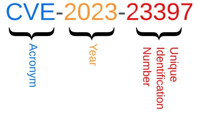
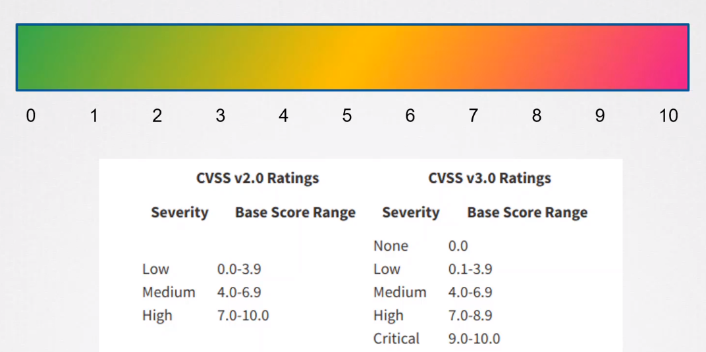
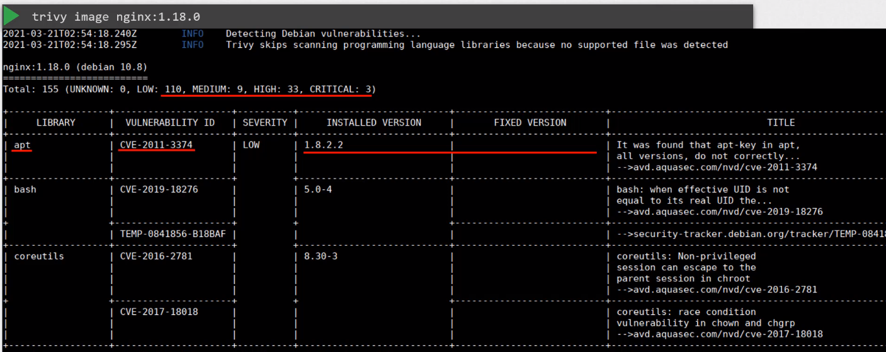

# Scan images for known vulnerabilities


- [Vulnerability](#vulnerability)
- [CVE](#cve)
    - [Identifier](#identifier)
    - [Severity Rating](#severity-rating)
    - [Components of CVSS Common Vulnerability Scoring System](#components-of-cvss-common-vulnerability-scoring-system)
- [CVE Scanners](#cve-scanners)
- [Trivy](#trivy)
    - [Running Trivy](#running-trivy)
- [Best Practices](#best-practices)


## Vulnerability 

A vulnerability is a specific weakness or flaw within a software, hardware, or network system that can be exploited by an attacker to compromise its security. Vulnerabilities may arise from a range of sources, including but not limited to

- Human Error

- Design Flaws

- Configuration Issues

- Third-party Components

- Unpatched Software

- Zero-day Vulnerabilities

## CVE 

CVE stands for "Common Vulnerabilities and Exposures." It is a standardized identifier for known vulnerabilities and security exposures in software and hardware products. CVE provides a standardized naming convention for identifying and referencing security vulnerabilities.

### Identifier 

A CVE Identifier consists of three parts:

- **CVE**: The acronym itself, which stands for "Common Vulnerabilities and Exposures."

- **YEAR**: A four-digit year, representing the year the CVE was assigned or when the vulnerability was made public.

- **NUMBER**: A series of digits, typically four to six, that uniquely identifies the specific vulnerability within the given year.


<p align=center>

</p>


### Severity Rating 

Each CVE gets a severity rating. CVE Severity Ratings provide a standardized way to convey the potential impact and risk associated with a specific vulnerability. The severity rating helps organizations prioritize their efforts in addressing security vulnerabilities based on the potential threat level. 


<p align=center>

</p>


### Components of CVSS (Common Vulnerability Scoring System)

The Common Vulnerability Scoring System (CVSS) is commonly used to calculate the severity rating of a CVE entry. 

1. **Base Score**

    - The Base Score is calculated using a formula that takes into account various factors related to the vulnerability. 
    - These factors include the impact on confidentiality, integrity, and availability, as well as other characteristics like exploitability and complexity.

2. **Vector String**

    - The Vector String is a concise representation of the various metrics used in calculating the Base Score. 
    - It includes information about the impact on confidentiality, integrity, and availability, as well as other factors such as exploitability and scope.

## CVE Scanners 

CVE Scanners, specifically container scanners look for vulnerabilities in thee execution environment, including applications running in the containers. Note that the more packages you have in your system, the more it is likely to have larger number of vulnerabilities.

Here is a list of popular tools for CVE scanning in container and Kubernetes environments:

1. **Trivy**
   - Trivy is an open-source vulnerability scanner for containers and other artifacts, such as operating system packages. It supports multiple image formats and can be integrated into CI/CD pipelines.
   - **GitHub Repository:** [aquasecurity/trivy](https://github.com/aquasecurity/trivy)

2. **Clair**
   - Clair is an open-source vulnerability scanner for containers. It is designed to integrate with container registries and provides detailed reports on vulnerabilities present in container images.
   - **GitHub Repository:** [quay/clair](https://github.com/quay/clair)

3. **Kube-bench**
   - Kube-bench is a tool that checks whether Kubernetes is deployed securely by running the checks documented in the CIS Kubernetes Benchmark. It includes checks for various security-related configurations and vulnerabilities.
   - **GitHub Repository:** [aquasecurity/kube-bench](https://github.com/aquasecurity/kube-bench)

4. **kube-hunter**
   - kube-hunter is a security tool for Kubernetes that actively scans for security issues and vulnerabilities in the cluster. It is designed to identify and assess potential attack vectors.
   - **GitHub Repository:** [aquasecurity/kube-hunter](https://github.com/aquasecurity/kube-hunter)

5. **Kubeaudit**
   - Kubeaudit is a tool for scanning Kubernetes configurations and manifests for security vulnerabilities and best practices. It focuses on identifying misconfigurations in Kubernetes deployments.
   - **GitHub Repository:** [kubeaudit/kubeaudit](https://github.com/kubeaudit/kubeaudit)

6. **Tranchess**
   - Tranchess is a tool that focuses on container scanning for vulnerabilities, misconfigurations, and license compliance. It provides insights into the security posture of containerized applications.
   - **GitHub Repository:** [tranchess/tranchess](https://github.com/tranchess/tranchess)

7. **Kritis**
   - Kritis is a policy engine for Kubernetes that integrates with container image signing. It allows you to enforce policies based on image signatures and ensures that only signed images are deployed.
   - **GitHub Repository:** [kritis-compliance/kritis](https://github.com/kritis-compliance/kritis)

8. **Gatekeeper (OPA Gatekeeper)**
   - Gatekeeper is an Open Policy Agent (OPA) based policy engine for Kubernetes. It enables the enforcement of policies on resource configurations, ensuring compliance with security and operational requirements.
   - **GitHub Repository:** [open-policy-agent/gatekeeper](https://github.com/open-policy-agent/gatekeeper)

When using these tools, it's important to integrate them into your CI/CD pipelines or use them as part of your regular security scanning processes. Regularly scanning and addressing vulnerabilities in container images and Kubernetes configurations is crucial for maintaining a secure and resilient environment.

## Trivy 

Trivy is a comprehensive and versatile security scanner. Trivy has scanners that look for security issues, and targets where it can find those issues.

Targets (what Trivy can scan):

- Container Image
- Filesystem
- Git Repository (remote)
- Virtual Machine Image
- Kubernetes
- AWS

Scanners (what Trivy can find there):

- OS packages and software dependencies in use (SBOM)
- Known vulnerabilities (CVEs)
- IaC issues and misconfigurations
- Sensitive information and secrets
- Software licenses

To learn more, check out the [official Github repository.](https://github.com/aquasecurity/trivy) 

### Running Trivy

To use Trivy to scan an image:

```bash
trivy image <image-name> 
```




We can also pass other flags to filter the severities:

```bash
trivy image --severity CRITICAL nginx:1.18.0 
trivy image --severity CRITICAL,HIGH nginx:1.18.0
trivy image --ignore-unfixed nginx:1.18.0
```

We can also scan images that are in archive format:

```bash
docker save nginx:1.18.0 > nginx.tar 
trivy image --input archive.tar 
```

## Best Practices 

- Continuously rescan images 
- Integrate scanning into deployments using Kubernetes Admission Controllers 
- Have your own repository with pre-scanned images ready to go 
- Integrate scanning into your CI/CD pipeline 


<br>

[Back to first page](../../README.md#kubernetes-security)
