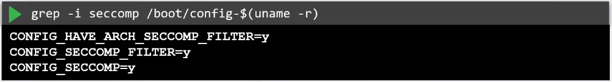
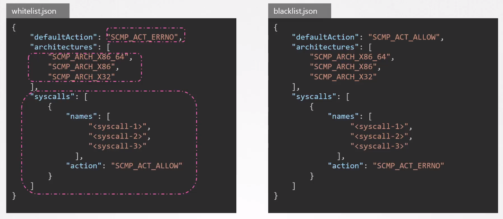
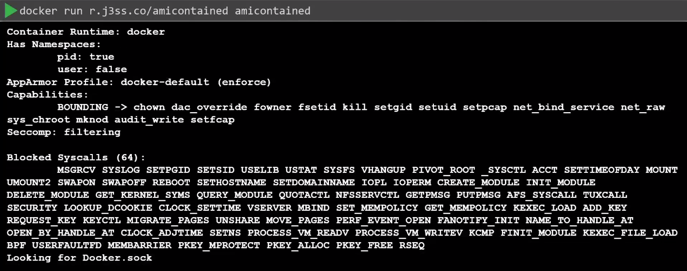
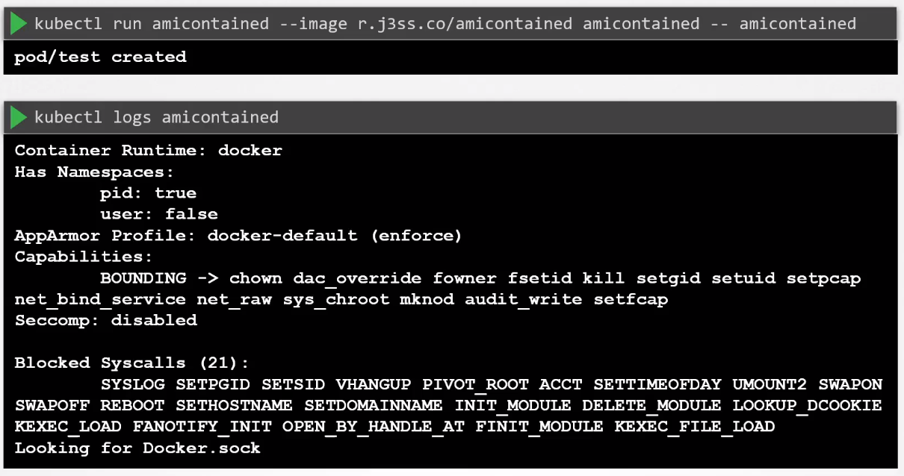
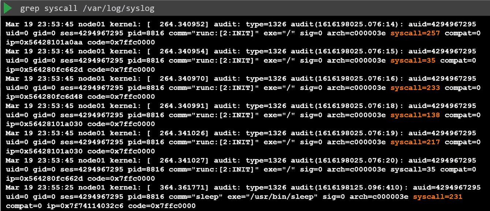
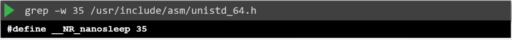
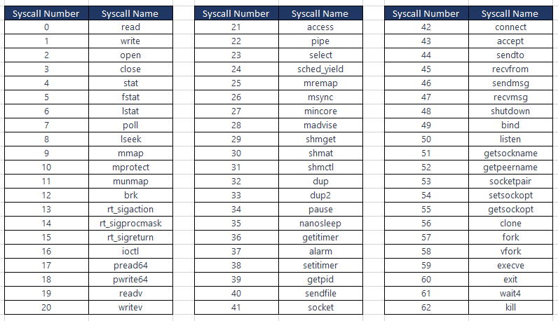
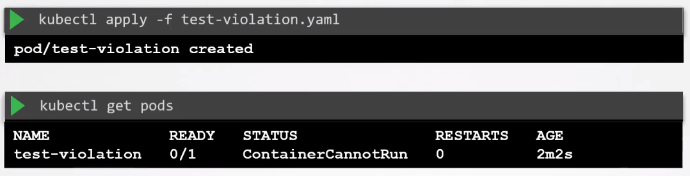

# Seccomp 

- [Seccomp in Docker](#seccomp-in-docker)
    - [Built-in Seccomp Filters on Docker](#built-in-seccomp-filters-on-docker)
    - [Seccomp Modes](#seccomp-modes)
        - [Filter Mode](#filter-mode)
        - [User Notification Mode](#user-notification-mode)
    - [Seccomp Profiles](#seccomp-profiles)
    - [Specifying a Custom Seccomp Profile](#specifying-a-custom-seccomp-profile)
    - [Disable Seccomp when Running Container](#disable-seccomp-when-running-container)
- [Seccomp in Kubernetes](#seccomp-in-kubernetes)
- [Using Custom Seccomp Profile](#using-custom-seccomp-profile)
- [Reject all syscalls made by the container](#reject-all-syscalls-made-by-the-container)


## Seccomp in Docker

Seccomp (Secure Computing Mode) is a Linux kernel feature that allows you to restrict the system calls available to a process. It provides a way to create a secure execution environment by limiting the set of allowed system calls, reducing the attack surface of a program.

Simply put, we can limit the syscalls that programs can use.

To check if seccomp is supported by the Kernel, check boot config file.




### Built-in Seccomp Filters on Docker

Docker containers have a builtin Seccomp fitler that is used when a container is created, provided that the host Kernel has Seccomp enabled. 

Below is a snippet of the full Seccomp profile. The complete profile includes a more extensive list of allowed syscalls and actions.

```json
{
  "defaultAction": "SCMP_ACT_ALLOW",
  "architectures": [
    "amd64",
    "x86_64"
  ],
  "syscalls": [
    {
      "name": "accept4",
      "action": "SCMP_ACT_ALLOW"
    },
    {
      "name": "access",
      "action": "SCMP_ACT_ALLOW"
    },
    {
      "name": "adjtimex",
      "action": "SCMP_ACT_ALLOW"
    },
    // ... additional syscalls ...
  ]
}
```


### Seccomp Modes 

Seccomp (Secure Computing Mode) operates in these modes:

- "0" - Disabled 
- "1" - Filter Mode
- "2" - Notification Mode 

#### Filter Mode

In filter mode, Seccomp allows or denies system calls based on a predefined filter set by the process.

- The filter is typically a set of rules specifying which system calls are permitted and which are denied.
- If a process attempts to make a system call that is not allowed by the filter, the action specified in the filter (such as allowing, denying, or notifying the calling process) is taken.

Example of a Seccomp Filter in JSON format:

```bash
{
  "defaultAction": "SCMP_ACT_ALLOW",
  "architectures": [ "amd64" ],
  "syscalls": [
    { "name": "read" },
    { "name": "write" },
    { "name": "exit" }
  ]
}
```

#### User Notification Mode

User notification mode allows a process to receive a notification (signal) when a specified system call is about to be executed.
- The process can decide how to handle the notification, either allowing the system call to proceed or terminating the process.
- This mode is useful for processes that want to monitor or control certain system calls.

Example of Using User Notification Mode in C:

```C
#include <linux/seccomp.h>
#include <stddef.h>
#include <stdio.h>
#include <sys/prctl.h>

int main() {
    prctl(PR_SET_SECCOMP, SECCOMP_MODE_FILTER, NULL);

    // Specify a system call for notification
    prctl(PR_SET_SECCOMP, SECCOMP_MODE_NOTIFY, SECCOMP_RET_TRAP);

    // ... Your application code ...

    return 0;
}
```

### Seccomp Profiles 

Seccomp profiles define the set of system calls allowed for a process. 
- Profiles can be strict, allowing only a predefined set of syscalls.
- They can also use a filter expression.
- Can be created manually or generated using tools like **seccomp-bpf** or **Docker** 

A Seccomp Profile consist of objects:

- **Default Action** - specifies actions for syscalls not defined in the syscall array.

- **Architecture** - defines which system the profile can be used for 

- **Syscalls Array** - set of syscall names and associated actions

Here's an example of a simple seccomp profile in JSON format that allows only a few basic syscalls:

```json
{
  "defaultAction": "SCMP_ACT_ALLOW",
  "architectures": [ "amd64" ],
  "syscalls": [
    { "name": "read" },
    { "name": "write" },
    { "name": "exit" },
    { "name": "exit_group" }
  ]
}
```

Note that there are two types of profiles:

- Whitelist - Allows defined syscalls, deny the rest .
- Blacklist - Rejects defined syscalls, allows the rest.

Below is an example:




### Specifying a Custom Seccomp Profile 

We can create a custom Seccomp profile and use it when running containers:

```json 
## custom.json 
{
  "defaultAction": "SCMP_ACT_ALLOW",
  "architectures": ["amd64"],
  "syscalls": [
    { "name": "read", "action": "SCMP_ACT_ALLOW" },
    { "name": "write", "action": "SCMP_ACT_ALLOW" },
    { "name": "exit", "action": "SCMP_ACT_ALLOW" },
    { "name": "exit_group", "action": "SCMP_ACT_ALLOW" },
    { "name": "open", "action": "SCMP_ACT_ALLOW" },
    { "name": "close", "action": "SCMP_ACT_ALLOW" },
    { "name": "fstat", "action": "SCMP_ACT_ALLOW" },
    { "name": "arch_prctl", "action": "SCMP_ACT_ALLOW" },
    { "name": "brk", "action": "SCMP_ACT_ALLOW" },
    { "name": "munmap", "action": "SCMP_ACT_ALLOW" },
    { "name": "mmap", "action": "SCMP_ACT_ALLOW" }
    // Add more syscalls as needed
  ]
}
```

To use the seccomp profile, pass it when running th container. 

```bash
docker run \
--security-opt seccomp=/path/to/custom.json \
-it ubuntu:latest
```

### Disable Seccomp when Running Container

We can also tell the Docker container to completely ignore any seccomp profile completely:

```bash
docker run \
--security-opt seccomp=unconfined   \
-it ubuntu:latest
```

By doing this, the container should be able to use all avaiable syscalls from within the container. 

This is **NOT RECOMMENDED.**
 
## Seccomp in Kubernetes 

Below is an example of a Docker container. This container displays the runtime used and the list of blocked syscalls.



Now, if we try to run a pod using the image, we'll see a different output.



From the pod logs above, we see that there's lesser blocked syscalls, and the Seccomp is set to disabled. This is because Kubernetes doesn't implement Seccomp by default.

To implement Seccomp in the Pod, specify it as a Security Context in the Pod definition file.

```yaml
### pod.yaml 
apiVersion: v1
kind: Pod
metadata:
  name: seccomp-pod
spec:
  securityContext:
    seccompProfile:
      tye: RuntimeDefault
  containers:
  - name: my-container
    image: nginx:latest
    securityContext:
      allowPrivilegeEscalation: false
  # Add more containers or configurations if needed
```

## Using Custom Seccomp Profile 

If we want to use a custom Seccomp profile, we could also specify it in the Pod definition file. 

But first, ensure that the <code>/var/lib/kubelet/seccomp/profiles/</code> directory is created. Inside this directory, create the custom.json file.

Create the custom json file.

```bash
## audit.json 
{
    "defaultAction": "SCMP_ACT_LOG"
}
```

```yaml
apiVersion: v1
kind: Pod
metadata:
  name: seccomp-pod
spec:
  securityContext:
    seccompProfile:
      type: Localhost
      localhostProfile: profiles/audit.json
  containers:
  - name: my-container
    image: nginx:latest
    securityContext:
      allowPrivilegeEscalation: false    

  # Add more containers or configurations if needed
```

Once pod is created, syslog calls made by the container in the pod will be logged in the /var/log/syslog file. 




From the syslog output above, we could see the syslog call number made by the container in the pod. Note that this number are mapped to specific syscall names, which we can check in the /usr/include/asm/unistd_64.h



Below are just some of the syscall numbers and their corresponding syscall names.




## Reject all syscalls made by the container

We can create another custom profile which will reject all syscalls made by the container. Create the violation.json.

```bash
## /var/lib/kubelet/seccomp/profiles/violation.json 
{
    "defaultAction": "SCMP_ACt_ERRNO"
}
```

We can then specify this profile in the Pod definition file.

```yaml
apiVersion: v1
kind: Pod
metadata:
  name: test-violation
spec:
  restartPolicy: Never
  securityContext:
    seccompProfile:
      type: Localhost
      localhostProfile: profiles/violation.json
  containers:
  - name: my-container
    image: nginx:latest
    securityContext:
      allowPrivilegeEscalation: false    
```

Once we apply the manifest and check the pod, we'll see that the pod has a "ContainerCannotRun" status.




<br>

[Back to first page](../../README.md#kubernetes-security)
