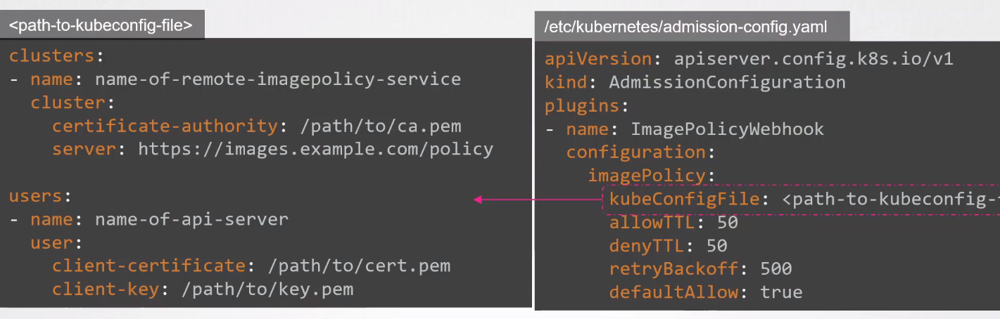
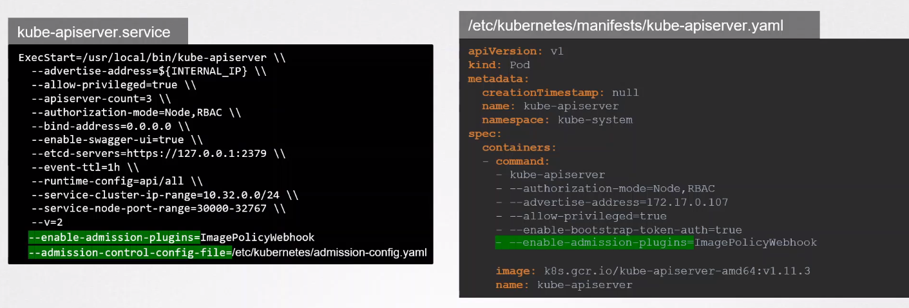

# Whitelist Allowed Registries


We can utilize various options to prevent users from using images from unwanted registries. 

- Deploy our own Admission Webhook Server which checks the image name.
- Deploy an OPA service and a policy that restricts the trusted registries we can use. 
- Leverage the built-in admission controller called **Image Policy Webhook**.

For the Image Policy Webhook, we first need to create the config file.

```yaml
## /etc/kubernetes/admission-config.yaml 

apiVersion: apiserver.config.k8s.io/v1
kind: AdmisisionConfiguration
plugins:
- name: ImagePolicyWebhook 
  configuration:
    imagePolicy:
      kubeConfigFile: /path/tp/config/file 
      allowTTL: 50 
      denyTTL: 50 
      retryBackoff: 500 
      defaultAllow: true 
```

We can configure the Admission Webhook Server in the kubeconfig file:



To enable the admission controller, add it in the kube-apiserver files.




<br>

[Back to first page](../../README.md#kubernetes-security)
