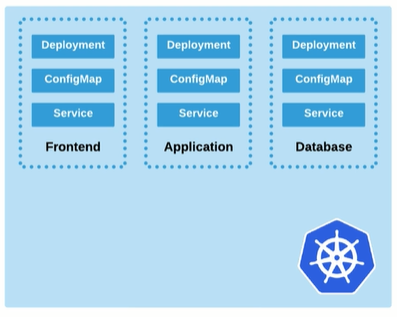
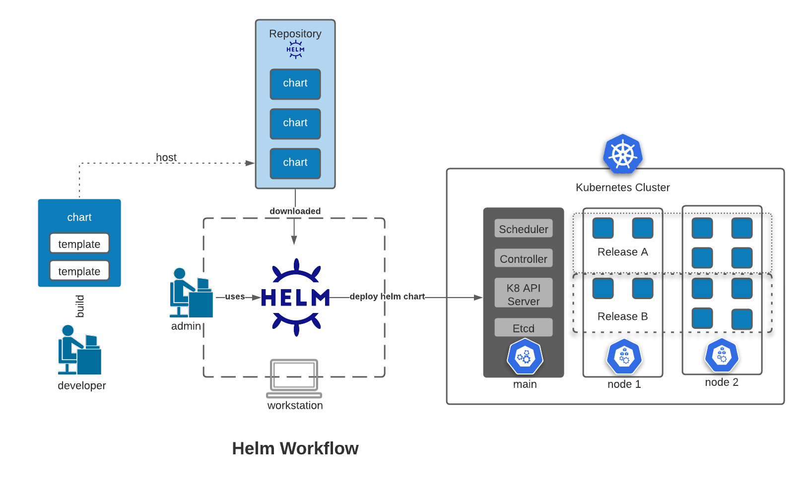

# Helm 

- [Pre-requisites](#pre-requisites)
- [Helm](#helm)
- [Concepts](#concepts)
- [Helm 2 vs. Helm 3](#helm-2-vs-helm-3)
- [Architecture](#architecture)
- [Setting up Helm](#setting-up-helm)
    - [Install Helm](#install-helm)
    - [Initialize a Repository](#initialize-a-repository)
    - [Deploy a Sample Chart](#deploy-a-sample-chart)
    - [Delete the Chart](#delete-the-chart)
- [Next Steps](#next-steps)

---

## Pre-requisites 

- A basic understanding of Kubernetes
- Experience in deploying Kubernetes resources sucj as Pods, Deployments, Services, etc.

## Helm 

**Helm** is the Kubernetes package manager which helps package installation in Kubernetes and manages package dependencies. A typical 3-tier architecture usually looks like the diagram below, with each tier consiting of a **Deployment, ConfigMap,** and a **Service.**

<p align=center>

</p>

Before Helm, each of this components will have manifests that needs to be ran separately.

```bash
kubectl apply -f frontend-deployment.yml 
kubectl apply -f frontend-configmap.yml 
kubectl apply -f frontend-service.yml 

kubectl apply -f app-deployment.yml 
kubectl apply -f app-configmap.yml 
kubectl apply -f app-service.yml 

kubectl apply -f data-deployment.yml 
kubectl apply -f data-configmap.yml 
kubectl apply -f data-service/yml
```

This is tedious deployment and raises some important questions:

- How to paramaeterize? 
- How to add in application lifecycle hooks?
- How to manage versions of related resources?

This is where **Helm** comes into play. Helms uses **charts** which is similar to a Linux package that contains all the related parts of a specific cluster deployment. Helm can therefore be used to deploy multiple resources in a single command.

Benefits of Helm include: 
- Helm abstracts away complexity by being able to ran everything in one go 
- history changes are versioned 
- package or charts are easy to create once you're done with the build
- charts can be hosts in a repository and be shared 

To learn more, visit the official [Helm website.](https://helm.sh/)

## Concepts 

- **Chart** - contains all the dependencies to deploy a Kubernetes cluster
- **Templates** - makes up a chart
- **Config** - optional configs to override default configs
- **Release** - a running instance of a chart
- **Chart Repository** - centralized location for storing charts

  

## Helm 2 vs. Helm 3 

There is a new Helm 3 version, which differs with Helm 2.

- Helm 2 architecture is different
- Helm 2 command line and chart structure might differ 
- Helm 2 charts are compatible with Helm 3
- Helm 2 uses a cluster component called "Tiller" which acts as authentication
- Helm 3 client communicates directly with the K8S API server
- Helm 3 authenticate using the same credentials in .kube/config file

## Architecture 

- **Helm Client** - CLI client for managing repositories, releases, and interfacing with Helm library

- **Helm Library** - responsible for Helm operations towards the API Server.

## Setting up Helm 

Helm can be installed either from a source, or from pre-built binary releases. The steps for setting up Helm.

- [Install Helm](https://helm.sh/docs/intro/install/) 

- [Initialize a Helm Chart Repository](https://helm.sh/docs/intro/quickstart/#initialize-a-helm-chart-repository)


### Install Helm 

If you're using a Windows Machine with WSL2 that's running Ubuntu, you can simply run these commands:

```bash
$ curl -fsSL -o get_helm.sh https://raw.githubusercontent.com/helm/helm/main/scripts/get-helm-3

$ chmod 700 get_helm.sh

$ ./get_helm.sh
```

For auto-completion, consider running this in the command line.

```bash
source <(helm completion bash)
echo "source <(helm completion bash)" >> ~/.bash_profile
```

### Initialize a Repository

Next, add a repository. Note that starting with Helm v3, there are no repositories installed by default. We can also add other repositories.

In the command below, we named the repo "stable".

```bash
$ helm repo add stable https://charts.helm.sh/stable 
```

Let's try to add another repo and give it the name "bitnami"

```bash
$ helm repo add bitnami https://charts.bitnami.com/bitnami 
```

To check the repositories added,

```bash
$ helm repo list 
```

It's best practice to fetch the latest updates from the repo.

```bash
$ helm repo update 
```

We can take a look at all the charts contained in the repository.

```bash
$ helm search repo 
```

### Deploy a Sample Chart 

Let's try to install a redis chart and name it "my-test-redis1

```bash
$ helm install my-test-redis1 bitnami/redis 
```

Verify that the pods are running.

```bash
$ kubectl get pods 
```

To get a list of deployed charts,

```bash
$ helm ls 
```

### Delete the Chart 

Run the uninstall command and specify the chart name.

```bash
$ helm uninstall my-test-1 
```

## Next Steps 

- See [Helm Chart and Templates](./032-Helm-Chart-and-Templates.md)
- See [Helm Commands](./031-Helm-commands.md) 
