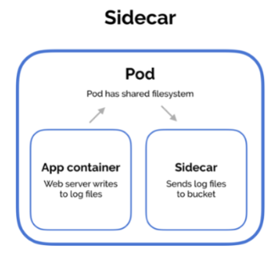
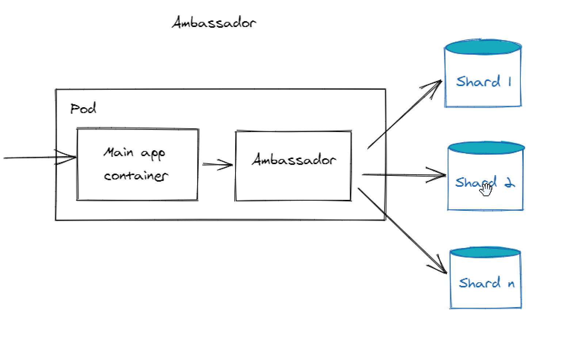
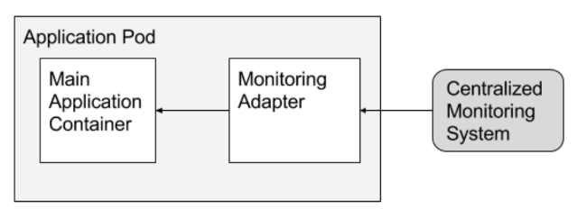

# Kubernetes Patterns for Application Developers

Learning Kubernetes patterns has became more essential as more organization shifts to production-ready containers, especially for application developers. We'll explore the following Kubernetes patterns:


- [Multi-container Patterns](#multi-container-patterns)
    - [Sidecar-container Pattern](#sidecar-container-pattern)
    - [Ambassador Pattern](#ambassador-pattern)
    - [Adapter Pattern](#adapter-pattern)
- [Networking](#networking)
    - [IP-per-Pod](#ip-per-pod)
    - [Services](#services)
    - [Network Policies](#network-policies)
    - [Isolated vs. Non-Isolated Pods](#isolated-vs-non-isolated-pods)
- [Service Accounts](#service-accounts)
- [Leveraging kubectl](#leveraging-kubectl)


## Multi-container Patterns 

**Multiple containers in a Pod**

Pods are an extra level of abstraction above containers. Pods allow us to specify additional information for the container as well as simplifying the usage of different underlying container runtimes (e.g. docker, rocket). To learn more about Pods, check out the [Pods page](./009-Pods.md).

We can also have tightly coupled containers co-located in the same Pod and they can be managed as a single unit, allowing for better separation of concerns and container image reusability. All of these can be achieved through the following patterns.


### Sidecar-container Pattern

Sidecar pattern uses a helper container which is used to extend the functionality of a primary container. The benefits of sidecar pattern is that it helps with isolating failures. If a sidecar like a logging agent fails, the primary container can still work. Common examples include:

- shipping logs to a central aggregation 
- syncing files with external systems

As an example, we could have a primary container that writes to log files. We can extend the functionality of this container by using a sidecar container which sends the log files to a central S3 Bucket for collection. 

<p align=center>

</p>

<small><center>Photo courtesy of [Multi-Container Pods](https://ansilh.com/08-multi_container_pod/04-pod-patterns/) 
</center></small>

### Ambassador Pattern

The ambassador pattern can be used to proxy connections from a primary container to the outside world. The primary container only needs to consider connecting to localhost, while the ambassador controls proxying the connections to different environments. This is because containers in the same pod share the same network space, and can communicate with each other over localhost. Common examples include:

- proxying connections to databases
- proxying connections to different environments
- multiple applications written in different languages

As an example, we could have:
- a web app (primary container), and 
- a database proxy container 

The web app handles requests from clients and when the data needs to be updated the web app sends a request over local host, where it is received by the database proxy. 

<p align=center>

</p>

<small><center>Photo courtesy of [Kubernetes multi-container patterns](https://raghavramesh.github.io/posts/kubernetes-multi-container-patterns/)
</center></small>

The database proxy then forwards the request to the correct database backend. The database could have a single endpoint, or the database could be shared across multiple database instances. The ambassador can encapsulate the logic for sharding the requests in the latter case. Meanwhile, the web app is free from any of the associated complexity.

### Adapter Pattern 

The adapter pattern provides a standardized interface of an application across multiple Pods. The adaptor pattern is the opposite of the ambassador pattern, in that the ambassador presents a simplified view to the primary container while the adaptor pattern presents a simplified view of the application to the outside world. Common examples include:

- normalizing output logs and monitoring data 
- legacy applications that write metrics in non-standard form
- integrating with third-party software

As an example, we could have an application that needs to transform heterogenous monitoring data into a single unified representation. We can refactor the application and develop the needed feature, or we can make use of an adapter container whose sole purpose is the transformation.

<p align=center>

</p>

<small><center>Photo courtesy of [Adapter containers](https://kubernetes.io/blog/2015/06/the-distributed-system-toolkit-patterns/#example-3-adapter-containers)
</center></small>


## Networking 

### IP-per-Pod 

As an application developer, learning the networking concepts of Kubernetes and how they can be used to access applications running in a cluster, starting with **IP-per-Pod**.

- this means each Pod is assigned with one unique IP
- containers in the same Pod share the same IP address 
- containers in the same Pod comunicate with each other's ports over localhost
  
Pods are ephemeral, which means they will be killed and everytime they are restarted, they will have a different IP. Pods may also have multiple replicas spread over many nodes.

### Services 

Kubernetes Services can help in maintaining a list of endpoints as Pods are added and removed from the set.

- Service sends requests to any of the Pods 
- clients of the Service just needs to know the Service, not the Pods 
- Pods can discover Services using environment variables or DNS add-on  
- IP given to a Service is called Cluster IP

Below are the types of Kubernetes Services available:

- **Cluster IP** - IP given to a service, accessible only inside the cluster
- **Node Port** - for opening port on each node for Service access 
- **Loadbalancer** - exposes the service externally     
- **External Name** - Access services outside the cluster using DNS CNAME records


### Network Policies 

Network Policies are similar to security groups for virtual machines because they are used for controlling access.
 
- policies can be used to control access to a group of Pods in a namespace
- cluster's network plugin must support network policies

### Isolated vs. Non-Isolated Pods 

The default behavior of a Pod is to allow traffic from any source, making it a non-isolated Pod. Once a pod is selected by a network policy it becomes isolated. The pods are selected using labels, which are the core grouping primitive in Kubernetes.

## Service Accounts 

Service accounts provide an identity to pods running in a cluster. Unlike user accounts whicha re managed by an external entity and are intended for humans, service accounts are made to be used by Pods.

- used for authenticating the Pods
- compatible with RBAC (role-based access control)
- useful for storing image pull secrets when working with private container image registries

Pods have a token that is automatically mounted on a volume that can be used to authenticate requests. Every namespace also has a **default** service account token which has no additional permissions than an unauthenticated user.

To learn more, check out the [Service Accounts page.](https://kubernetes.io/docs/reference/access-authn-authz/service-accounts-admin/)

## Leveraging kubectl 

In addition to the other patterns mentioned above, it is also beneficial to not just familiarize ourself with kubectl but to leverage its functionalities:

- shell completions helps in command completion 
- *get* tricks for filtering outputs 
- generating manifest files for resources 

To enable the command completion for kubectl:

```bash
suorce <(kubectl completion bash)>  
```

If you have multiple manifest files that you need to run, you can simply put them in one directory:

```bash
$ tree my-files 
├── web.yml
├── db.yml
└── cache.yml
```

Then run all files in one go by specifying the directory.

```bash
kubectl apply -f my-files 
```

If you want to create the manifest of a resource, let's say a namespace, on the command line, you can simply do all it by forwarding the output of the *--dry-run* command to a file:

```bash
kubectl create namespace my-namespace -o yaml --dry-run > myname.yaml 
```

Then apply the YAML file:

```bash
kubectl apply -f myname.yml  
```

In addition to these, another extremely important trick is:

```bash
kubectl api-resources  
```

This command display all the available api-resources and their shortnames. Some resources have long names so knowing the shorthand names for the resource can save some time in typing.


## Resources 

- [Kubernetes Patterns for Application Developers](https://cloudacademy.com/course/kubernetes-patterns-for-application-developers/introduction/)


<br>

[Back to first page](../../README.md#kubernetes)
