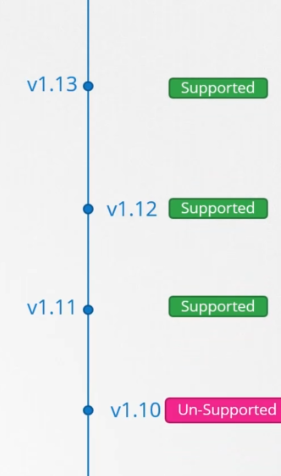

# Cluster Maintenance 


- [OS Upgrade](#os-upgrade)
- [Kubernetes Software Versions](#kubernetes-software-versions)
- [Upgrading the Cluster](#upgrading-the-cluster)
- [Backup and Restore](#backup-and-restore)


## OS Upgrade 

When one of the node goes down for a short time and immediately came back, the kubelet process starts and the Pods come back online. If the node is down for more than 5 mins, the Pods are terminated from that node. 

If the Pod is a part of a ReplicaSet, then the Pod are recreated on the next available node.

For maintenance purposes, we can purpose;y drain the nodes so that the Pods are gracefully terminated and scheduled on the next available node before the main node goes down.

```bash
kubectl drain node-1  
```

To mark a node be "unscheduleable", we need to cordon it. Unlike drain, cordoning doesn't terminate any running Pods. it just ensures that no new Pods will be scheduled onto the marked node.

```bash
kubectl cordon node-1 
```

When the node is brought up again, it still won't serve any of the Pods. We need to uncordon it first. Note that the Pods running on the other nodes will not automatically move to the new node. However, new Pods may be schedule onto the new node.

```bash
kubectl uncordon node-1 
```


## Kubernetes Software Versions

We can see the Kubernetes version when we retrieve the nodes:

```bash
$ kubectl get nodes

NAME      STATUS   ROLES    AGE     VERSION
master    Ready    <none>   7h21m   v1.11.3
worker1   Ready    <none>   7h21m   v1.11.3
worker2   Ready    <none>   7h21m   v1.11.3 
```


The version number:

  


Note that Kubernetes only supports the three latest versions.

<p align=center>

</p>


## Upgrading the Cluster

For managed Kubernetes clusters, they can be updated through the Management Console provider. 

For Kubernetes cluster which are created through kubeadm, upgrading them involves two steps:

1. Upgrade the master node
2. Upgrade the worker node

The worker nodes can be upgraded through:

- **All at once**, which means the entire cluster is down and unable to serve any request.

- **One node at a time**, which allows the workload to be moved to the other available nodes while the first node is being upgraded.

- **Add new nodes with the new software versions**, which moves the workload to the new nodes and the remove the old node.

To see a cluster upgrade in action, check out this [lab](../../Lab21_Backup_Restore_and_Upgrade_a_Kubernetes_Cluster/README.md)

## Backup and Restore

#### Resource Configs

To quickly backup all the resource configs, we can retrieve all the resources in all namespaces and forward their YAML output to a file.

```bash
kubectl get all --all-namespaces -o yaml > all-resources.yml 
```

Another way is to ensure that all the manifests are safely stored in a Git repository.

#### etcd

To backup the etcd server, we can backup the data directory:

```bash
/var/lib/etcd  
```

We can also make use of a built-in snapshot solution called **etcdctl** which will create snapshot file. 

```bash
ETCDCTL_API=3 etcdctl \
--cacert=/etc/kubernetes/pki/etcd/ca.crt \
--cert=/etc/kubernetes/pki/etcd/peer.crt \
--key=/etc/kubernetes/pki/etcd/peer.key \
snapshot save /snapshots/backup.db 
```

Note that the etdctl command requires the following to encrypt the etcd traffic:

- certificate authority certificate
- a client key
- a client certificate 

To restore the etcd server from the snapshot:

```bash
ETCDCTL_API=3 etcdctl \
snapshot restore  /snapshots/backup.db \
    --data-dir /var/lib/etcd-from-backup 
    --initial-cluster master-1=https://192.168.3.10:2380  \
    --initial-cluster-token etcd-cluster-1 \
    --initial-advertise-peer-urls https://${INTERNAL_IP}:2380
```

We can also use another Docker -compatible CLI for containerd called **nerdctl**

```bash
sudo nerdctl run --rm \
    -v '/snapshots:/snapshots' \
    -v '/var/lib/etcd:/var/lib/etcd' \
    -e ETCDCTL_API=3 \
    'k8s.gcr.io/etcd:3.5.3-0' \
    /bin/sh -c "etcdctl snapshot restore --data-dir /var/lib/etcd /snapshots/backup.db"
```

Make sure to reload the daemon and restart etcd.

```bash
systemctl daemon-reload
systemctl restart etcd 
```

To see a backup and restore in action, check out this [lab](../../Lab21_Backup_Restore_and_Upgrade_a_Kubernetes_Cluster/README.md)
