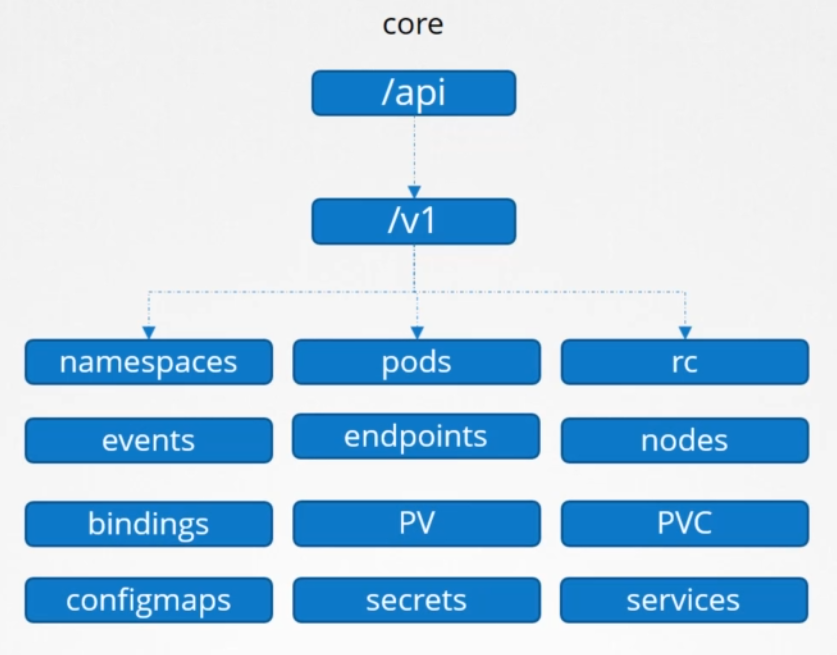
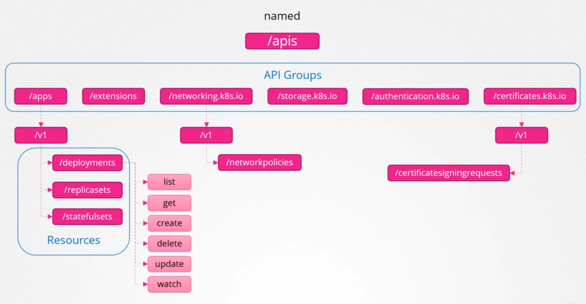

# Kubernetes API

- [Kubernetes API Server](#kubernetes-api-server)
- [Kubernetes API](#kubernetes-api)
- [API Resources](#api-resources)
- [Resources](#resources)

## Kubernetes API Server

This is the main way to interact with the cluster. It is a RESTful API that runs over HTTP or HTTPS using JSON. 

- composed of **API Objects**, which are a collection of primitives to represent your system's state

- Enables to declaratively configuring the state, which means we define what we want the end result to look like instead of defining the individual steps.

- information exchanged with the cluster are persisted and serialized to the data store


## Kubernetes API 

The Kubernetes API is not a single API but rather a collection of APIs which defines the resources that can be used in the Kubernetes environment. The API information is what we'll use in the Kubernetes YAML file. The Kubernetes API is composed of multiple groupings based on their purpose:

     /version 
     /healthz
     /metrics 
     /logs
     /api
     /apis

The two APIs used for clsuter functionality are:

- **/api** - core APi, represented by "v1"
- **/apis** - named group

The core groups is where all the core functionalities exist.

<p align=center>

</p>

The named group is where all the newer API features are added. The sample below are just a few.

<p align=center>

</p>


To show the list of API groups (*localhost* assumes that Kubernetes cluster is deployed locally)

```bash
$ curl https://localhost:6443 -k  
{
  "paths": [
     "/api",
     "/api/v1",
     "/apis",
     "/apis/",
     "/healthz",
     "/logs",
     "/metrics",
     "/openapi/v2",
```

To show the resource group for a specific API group:

```bash
$ curl https://localhost:6443/apis -k  | grep "name"

  "name": "extensions",
  "name": "apps",
  "name": "events.k8s.io",
  "name": "authentication.k8s.io",
  "name": "authorization.k8s.io",
  "name": "autoscaling",
  "name": "batch",
```

If you get an **Forbidden** error message, that means you don't have access to certain API. You will need to specify the certificate and key.

```bash
curl https://localhost:6443 -k \
--cacert ca.crt \
--cert admin.crt \
--key admin.key 
```


## API Resources 

To show the list of resources defined in the API:

```bash
kubectl api-resources 
```

To show the resource versions:

```bash
kubectl api-versions 
```

To get more details about a resource:

```bash
kubectl explain <resource>
```

To explain further:

```bash
kubectl explain <resource>.spec  
```

The API versions are updated every 3 months, which may include the APIs included in that version. This may include some syntax or parameter changes which we may need to reflect in our Kubernetes  YAML files.

Here's an example output:

```bash
$ kubectl api-resources 

NAME                        SHORTNAMES   APIVERSION  NAMESPACED   KIND
bindings                                 v1          true         Binding
componentstatuses           cs           v1          false        ComponentStatus
configmaps                  cm           v1          true         ConfigMap
endpoints                   ep           v1          true         Endpoints
events                      ev           v1          true         Event
limitranges                 limits       v1          true         LimitRange
namespaces                  ns           v1          false        Namespace
nodes                       no           v1          false        Node
persistentvolumeclaims      pvc          v1          true         PersistentVolumeClaim
persistentvolumes           pv           v1          false        PersistentVolume
pods                        po           v1          true         Pod
podtemplates                             v1          true         PodTemplate
replicationcontrollers      rc           v1          true         ReplicationController
resourcequotas              quota        v1          true         ResourceQuota
secrets                                  v1          true         Secret
serviceaccounts             sa           v1          true         ServiceAccount
services                    svc          v1   
```

```bash
$ kubectl api-versions

admissionregistration.k8s.io/v1beta1
apiextensions.k8s.io/v1beta1
apiregistration.k8s.io/v1
apiregistration.k8s.io/v1beta1
apps/v1
apps/v1beta1
apps/v1beta2
authentication.k8s.io/v1
authentication.k8s.io/v1beta1
authorization.k8s.io/v1
authorization.k8s.io/v1beta1
autoscaling/v1
autoscaling/v2beta1
autoscaling/v2beta2
batch/v1
batch/v1beta1
```
```bash
$ kubectl explain deploy

KIND:     Deployment
VERSION:  extensions/v1beta1 <== API Version

DESCRIPTION:
     DEPRECATED - This group version of Deployment is deprecated by
     apps/v1beta2/Deployment. See the release notes for more information.
     Deployment enables declarative updates for Pods and ReplicaSets.

FIELDS:
   apiVersion   <string>
     APIVersion defines the versioned schema of this representation of an
     object. Servers should convert recognized schemas to the latest internal
     value, and may reject unrecognized values. More info:
     https://git.k8s.io/community/contributors/devel/api-conventions.md#resources  
```
```bash
$ kubectl explain pod

KIND:     Pod
VERSION:  v1   <==  API version

DESCRIPTION:
     Pod is a collection of containers that can run on a host. This resource is
     created by clients and scheduled onto hosts.

FIELDS:
   apiVersion   <string>
     APIVersion defines the versioned schema of this representation of an
     object. Servers should convert recognized schemas to the latest internal
     value, and may reject unrecognized values. More info:
     https://git.k8s.io/community/contributors/devel/api-conventions.md#resources 
```
```bash
$ kubectl explain deployment.spec.strategy

RESOURCE: strategy <Object>
DESCRIPTION:
     The deployment strategy to use to replace existing pods with new ones.
DeploymentStrategy describes how to replace existing pods with new ones.
FIELDS:
   rollingUpdate <Object>
     Rolling update config params. Present only if DeploymentStrategyType =
     RollingUpdate.
type <string>
     Type of deployment. Can be "Recreate" or "RollingUpdate". Default is
     RollingUpdate.  
```

## Resources

- https://kubernetes.io/docs/concepts/overview/kubernetes-api/

- https://stackoverflow.com/questions/52711326/kubernetes-how-to-know-latest-supported-api-version