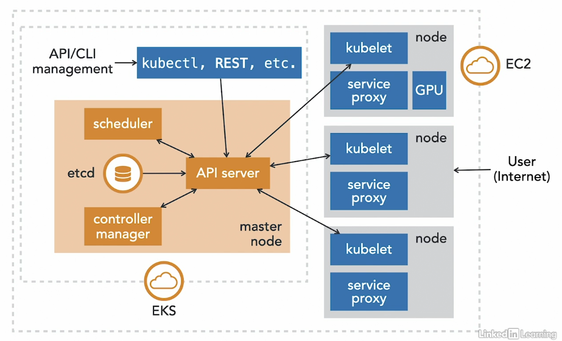

# Amazon EKS - Managed Kubernetes

**Amazon EKS** is the Kubernetes offering from AWS which allows users to deploy the management plane and let AWS handles the control plane and all it components. 

It's up to the users to provision where their workload will run. The workloads can run on Fargate or EC2.

  

Traditionally, you'll have to setup and deploy Kubernetes yourself:

- deploy master nodes
- deploy etcd
- setup CA for TLS encryption 
- setup monitoring, auto-scaling, auto-healing
- setup authentication 
- setup worker nodes  

With EKS:

- no control plane to manage
- built-in loadbalancing, networking, volume storage 
- easy to turn on and off
- authentication is handled through IAM
- integrations with other AWS components to build applications (S3, Redshift, RDS, Lambda, Cognito, etc.)
- AMI for nodes can be customized
- container images can be stored through ECR

In the image below, we can see which components that Amazon EKS takes care for us and which components we need to manage as users.

  

When you create you EKS cluster, AWS takes care of all of these under the hood:
1. master node is set up for HA
2. etcd is set up  for HA.
3. IAM plugin is setup.
4. CA is setup for TLS.
5. Autoscaling is set up.
6. Loadbalancers are provisioned (NLB and ELB)

**The EKS Control Plane**

- highly available
- single tenant (you don't share it with other customers)
- made of native AWS components
- API server talks to etcd using an ALB
- the whole control plane is fronted by an NLB with fixed IP

 

[Back to first page](../../README.md#amazon-elastic-kubernetes-service)