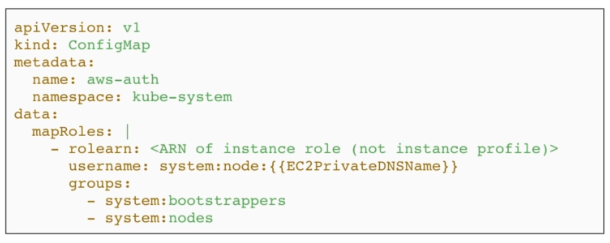

# Amazon EKS - IAM and RBAC

Kubernetes is deeply integrated with IAM and RBAC.

- Authentication is managed by IAM
- Authorization is natively managed by Kubernetes RBAC

We can assign RBAC directly to IAM entities and this will allow them access to the Kubernetes clusters. 

<p align=center>

</p>


### Worker Nodes

When create a worker node, it will join the cluster and be assigned an IAM role that authorize in RBAC to let them join:

- system:bootstrappers 
- system:nodes 

This can be seen in the Configmap. To edit the Configmap:

```bash
$ kubectl edit -n kube-system configmap/aws-auth 
```

<p align=center>

</p>


### IAM Users

An example of users that we can create:

- **cluster admin** - able to do all administrative operations on a cluster-level

- **read-only user** - limited to a dedicated namespace

We can also assign a more fine-grained policy for the user. 
To learn more, check out this [lab](lab53_EKS_IAM_and_RBAC/README.md).

You can also take a look at [Using RBAC Authorization](https://kubernetes.io/docs/reference/access-authn-authz/rbac/).
