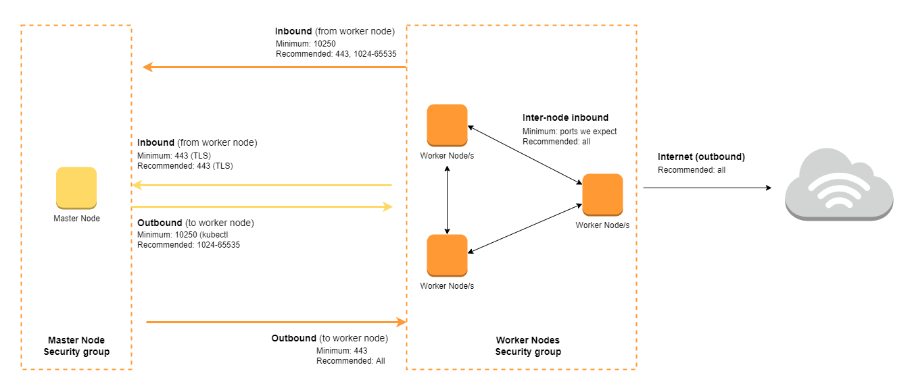

# Amazon EKS - Networking 


- [Subnets](#subnets)
- [Security Groups](#security-groups)
- [Pod Networking](#pod-networking)
- [Network Security with Calico](#network-security-with-calico)


## Subnets 

When it comes to networking in EKS clusters, here are some key points to remember about subnets:

- cluster must have **Private subnets**
    - needs a large CIDR 
    - will contain all the worker nodes
    - applications will be deployed here 

- cluster must have **Public subnets**
    - doesn't need a big CIDR
    - contains all the internet-facing Loadbalancers
    - Loadbalancers will expose the applications
    - Loadbalancers comunicate with end users

- if we use **private subnets only**, our applications can't be exposed to the web

- if we use **private subnets only**, our worker nodes will be exposed to the internet

- the AWS documentation recommends a mix of public and private subnets 

- VPC must have **DNS Names** and **DNS Resolution support** for nodes to be registered 

## Security Groups 

There are two security groups which you can control:

- Control Plane security group 
- Worker node security group

When you create a cluster, Amazon EKS creates a security group that's named:

```bash
eks-cluster-sg-<cluster-uniqueID>
```

This security group has the following default rules:


  

Here are the minimum required rules required for the cluster:

  


Here's a visual diagram of the recommended ports for the master node security group and the worker node security group.

<p align=center>

</p>


## Pod Networking

An EKS cluster is shipped with the **Amazon VPC CNI Plugin** which enables each Pod to receive 1 IP address that's linked to an ENI (Elastic Network Interface)

- a Pod will the same IP address inside and outside of the cluster
- this ensures external apps can talk to the Pods

However, it has some **subnet limitations:**

- a small subnet limits the number of Pods
- CIDR /24 has 254 IP can't run a lot of Pods
- CIDR /18 has 16,384 IP is good for running more Pods

In addition to this, it also has **EC2 limitations:**

- limited IP address per ENI 
- this depends on instance type

To learn more, check out [EC2 ENI and IP Limits.](https://docs.aws.amazon.com/AWSEC2/latest/UserGuide/using-eni.html#AvailableIpPerENI)


## Network Security with Calico

This is a third-party project that allows you to use network policies instead of using the AWS security groups.

- to segment apps, tenants, environments
- network policies directly assigned to Pods
- security groups are **node-level**
- network policies are **Pod-level**
- greater network security

To learn more, check out the [Calico add-on in EKS.](https://docs.aws.amazon.com/eks/latest/userguide/calico.html)


<br>

[Back to first page](../../README.md#amazon-elastic-kubernetes-service)