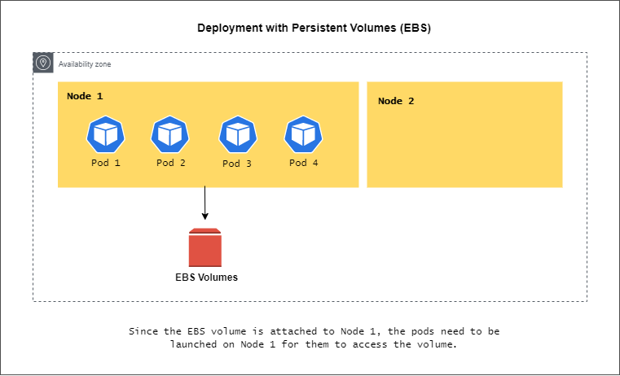
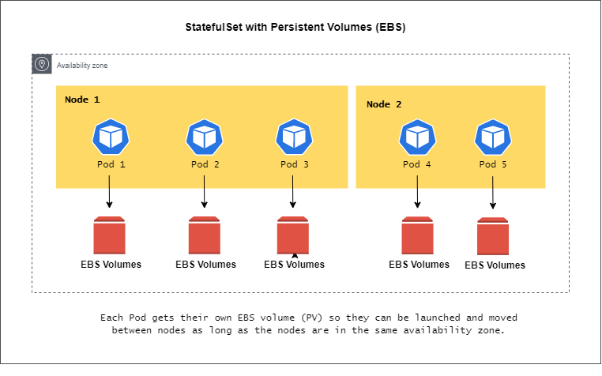
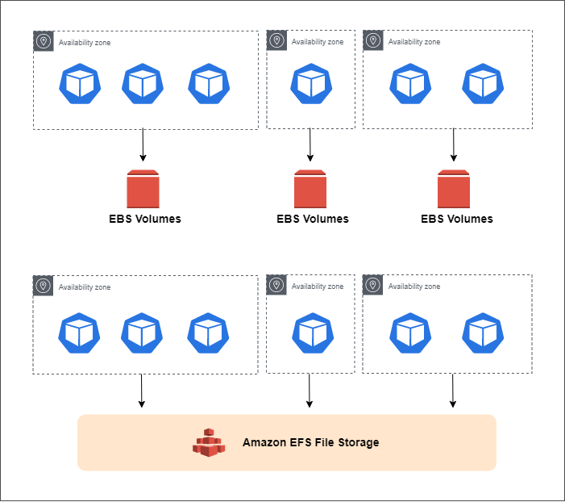
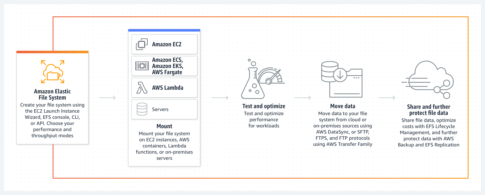

# Amazon EKS - Persistent Volumes 

- [Deployment vs. StatefulSet](#deployment-vs-statefulset)
- [Amazon EBS Volumes](#amazon-ebs-volumes)
- [Amazon EFS](#amazon-efs)

## Deployment vs. StatefulSet

**Deployments with Persistent Volumes**

As soon as the EBS volume is attached to a node, the Pods needs to be launched inside that one node only for the Pods to use the EBS volume.

**StatefulSet with Persistent Volumes** 

This is usually used with applications like Apache Kafka, Zookeeper, and Cassandra. In this setup, multiple Pods can be launched on multiple nodes and each Pod will have its own persistent volume attached.

## Amazon EBS Volumes 

Here are some key points to remember about using EBS volumes as persistent storage for EKS clusters:

- They are specific to each Availability Zone (AZ)
- Recreated Pods can only be started in the AZ of the existing EBS volume
- Pods in the same AZ can share the same EBS volume
- Pods in different nodes cannot share the same EBS volume
- If you have two AZs, then each AZ should have their own EBS volume

To properly deploy the application, the Wordpress Pods needs be able to share the same storage even if the Pods are spread across different Availability Zone. However, this can't be accomplished if we're using EBS volumes as persistent storage.

So for this kind requirement, we will need to utilize **Amazon Elastic Filesystem (EFS)**. This is a drive that can be attached in multiple instances in multiple availability zones.

## Amazon EFS

Amazon Elastic File System or [EFS](https://aws.amazon.com/efs/) is a managed network file system that can be mounted and shared between multiple EC2 instances.

- spans across availability zones (AZs)
- instances in different AZs can share the same EFS
- highly scalable, available, but is very expensive
- you pay per amount of storage you use 

  

**EFS for Kubernetes**

Once we use EFS as the persistent storage for our cluster, we can no launch the Pods in any of the availability zones in a region.

- EFS is mounted onto the worker nodes
- instances can start sharing state config files