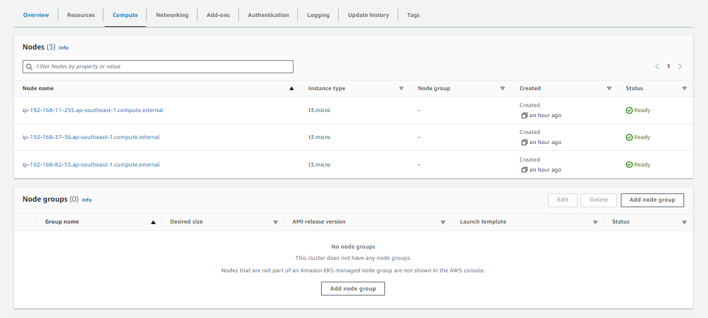
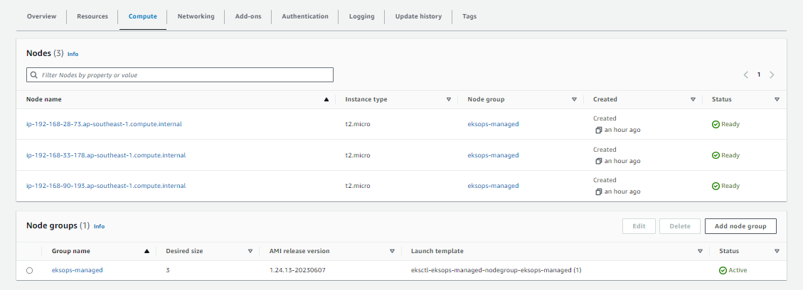
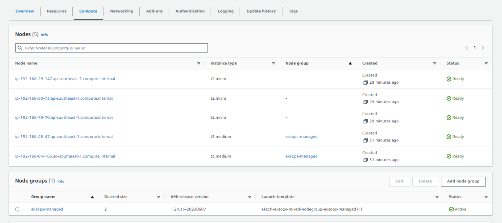

# Amazon EKS - Self-managed vs. Managed Nodegroups

- [Self-managed Nodegroups](#self-managed-nodegroups)
- [Managed Nodegroups](#managed-nodegroups)
- [Resources](#resources)


## Self-managed/Unmanaged Nodegroups 

The Kubernetes administrator is responsible for configuring a lot of stuff with self-managed node, which includes:

- installing the kubelet,
- container runtime,
- connecting to the cluster,
- autoscaling,
- networking, and more. 

Most EKS clusters do not need the level of customization that self-managed nodes provide.

Below is an example YAML file for creating an EKS cluster with self-managed nodegroup using eksctl.

```yaml
apiVersion: eksctl.io/v1alpha5
kind: ClusterConfig

metadata:
    version: "1.24"
    name: eksops-unmanaged
    region: ap-southeast-1 
nodeGroups:
    -   name: eksops-unmanaged
        instanceType: t3.micro
        minSize: 0
        maxSize: 5
        desiredCapacity: 3
        ssh: 
            publicKeyName: "k8s-kp"
```

To create the cluster:

```bash
time eksctl create cluster -f eksops.yml  
```

From **kubectl**:

```bash
$ kubectl get nodes
NAME                                                STATUS   ROLES    AGE   VERSION
ip-192-168-11-255.ap-southeast-1.compute.internal   Ready    <none>   55m   v1.24.13-eks-0a21954
ip-192-168-37-36.ap-southeast-1.compute.internal    Ready    <none>   55m   v1.24.13-eks-0a21954
ip-192-168-82-53.ap-southeast-1.compute.internal    Ready    <none>   55m   v1.24.13-eks-0a21954  
```

From the **AWS Management Console > Amazon EKS**:




## Managed Nodegroups 

Managed node groups handle the lifecycle of each worker node for you. A managed node group will:

- come with all the prerequisite software and permissions, 
- connect itself to the cluster, and 
- makes it easier for lifecycle actions like autoscaling and updates. 

AWS manages the servers for you - You just specify the instance type, but not the AMI. Patching can be managed for you.

In most cases managed node groups will reduce the operational overhead of self managing nodes and provide a much easier experience.


Below is an example YAML file for creating an EKS cluster with a managed nodegroup using eksctl.

```yaml
# eksops-managed.yaml
---
apiVersion: eksctl.io/v1alpha5
kind: ClusterConfig

metadata:
  name: eksops-managed
  region: ap-southeast-1

managedNodeGroups:
  - name: eksops-managed
    instanceType: t2.micro
    minSize: 0
    maxSize: 5
    desiredCapacity: 3
    volumeSize: 10
    ssh:
      allow: true
      publicKeyPath: ~/.ssh/tst-kp-ubuntu.pub
    labels: {role: worker}
    tags:
      nodegroup-role: worker
    iam:
      withAddonPolicies:
        externalDNS: true
        certManager: true
```

To create the cluster:

```bash
time eksctl create cluster -f eksops-managed.yml  
```

From **kubectl**:

```bash
$ kubectl get nodes
NAME                                                STATUS   ROLES    AGE   VERSION
ip-192-168-11-255.ap-southeast-1.compute.internal   Ready    <none>   55m   v1.24.13-eks-0a21954
ip-192-168-37-36.ap-southeast-1.compute.internal    Ready    <none>   55m   v1.24.13-eks-0a21954
ip-192-168-82-53.ap-southeast-1.compute.internal    Ready    <none>   55m   v1.24.13-eks-0a21954  
```

From the **AWS Management Console > Amazon EKS**:




## Combining both 

We can also create an EKS Cluster that has a managed node group and an unmanaged nodegroup.

```bash
## eksops.yml 
--- 
apiVersion: eksctl.io/v1alpha5
kind: ClusterConfig

metadata:
    name: eksops-mixed
    region: ap-southeast-1 
    version: "1.24"

nodeGroups:
  - name: eksops-unmanaged
    instanceType: t2.micro
    minSize: 0
    maxSize: 3
    desiredCapacity: 3
    ssh: 
      publicKeyName: "k8s-kp"

managedNodeGroups:
  - name: eksops-managed
    instanceType: t3.medium
    minSize: 0
    maxSize: 2
    desiredCapacity: 2
    volumeSize: 10
    ssh:
      allow: true
      publicKeyPath: ~/.ssh/tst-kp-ubuntu.pub
    labels: {role: worker}
    tags:
      nodegroup-role: worker
    iam:
      withAddonPolicies:
        externalDNS: true
        certManager: true
```

To create the cluster:

```bash
time eksctl create cluster -f eksops.yml  
```

From the **AWS Management Console > Amazon EKS**:




## Resources 

- https://eksctl.io/usage/eks-managed-nodes/

- https://repost.aws/questions/QU3b7kgBtFSCGtWW88a3fiMQ/difference-between-eks-managed-node-group-and-self-managed-node-group


<br>

[Back to first page](../../README.md#amazon-elastic-kubernetes-service)