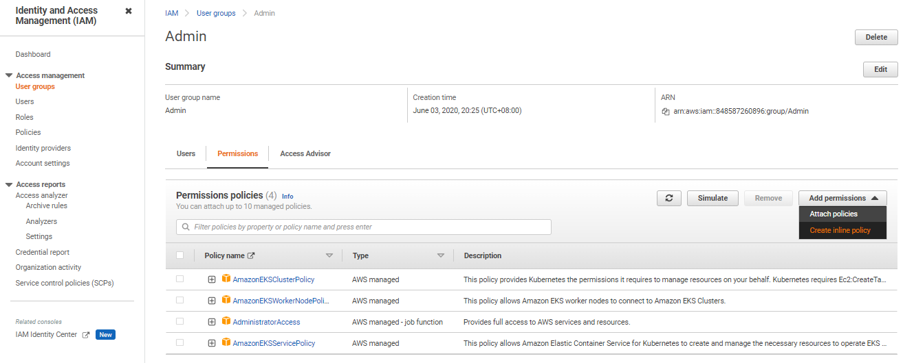

# Error: Cannot View Kubernetes Nodes 

- [Problem](#problem)
- [Cause](#cause)
- [Solution 1](#solution-1)
- [Solution 2](#solution-2)


## Problem

You might get the following error when checking the EKS cluster through the AWS Console.

```bash
Your current user or role does not have access to Kubernetes objects on this EKS cluster 
```

## Cause 

You might be using two different IAM user accounts:

- IAM-user1 - you originally use this to log-in to the AWS Management Console 
- IAM-user2 - this is the new user you created and generated the access key 

In the terminal, you set up the CLI access to connect to your AWS resources by editing
the credentials file. 

```bash
$ vim ~/.aws/credentials 
```

Check the identity.

```bash
$ aws sts get-caller-identity  
```

If the user returned is the same as the user currently logged-in the AWS Management Console, then you shouldn't have any issue.

If they're different users, then that means the user in the CLI (this is the user you used to create the EKS cluster) has different permissions from the user logged in the console.

## Solution 1 

Before anything else, run the command below  to make sure you are connected to the correct EKS cluster (if you have multiple clusters). The cluster with the '*' under the CURRENT column is the cluster that you are currently accessing.

```bash
$ kubectl config get-contexts

CURRENT   NAME                                                  CLUSTER                                     AUTHINFO                                              NAMESPACE
*         k8s-admin@eksops-managed.ap-southeast-1.eksctl.io     eksops-managed.ap-southeast-1.eksctl.io     k8s-admin@eksops-managed.ap-southeast-1.eksctl.io
          k8s-admin@eksops-unmanaged.ap-southeast-1.eksctl.io   eksops-unmanaged.ap-southeast-1.eksctl.io   k8s-admin@eksops-unmanaged.ap-southeast-1.eksctl.io
```

Edit eh ConfigMap. Add the **mapUsers** block with your **userarn**.

```bash
kubectl edit configmap aws-auth -n kube-system 
```
```bash
apiVersion: v1
data:
  mapRoles: |
    - groups:
      - system:bootstrappers
      - system:nodes
      rolearn: arn:aws:iam::12345678900:role/eksctl-exyz-managed-nodegroup-e-NodeInstanceRole-1OOHCL1LJM327
      username: system:node:{{EC2PrivateDNSName}}
  mapUsers: |
    - userarn: arn:aws:iam::12345678900:user/johnsmith
      groups:
      - system:masters 
```

## Solution 2 

You may try to log-in to the console using the same identity that you used in the CLI. If error still appeared, you may need to attach the inline policy to the group.

  

In the next page, choose the JSON tab and enter the following policy. Make sure to replace 111122223333 with your account ID.

```bash
{
    "Version": "2012-10-17",
    "Statement": [
        {
            "Effect": "Allow",
            "Action": [
                "eks:ListFargateProfiles",
                "eks:DescribeNodegroup",
                "eks:ListNodegroups",
                "eks:ListUpdates",
                "eks:AccessKubernetesApi",
                "eks:ListAddons",
                "eks:DescribeCluster",
                "eks:DescribeAddonVersions",
                "eks:ListClusters",
                "eks:ListIdentityProviderConfigs",
                "iam:ListRoles"
            ],
            "Resource": "*"
        },
        {
            "Effect": "Allow",
            "Action": "ssm:GetParameter",
            "Resource": "arn:aws:ssm:*:111122223333:parameter/*"
        }
    ]
}   
```

Click **Review Policy**, then in the next page, create a name for the policy. Click **Create Policy.** 

Next, create a rolebinding. If you need to change the Kubernetes group name, namespace, permissions, or any other configuration in the file, then download the file and edit it before applying it to your cluster

```bash
$ curl -o eks-console-full-access.yaml https://s3.us-west-2.amazonaws.com/amazon-eks/docs/eks-console-full-access.yaml
```
```bash
$ curl -o eks-console-restricted-access.yaml https://s3.us-west-2.amazonaws.com/amazon-eks/docs/eks-console-restricted-access.yaml 
```

You can apply any of the two YAML files.

```bash
$ kubectl apply -f eks-console-full-access.yaml
```
```bash
$ kubectl apply -f eks-console-restricted-access.yaml
```

Next, map the IAM user or role to the Kubernetes user or group in the aws-auth ConfigMap using eksctl.

```bash
export MYCLUSTER=<put-name-of-the-cluster-here> 
export MYREGION=<put-region-code-here> 
export MYACCOUNTID=<put-account-id-here>
export MYUSER=<put-user-id-here>
```

View the current mappings.

```bash
eksctl get iamidentitymapping --cluster $MYCLUSTER --region=$MYREGION 
```

Add a mapping for a role.

```bash
eksctl create iamidentitymapping \
    --cluster $MYCLUSTER \
    --region=$MYREGION \
    --arn arn:aws:iam::$MYACCOUNTID:role/my-console-viewer-role \
    --group eks-console-dashboard-full-access-group \
    --no-duplicate-arns 
```

Add a mapping for a user.

```bash
eksctl create iamidentitymapping \
    --cluster $MYCLUSTER \
    --region=$MYREGION \
    --arn arn:aws:iam::$MYACCOUNTID:user/$MYUSER \
    --group eks-console-dashboard-restricted-access-group \
    --no-duplicate-arns
```

To learn more, check out these links:

- [Can't see Nodes on the Compute tab/Resources tab](https://docs.aws.amazon.com/eks/latest/userguide/troubleshooting_iam.html#security-iam-troubleshoot-cannot-view-nodes-or-workloads)

- [View Kubernetes resources](https://docs.aws.amazon.com/eks/latest/userguide/view-kubernetes-resources.html#view-kubernetes-resources-permissions)


