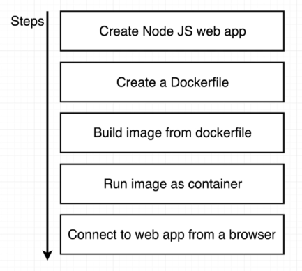
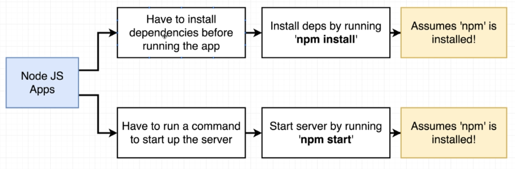
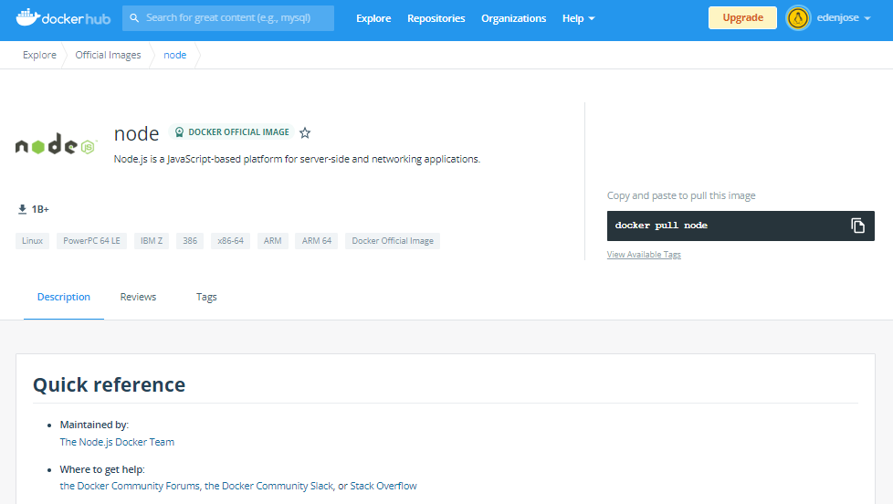
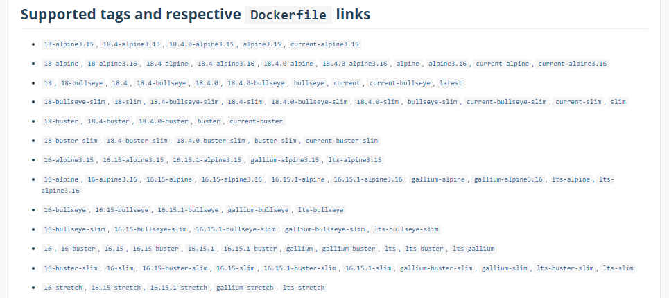
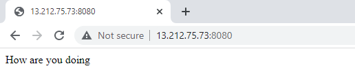

# Lab 005: Deploy a NodeJS Application

  - [Pre-requisites](#pre-requisites)
  - [Introduction](#introduction)
  - [Setup the Node Server](#setup-the-node-server)
  - [Create the Dockerfile and .dockerignore](#create-the-dockerfile-and-dockerignore)
  - [Build the Image and Run the Container](#build-the-image-and-run-the-container)
  - [Test it out](#test-it-out)
  - [Verify that the Working Directory is created](#verify-that-the-working-directory-is-created)
  - [Cleanup](#cleanup)


## Pre-requisites

- [Install Docker](../../pages/01-Pre-requisites/labs-docker-pre-requisites/README.md)

## Introduction

In this lab, we'll be deploying a website written in NodeJS on a container. We'll also make sure that it is accesible from a browser running on our local machine. Here's an outline of the steps:

<p align=center>

</p>


## Setup the Node Server

Create the **package.json**. This will contain the packages that needs to be installed and the scripts that we'll use to get the application up and running.

```json
{
  "name": "nodejs-app",
  "version": "1.0.0",
  "description": "Node.js on Docker",
  "author": "eden.noel@yahoo.com",
  "main": "index.js",
  "scripts": {
    "start": "node index.js"
  },
  "dependencies": {
    "express": "^4.16.1"
  }
}
```

Next, create the **index.js** binary. Here we'll define the code for our website. Notice the line with <code>app.get</code>: whenever someone visits the root ("/") route of our app, it will return the message "How are you doing".

```js
const express = require('express');

// App
const app = express();
app.get('/', (req, res) => {
  res.send('How are you doing');
});

app.listen(8080, () => {
  console.log('Listening on port 8080');
});
```

## Create the Dockerfile and .dockerignore

Here are the two commands that we need to know to install the dependencies and start the application. This is important to know since we have to define these steps in our dockerfile.

<p align=center>

</p>

Create the dockerfile. Note that for the base image, we can use **Alpine** image but it has limited functionalities and we'll encounter an issue like "npm not found" when we try to build the image from the dockerfile. 

Having said, we could install the other dependencies need for npm or we can simply look for an existing docker image with Node pre-installed. A quick Google search shows us an [official Node image from Dockerhub](https://hub.docker.com/_/node).

<p align=center>

</p>

<p align=center>

</p>

We'll use this Node image, specifically version 16. When the image is build, it uses the base image, runs <code>npm install</code>, and looks for the package.json. This file currently only exists in our local machine and not inside the container. To copy the files onto the container, use the **COPY** instruction.

```bash
# Specify base image
FROM node:16

# Create app directory
WORKDIR /usr/app/nodejs

# Install some dependencies
COPY ./package.json ./
RUN npm install
COPY ./ ./

# Default command
CMD ["npm", "start"]
```

Also, create the **.dockerignore** file in the same directory as your dockerfile. This will prevent your local modules and debug logs from being copied onto your Docker image and possibly overwriting modules installed within your image.

```bash
node_modules
npm-debug.log 
```

## Build the Image and Run the Container

Build the image. Specify the dockerfile using the "-f" flag.

```bash
$ docker build -t nodejs-app -f dockerfile .
```
```bash
$ docker images
REPOSITORY   TAG       IMAGE ID       CREATED          SIZE
nodejs-app   latest    081d9c5f2a46   22 seconds ago   913MB
node         16        b9f398d30e45   2 days ago       907MB 
```

Before we run the container from the image, get the IP of your machine. We'll use this later when we check if we can access the website.

```bash
$ curl ipecho.net/plain; echo 
```

Run the container in the background and verify it by running the **docker ps** command. We can also assign a name to the container using the "--name" flag.

```bash
$ $ docker run --name nodejs-app -d -p 8080:8080 nodejs-app
```
```bash
$ docker ps
CONTAINER ID   IMAGE        COMMAND                  CREATED         STATUS         PORTS                                       NAMES
cfcc030a3d29   nodejs-app   "docker-entrypoint.s…"   2 seconds ago   Up 2 seconds   0.0.0.0:8080->8080/tcp, :::8080->8080/tcp   nodejs-app
```

You can also run it on the foreground by removing the "-d" flag. It should return the "Listening on port 8080" message. NOte that this will run continuously.

```bash
$ docker run nodejs-app

> nodejs-app@1.0.0 start
> node index.js

Listening on port 8080 
```

## Test it out

Confirm once again that container is running.

```bash
$ docker ps
CONTAINER ID   IMAGE        COMMAND                  CREATED         STATUS         PORTS                                       NAMES
cfcc030a3d29   nodejs-app   "docker-entrypoint.s…"   2 seconds ago   Up 2 seconds   0.0.0.0:8080->8080/tcp, :::8080->8080/tcp   nodejs-app
```

Do a cURL to your machine's IP address through port 8080. It should return the "200 OK" message and the "How are you doing" message at the bottom.

```bash
$ curl -i localhost:8080
HTTP/1.1 200 OK
X-Powered-By: Express
Content-Type: text/html; charset=utf-8
Content-Length: 17
ETag: W/"11-uMf3iXG4FrUFeKil4Xs5YAEV4jU"
Date: Sat, 25 Jun 2022 07:56:37 GMT
Connection: keep-alive
Keep-Alive: timeout=5

How are you doing 
```

Open a web browser and navigate to your machine's IP and add the port at the end.

<p align=center>

</p>

## Verify that the Working Directory is created

Recall that out dockerfile has WORKDIR which specifies the working directory to be created inside the container. The files copied from our local machine should also reside here.

```bash
$ docker ps
CONTAINER ID   IMAGE        COMMAND                  CREATED              STATUS              PORTS                                       NAMES
0111d3e7a5a5   nodejs-app   "docker-entrypoint.s…"   About a minute ago   Up About a minute   0.0.0.0:8080->8080/tcp, :::8080->8080/tcp   romantic_beaver
```
```bash
$ docker exec -it 0111 sh

# pwd
/usr/app/nodejs
#
# ls -la
total 68
drwxr-xr-x  1 root root  4096 Jun 25 08:22 .
drwxr-xr-x  1 root root  4096 Jun 25 08:22 ..
-rw-rw-r--  1 root root    24 Jun 25 08:21 .dockerignore
-rw-rw-r--  1 root root   178 Jun 25 08:03 dockerfile
-rw-rw-r--  1 root root   204 Jun 25 07:19 index.js
drwxr-xr-x 59 root root  4096 Jun 25 08:22 node_modules
-rw-r--r--  1 root root 39661 Jun 25 08:22 package-lock.json
-rw-rw-r--  1 root root   243 Jun 25 07:14 package.json 
```

## Cleanup 

When you're done with the lab, you can stop all running containers by running the command below.

```bash
$ docker stop $(docker ps) 
```

Once all containers have "Exited" status, remove them.

```bash
$ docker ps  -a 
```
```bash
$ docker container prune -f 
```

Finally, remove all images.

```bash
$ docker image prune -af 
```

