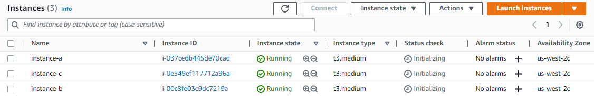

# Lab 021: Backup, Restore, and Upgrade a Kubernetes Cluster


- [Pre-requisites](#pre-requisites)
- [Introduction](#introduction)
- [Create a Simple Deployment](#create-a-simple-deployment)
- [Backing Up the Cluster](#backing-up-the-cluster)
- [Simulate a Cluster Failure](#simulate-a-cluster-failure)
- [Restore the Cluster](#restore-the-cluster)
- [Upgrading the Cluster](#upgrading-the-cluster)
     - [Upgrade the Master Node](#upgrade-the-master-node)
     - [Upgrade the Worker Node](#upgrade-the-worker-node)
- [Cleanup](#cleanup)
- [Resources](#resources)


## Pre-requisites

- [Lab 20-Create and Manage a Cluster using kubeadm](../Lab_020_Create_and_Manage_Cluster_using_kubeadm/README.md)

## Introduction

In the previous lab, we installed kubeadm and all its dependencies on our three EC2 instances. We then initialize the master nodes and joined the other two nodes into the cluster. 

We'll now try to backup the cluster and simulate a failure by deleting the data files in the etcd data store. We should be able to restore the cluster from the backup we created.

Lastly, we'll also upgrade the Kubernetes cluster to the new version. 

  


## Create a Simple Deployment

If you haven't done so, log in to **instance-a** and create a simple NGINX deployment with 2 replicas. We'll use this later to confirm that the deployment still exists after we restore the cluster.

```bash
kubectl create deployment nginx --image=nginx
kubectl scale deployment nginx --replicas=2
```

Expose the deployment using a ClusterIP service.

```bash
kubectl expose deployment nginx --type=ClusterIP --port=80 --target-port=80 --name=web
```

Confirm that the service is created.

```bash
$ kubectl get svc
NAME         TYPE        CLUSTER-IP      EXTERNAL-IP   PORT(S)   AGE
kubernetes   ClusterIP   10.96.0.1       <none>        443/TCP   28m
web          ClusterIP   10.107.142.62   <none>        80/TCP    17s
```

Next, check if the NGINX is running by sending an HTTP request to it.

```bash
# Get the Cluster IP of the service
service_ip=$(kubectl get service web -o jsonpath='{.spec.clusterIP}')
# Use curl to send an HTTP request to the service
curl -I $service_ip 
```

It sould return a **200 OK** response.

```bash
HTTP/1.1 200 OK
Server: nginx/1.23.2
Date: Sun, 27 Nov 2022 09:10:36 GMT
Content-Type: text/html
Content-Length: 615
Last-Modified: Wed, 19 Oct 2022 07:56:21 GMT
Connection: keep-alive
ETag: "634fada5-267"
Accept-Ranges: bytes
```

## Backing Up the Cluster

Kubernetes provides the **etcd** component to store the state information of the cluster. We can make use of snapshots to restore the clsuter to a previous state and restore the etcd.

etcd is configured to listen to HTTPs traffic only. The etcdctl command that we'll use requires the following to encrypt the etcd traffic:

- certificate authority certificate
- a client key
- a client certificate 

In addition to this, the **snapshot save** command creates a snapshot of the entire key-value store at the given location:

```bash
/snapshots/backup.db
```

We'll create a namespace called **dev** and job that creates a Pod and issues the **etcdctl snapshot save** command to backup the cluster. For this one we'll use the [backup.yml](backup.yml) file.

Apply the manifest and verify that the snapshot is created.

```bash
kubectl apply -f backup.yml 
```
```bash
$ ls -la /snapshots/
total 2912
drwxr-xr-x  2 root root    4096 Nov 27 09:22 .
drwxr-xr-x 24 root root    4096 Nov 27 09:22 ..
-rw-------  1 root root 2969632 Nov 27 09:22 backup.db 
```

As an additional step, we need to make sure that the Calico nodes can properly restore.

```bash
kubectl set env daemonset/calico-node -n kube-system IP_AUTODETECTION_METHOD=interface=ens*  
```

## Simulate a Cluster Failure 

We'll now simulate a cluster failure by removing the data files of the etcd key-value store. But before we do this, let's confirm that the NGINX pods are still running.

```bash
$ kubectl get pods
NAME                    READY   STATUS    RESTARTS   AGE
nginx-8f458dc5b-dq87h   1/1     Running   0          22m
nginx-8f458dc5b-fxp8p   1/1     Running   0          22m
```

Stop the control-plane's kubelet.

```bash
sudo systemctl stop kubelet.service 
```

Next, delete the etc data files stored in the specified directory:

```bash
sudo rm -rf /var/lib/etcd/member
```

## Restore the Cluster

We need to install a Docker -compatible CLI for containerd called **nerdctl**.

```bash
wget -c https://github.com/containerd/nerdctl/releases/download/v0.8.0/nerdctl-0.8.0-linux-amd64.tar.gz -O - | sudo tar -xz -C /usr/local/bin nerdctl 
```

Next, run a container that will restore the deelted etcd directory from the backup snapshot.  We're running a container instead of creating a POd because we previously stopped kubelet.

```bash
sudo nerdctl run --rm \
    -v '/snapshots:/snapshots' \
    -v '/var/lib/etcd:/var/lib/etcd' \
    -e ETCDCTL_API=3 \
    'k8s.gcr.io/etcd:3.5.3-0' \
    /bin/sh -c "etcdctl snapshot restore --data-dir /var/lib/etcd /snapshots/backup.db"
```

Once it's done, start the kubelet.

```bash
sudo systemctl start kubelet 
```

Confirm that the NGINX pods are running.

```bash
$ kubectl get pods
NAME                    READY   STATUS    RESTARTS   AGE
nginx-8f458dc5b-dq87h   1/1     Running   0          23m
nginx-8f458dc5b-fxp8p   1/1     Running   0          23m 
```

Lastly, check the web server's response again by sending an HTTP request.

```bash
$ curl -I $(kubectl get service web -o jsonpath='{.spec.clusterIP}')

HTTP/1.1 200 OK
Server: nginx/1.23.2
Date: Sun, 27 Nov 2022 09:33:45 GMT
Content-Type: text/html
Content-Length: 615
Last-Modified: Wed, 19 Oct 2022 07:56:21 GMT
Connection: keep-alive
ETag: "634fada5-267"
Accept-Ranges: bytes
```

## Upgrading the Cluster 

The upgrade process has the following steps:

1. Upgrading the Kubernetes control plane with kubeadm (Kubernetes components and add-ons excluding the CNI)
2. Manually upgrading the CNI network plugin, if applicable
3. Upgrading the Kubernetes packages (kubelet, kubeadm, kubectl) on the control-plane and worker nodes
4. Upgrading the kubelet config on worker nodes with kubeadm

In the actual production setup, it is important to go through the release notes of each new version to understand if there are some breaking changes and incompatibilities that could impact your workloads.  In addition to this, **always backup your data and test upgrades on a development environment before deploying to production.**

### Upgrade the Master Node

Our setup currently uses version 1.24.3. We'll need to update it to 1.25.3.

```bash
$ kubeadm version

kubeadm version: &version.Info{Major:"1", Minor:"24", GitVersion:"v1.24.3", GitCommit:"aef86a93758dc3cb2c658dd9657ab4ad4afc21cb", GitTreeState:"clean", BuildDate:"2022-07-13T14:29:09Z", GoVersion:"go1.18.3", Compiler:"gc", Platform:"linux/amd64"} 
```

Let's update the kubeadm first.

```bash
sudo apt-get install -y --allow-change-held-packages kubeadm=1.25.3-00
```

Next, create an upgrade plan for upgrading Kubernetes to version 1.25.3

```bash
sudo kubeadm upgrade plan 1.25.3 
```

It should return the steps that it will perform in the output.

```bash
Components that must be upgraded manually after you have upgraded the control plane with 'kubeadm upgrade apply':
COMPONENT   CURRENT       TARGET
kubelet     3 x v1.24.3   1.25.3

Upgrade to the latest version in the v1.24 series:

COMPONENT                 CURRENT   TARGET
kube-apiserver            v1.24.3   1.25.3
kube-controller-manager   v1.24.3   1.25.3
kube-scheduler            v1.24.3   1.25.3
kube-proxy                v1.24.3   1.25.3
CoreDNS                   v1.8.6    v1.9.3
etcd                      3.5.3-0   3.5.4-0

You can now apply the upgrade by executing the following command:

        kubeadm upgrade apply 1.25.3

_____________________________________________________________________


The table below shows the current state of component configs as understood by this version of kubeadm.
Configs that have a "yes" mark in the "MANUAL UPGRADE REQUIRED" column require manual config upgrade or
resetting to kubeadm defaults before a successful upgrade can be performed. The version to manually
upgrade to is denoted in the "PREFERRED VERSION" column.

API GROUP                 CURRENT VERSION   PREFERRED VERSION   MANUAL UPGRADE REQUIRED
kubeproxy.config.k8s.io   v1alpha1          v1alpha1            no
kubelet.config.k8s.io     v1beta1           v1beta1             no
_____________________________________________________________________
 
```

Apply the upgrade plan and enter "y" when prompted. This will startt with upgrading the cluster components on the control-plane node.

```bash
sudo kubeadm upgrade apply 1.25.3 -y
```

This command is **idempotent** which means it can be ran multiple times as required. This is specially important if the upgrade times out. If the ugprade successful, it should return this message:

```bash
[upgrade/successful] SUCCESS! Your cluster was upgraded to "v1.25.3". Enjoy!
```

**Note:** It could actually take you 3 to 4 time outs before it succeeds.

After that, we'll need to drain the node to upgrade the control-plane's node.

```bash
kubectl drain $HOSTNAME --ignore-daemonsets
```

We can now update the kubelet packages. This may take a few minutes to run. 
When prompted, enter "N" followed by "Enter".

```bash
sudo apt-get update
sudo apt-get upgrade -y --allow-change-held-packages \
     kubelet=1.25.3-00 kubectl=1.25.3-00
```
```bash
Configuration file '/etc/containerd/config.toml'
 ==> Modified (by you or by a script) since installation.
 ==> Package distributor has shipped an updated version.
   What would you like to do about it ?  Your options are:
    Y or I  : install the package maintainer's version
    N or O  : keep your currently-installed version
      D     : show the differences between the versions
      Z     : start a shell to examine the situation
 The default action is to keep your current version.
*** config.toml (Y/I/N/O/D/Z) [default=N] ? N 
```

After upgrading the control plane, we need to uncordon the node to allow pods to be scheduled on it.

```bash
kubectl uncordon $HOSTNAME
```

Verify that the control-plane is upgraded.

```bash
$ kubeadm version 
kubeadm version: &version.Info{Major:"1", Minor:"25", GitVersion:"v1.25.4", GitCommit:"872a965c6c6526caa949f0c6ac028ef7aff3fb78", GitTreeState:"clean", BuildDate:"2022-11-09T13:35:06Z", GoVersion:"go1.19.3", Compiler:"gc", Platform:"linux/amd64"}
```

We can also check the nodes to see that the master node has been upgraded.

```bash
$ kubectl get nodes 
NAME            STATUS   ROLES           AGE   VERSION
ip-10-0-0-10    Ready    <none>          49m   v1.24.3
ip-10-0-0-100   Ready    control-plane   53m   v1.25.3
ip-10-0-0-11    Ready    <none>          47m   v1.24.3
```

### Upgrade the Worker Node

Still at **instance-a**, drain the worker nodes to prepare them for upgrading.

```bash
# Get the worker's name
worker_name=$(kubectl get nodes | grep \<none\> | cut -d' ' -f1)
# Drain the worker node
kubectl drain $worker_name --ignore-daemonsets
```

It should return the following output.

```bash
node/ip-10-0-0-10 cordoned
node/ip-10-0-0-11 cordoned
Warning: ignoring DaemonSet-managed Pods: kube-system/calico-node-bgwbr, kube-system/kube-proxy-ns6s9
evicting pod kube-system/coredns-565d847f94-kw8tr
evicting pod default/nginx-8f458dc5b-k5t9v
evicting pod default/nginx-8f458dc5b-rz9sb
pod/nginx-8f458dc5b-k5t9v evicted
pod/nginx-8f458dc5b-rz9sb evicted
pod/coredns-565d847f94-kw8tr evicted
node/ip-10-0-0-10 drained
Warning: ignoring DaemonSet-managed Pods: kube-system/calico-node-dzlvv, kube-system/kube-proxy-bv5zb
evicting pod kube-system/coredns-565d847f94-947zw
evicting pod kube-system/calico-kube-controllers-84c476996d-kqjcv
pod/calico-kube-controllers-84c476996d-kqjcv evicted
pod/coredns-565d847f94-947zw evicted
```

Connect to **instance=b**. Drain the node and upgrade. Press "N" and "Enter" when prompted.

```bash
sudo apt-get update
sudo apt-get upgrade -y --allow-change-held-packages \
     kubelet=1.25.3-00 kubeadm=1.25.3-00 kubectl=1.25.3-00
```

Restart the worker node's kubelet.

```bash
sudo systemctl restart kubelet 
```

Connect to **instance-c** to drain the nodes and upgrade. Make sure to restart the kubelet in **instance-c** afterwards.

Return to **instance-a** and uncordon the worker node.

```bash
kubectl uncordon $worker_name 
```

Confirm that all the nodes are ready and running version 1.25.3.

```bash
$ kubectl get nodes 
NAME            STATUS     ROLES           AGE   VERSION
ip-10-0-0-10    Ready      <none>          55m   v1.25.3
ip-10-0-0-100   Ready      control-plane   59m   v1.25.3
ip-10-0-0-11    NotReady   <none>          53m   v1.25.3
```

## Cleanup 

To cleanup the resources, simply delete the EC2 instances from the AWS Management Console.

## Resources

- [Backup, Restore, and Upgrade a Kubernetes Cluster](https://cloudacademy.com/lab/backup-restore-and-upgrade-kubernetes-cluster/connecting-kubernetes-cluster/?context_id=888) 


<br>

[Back to first page](../../README.md#kubernetes)
