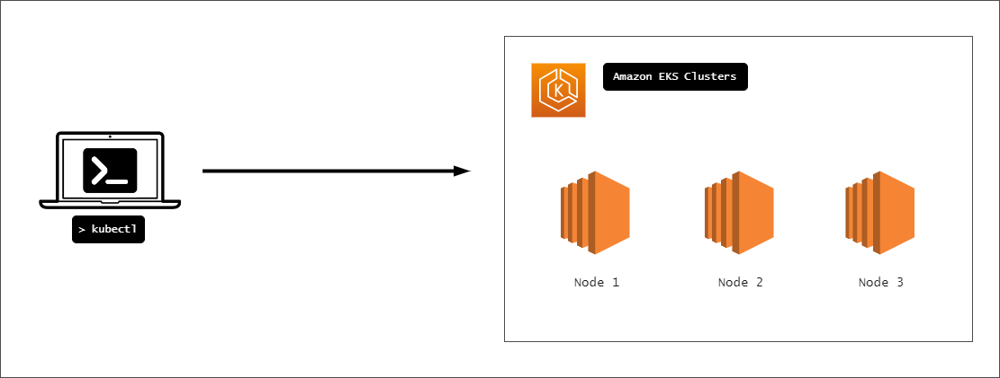

# Lab 040: Kubernetes Basics


- [Pre-requisites](#pre-requisites)
- [Introduction](#introduction)
- [Launch a Simple EKS Cluster](#launch-a-simple-eks-cluster)
- [Pods](#pods)
- [Ports](#ports)
- [Labels](#labels)
- [Resource Requests](#resource-requests)
- [Services](#services)
- [Cleanup](#cleanup)
- [Next step](#next-step)

## Pre-requisites

- [Basic Understanding of Kubernetes](../../README.md#kubernetes)
- [AWS account](../../pages/01-Pre-requisites/labs-optional-tools/README.md#create-an-aws-account)
- [AWS IAM Requirements](../../pages/01-Pre-requisites/labs-optional-tools/01-AWS-IAM-requirements.md)
- [AWS CLI, kubectl, and eksctl](../../pages/01-Pre-requisites/labs-kubernetes-pre-requisites/README.md#install-cli-tools) 


## Introduction

In this lab, we'll be working on simple manifests to understand the basics of Kubernetes. To learn more about the theory, check out the [Kubernetes section](../../README.md#kubernetes) in the main page.

This will be our setup. I'm currently using a laptop with  We'll be using a laptop with the necessary pre-requisites installed. We'll launch all our resources in the **ap-southeast-1** region (Singapore). To talk to our EKS cluster, we'll use kubectl.

<p align=center>

</p>


## Launch a Simple EKS Cluster 

We'll be utilizing an EKS cluster for this lab but you can setup your cluster locally or on another cloud platform. To learn more, check out [Setting up Kubernetes.](../../pages/04-Kubernetes/008-Setting-up-Kubernetes.md)

Let's first verify if we're using the correct IAM user's access keys. This should be the user we created from the **pre-requisites** section above.

```bash
$ aws sts get-caller-identity 
```
```bash
{
    "UserId": "AIDxxxxxxxxxxxxxx",
    "Account": "1234567890",
    "Arn": "arn:aws:iam::1234567890:user/k8s-admin"
} 
```

For the cluster, let's **eksops.yml** file. 

<details><summary> eksops.yml </summary>
 
```bash
apiVersion: eksctl.io/v1alpha5
# apiVersion: client.authentication.k8s.io/v1beta1
kind: ClusterConfig

metadata:
    version: "1.23"
    name: eksops
    region: ap-southeast-1 
nodeGroups:
    -   name: ng-dover
        instanceType: t3.large
        minSize: 1
        maxSize: 5
        desiredCapacity: 1
        ssh: 
            publicKeyName: "k8s-kp"
```

</details>

Feel free to set the **desiredCapacity** to any size that will not exceed the **maxSize** specified. In addition to this, you must have the keypair already created in the AWS Management Console as a pre-requisite.

Launch the cluster. We're adding the **time** parameter so we can know how long it ran. This will take around 10-15 minutes.

```bash
time eksctl create cluster -f eksops.yml  
```

Once its done running, check the running nodes.

```bash
kubectl get nodes
```
```bash
NAME                                                STATUS   ROLES    AGE    VERSION
ip-192-168-25-92.ap-southeast-1.compute.internal    Ready    <none>   114m   v1.23.9-eks-ba74326
ip-192-168-35-140.ap-southeast-1.compute.internal   Ready    <none>   114m   v1.23.9-eks-ba74326
ip-192-168-88-211.ap-southeast-1.compute.internal   Ready    <none>   114m   v1.23.9-eks-ba74326 
```


## Pods 

We'll use the manifests below. To learn more about Pods, check out the [Pods](../../pages/04-Kubernetes/009-Pods.md) page.

The YAML files are in the **manifests** directory:

```bash
cd manifests  
```

To apply the basic NGINX pod:

```bash
kubectl apply -f basic-pod-1.yml 
```
```bash
pod/mypod created 
```

Check out the status of the resource created:

```bash
kubectl get pods 
```
```bash
NAME    READY   STATUS    RESTARTS   AGE
mypod   1/1     Running   0          17s 
```

To check the status of all running pods:

```bash
kubectl get pods -A 
```

To learn more about the **mypod**:

```bash
kubectl describe pod mypod
```

It should return a detailed description of the image used, the status, the ports publiched, and the events.

```bash
Name:         mypod
Namespace:    default
Priority:     0
Node:         ip-192-168-25-92.ap-southeast-1.compute.internal/192.168.25.92
Start Time:   Fri, 23 Sep 2022 07:11:51 +0800
Labels:       <none>
Annotations:  kubernetes.io/psp: eks.privileged
Status:       Running
IP:           192.168.22.198
IPs:
  IP:  192.168.22.198
Containers:
  mycontainer:
    Container ID:   docker://9b5529c8ce54fe6d72cd71b1c32674678fc3b21b2982c8c9d3b3954f13a2cf18
    Image:          nginx:latest
    Image ID:       docker-pullable://nginx@sha256:0b970013351304af46f322da1263516b188318682b2ab1091862497591189ff1
    Port:           <none>
    Host Port:      <none>
    State:          Running
      Started:      Fri, 23 Sep 2022 07:12:01 +0800
    Ready:          True
    Restart Count:  0
    Environment:    <none>
    Mounts:
      /var/run/secrets/kubernetes.io/serviceaccount from kube-api-access-dqjz5 (ro)
Conditions:
  Type              Status
  Initialized       True
  Ready             True
  ContainersReady   True
  PodScheduled      True
Volumes:
  kube-api-access-dqjz5:
    Type:                    Projected (a volume that contains injected data from multiple sources)
    TokenExpirationSeconds:  3607
    ConfigMapName:           kube-root-ca.crt
    ConfigMapOptional:       <nil>
    DownwardAPI:             true
QoS Class:                   BestEffort
Node-Selectors:              <none>
Tolerations:                 node.kubernetes.io/not-ready:NoExecute op=Exists for 300s
                             node.kubernetes.io/unreachable:NoExecute op=Exists for 300s
Events:
  Type    Reason     Age   From               Message
  ----    ------     ----  ----               -------
  Normal  Scheduled  51s   default-scheduler  Successfully assigned default/mypod to ip-192-168-25-92.ap-southeast-1.compute.internal
  Normal  Pulling    50s   kubelet            Pulling image "nginx:latest"
  Normal  Pulled     42s   kubelet            Successfully pulled image "nginx:latest" in 8.296903344s
  Normal  Created    41s   kubelet            Created container mycontainer
  Normal  Started    41s   kubelet            Started container mycontainer 
```

Notice that the **Port** and **Host port** is set to None, which means the no port is exposed and the container is not accessible from outside the Pod.

## Ports 

We'll launch a second Pod using the [basic-pod-port.yml](manifests/basic-pod-port.yml). It's the same time YAML file but this time we're exposing the port.

Launch the second Pod.

```bash
kubectl apply -f basic-pod-2-port.yml
```

Checking the details for this Pod, we see that this Pod is using Port 80 and the TCP protocol (default).

```bash
kubectl describe pod mypod-2
```

**Now that the port is published, will the Pod be accesible?**
Not yet, for that it needs a Service to set the networking.
Scroll down to learn more.

## Labels 

Labels are key-value pairs which we can use to specify attributes for the pods. We can also use this to tell kubectl to "filter" or apply only the changes to specific pods with those labels.

Let's launch a third Pod using [basic-pod-3-label.yml.](manifests/basic-pod-3-label.yml). This used labels to tell kubectl that the Pod will be a "webserver" app.

```bash
kubectl apply -f basic-pod-3-label.yml 
```

## Resource Requests 

As more Pods are launched inside the nodes, it could create contention betweeen the Pods as to how much each Pod can consume resources. To prevent a single Pod from hogging all the resources, we should set resource requests.

Let's take a look at [basic-pod-4-resource-requests.yml](manifests/basic-pod-4-resource-requests.yml). 

The **resources** specifies the minimum requirements that a Pod needs while the **limits** specifies the maximum amount of node resources the Pod can use.

This ensures that the Pod is guaranteed with those resources or the pod will only be launched when those resources becomes available.

Resource requests can be specified for each running container.

```bash
resources:
    requests:
    memory: "128Mi" # 128Mi = 128 mebibytes
    cpu: "500m"     # 500m = 500 milliCPUs (1/2 CPU)
    limits:
    memory: "128Mi"
    cpu: "500m" 
```

Launch the fourth Pod.

```bash
kubectl apply -f basic-pod-4-resource-requests.yml
```

Checking the details for the Pod, we can see that the Pod has **QoS class** set to **Guaranteed**

```bash
kubectl describe pod mypod-4 
```
```bash
QoS Class:                   Guaranteed 
```

## Services 

Recall that a Pod will have 1 IP address regardless of how many containers are running inside it. Whenever a Pod is started, it will be assigned an IP from the available pool of IP addresses. When a Pod fails and is restarted, it may get a different IP address.

To resolve the dilemma of changing Pod IP, we can use **[Services](../../pages/04-Kubernetes/013-Services.md)**. This allows the Pod to be accesible from the internet.

We'll use [basic-pod-5-service.yml.](manifests/basic-pod-5-service.yml). This used the same format but here we're specifying the **kind** as **Service**.

```bash
apiVersion: v1
kind: Service
metadata:
  name: webserver
  labels:
    app: webserver
spec:
  type: NodePort
  ports:
    - port: 80
  selector:
    app: webserver 
```

Under the **spec** block, we specified the type as **NodePort** which tells the Service to allocate a port over this service on each node in the cluster. This allows us to send a request to any node in the cluster and whichever node has the targetted Pod will cater the request.

We also added **selector** to use the label "app: webserver". This ensures that kubectl will target the Pods with the same labels.

Launch the service.

```bash
kubectl apply -f basic-pod-5-service.yml
```

To list the running services in the default namespace:

```bash
kubectl get svc
```
```bash
NAME         TYPE        CLUSTER-IP       EXTERNAL-IP   PORT(S)        AGE
kubernetes   ClusterIP   10.100.0.1       <none>        443/TCP        114m
webserver    NodePort    10.100.235.136   <none>        80:30225/TCP   21s 
```

The **CLUSTER-IP** is the private IP for each IP while the **EXTERNAL-IP** is the public IP for the service. This is currently not availabile for NodePort services. The **PORT** specifies the port mapping between the service and the specified container port 80 and randomly allocated port on the node (range is 30000-32767).

To see more details about the service **webserver**:

```bash
kubectl describe svc webserver 
```
```bash
Name:                     webserver
Namespace:                default
Labels:                   app=webserver
Annotations:              <none>
Selector:                 app=webserver
Type:                     NodePort
IP Family Policy:         SingleStack
IP Families:              IPv4
IP:                       10.100.235.136
IPs:                      10.100.235.136
Port:                     <unset>  80/TCP
TargetPort:               80/TCP
NodePort:                 <unset>  30225/TCP
Endpoints:                192.168.3.175:80,192.168.81.60:80
Session Affinity:         None
External Traffic Policy:  Cluster
Events:                   <none> 
```

The **Endpoints** lists the IP address of Pods that are associated with the service. Note that since we only used labels on **mypod-3** and **mypod-4**, then the service is only attached to this Pods and only two IP address appears as endpoints.

Kubernetes also automatically updates the endpoints as Pods are created and deleted.

Let's get the IP addresses of the underlying nodes on which the Pods are running.

```bash
kubectl describe nodes | grep -i address -A 2 
```
```bash
Addresses:
  InternalIP:   192.168.25.92
  ExternalIP:   13.214.197.147
--
Addresses:
  InternalIP:   192.168.35.140
  ExternalIP:   13.212.37.171
--
Addresses:
  InternalIP:   192.168.88.211
  ExternalIP:   13.213.4.109 
```

Now let's check on which nodes mypod-3 and mypod-4 is running on.

```bash
kubectl get pods -o wide | awk '{print $1" "$7}' | column -t
```
```bash
NAME     NODE
mypod    ip-192-168-25-92.ap-southeast-1.compute.internal
mypod-2  ip-192-168-88-211.ap-southeast-1.compute.internal
mypod-3  ip-192-168-25-92.ap-southeast-1.compute.internal
mypod-4  ip-192-168-88-211.ap-southeast-1.compute.internal
```

Recall that the service doesn't have an external IP so we cannot access it from our laptop that we're running on. However, the pods can talk to each other. We can enter one of the Pod and curl the webserver pods from there.

Let's use **mypod**.

```bash
kubectl exec -it mypod bash 
```

Inside the pod, curl the webserver running on **mypod-3**. It should return a **200 OK** status.

```bash
root@mypod:/# curl -I 192.168.25.92:30225

HTTP/1.1 200 OK
Server: nginx/1.23.1
Date: Fri, 23 Sep 2022 02:10:04 GMT
Content-Type: text/html
Content-Length: 615
Last-Modified: Tue, 19 Jul 2022 14:05:27 GMT
Connection: keep-alive
ETag: "62d6ba27-267"
Accept-Ranges: bytes
```

Now check for **mypod-4**.

```bash
root@mypod:/# curl -I 192.168.88.211:30225

HTTP/1.1 200 OK
Server: nginx/1.23.1
Date: Fri, 23 Sep 2022 02:12:56 GMT
Content-Type: text/html
Content-Length: 615
Last-Modified: Tue, 19 Jul 2022 14:05:27 GMT
Connection: keep-alive
ETag: "62d6ba27-267"
Accept-Ranges: bytes 
```

## Cleanup

Make sure to delete the cluster after the lab to save costs.

```bash
$ time eksctl delete cluster -f eksops.yml 
```

When you delete your cluster, make sure to double check the AWS Console and that the Cloudformation stacks (which we created by eksctl) are dropped cleanly.

## Next step

Head on the next lab to learn more about multi-container pods!


