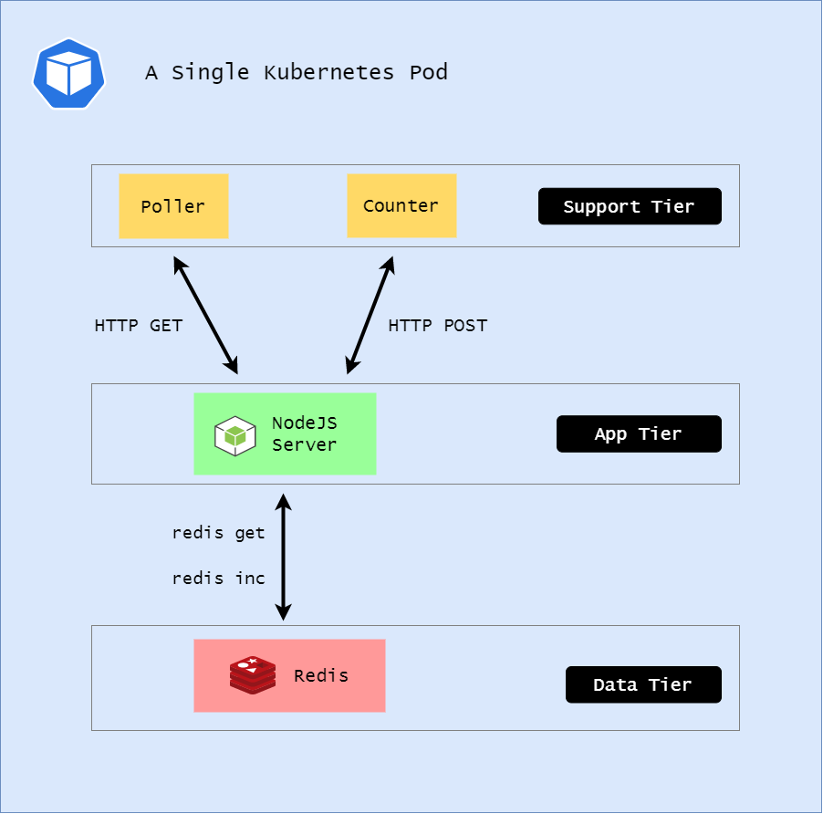

# Lab 041: Multi-Container Pods

## Pre-requisites

- [Basic Understanding of Kubernetes](../../README.md#kubernetes)
- [AWS account](../../pages/01-Pre-requisites/labs-optional-tools/README.md#create-an-aws-account)
- [AWS IAM Requirements](../../pages/01-Pre-requisites/labs-optional-tools/01-AWS-IAM-requirements.md)
- [AWS CLI, kubectl, and eksctl](../../pages/01-Pre-requisites/labs-kubernetes-pre-requisites/README.md#install-cli-tools) 

Here's a breakdown of sections for this lab.

- [Introduction](#introduction)
- [Launch a Simple EKS Cluster](#launch-a-simple-eks-cluster)
- [Namespace](#namespace)
- [Multi-Container Pods](#multi-container-pods)
- [Logs](#logs)
- [Cleanup](#cleanup)


## Introduction

In this lab, we'll use a sample counter application that increments and prints a counter. This application will be split into 4 containers across three tiers:

- **Application tier** - a NodeJS application server that accepts POST requests to increment the counter and GET requests to retrieve the counter value

- **Data tier** - a Redis database which stores the data from the counter

- **Support tier** - a poller that continuously makes GET requests and a counter that continuously makes POST requests

<p align=center>

</p>

## Launch a Simple EKS Cluster

Before we start, let's first verify if we're using the correct IAM user's access keys. This should be the user we created from the **pre-requisites** section above.

```bash
$ aws sts get-caller-identity 
```
```bash
{
    "UserId": "AIDxxxxxxxxxxxxxx",
    "Account": "1234567890",
    "Arn": "arn:aws:iam::1234567890:user/k8s-admin"
} 
```

For the cluster, we can reuse the **eksops.yml** file from the previous labs.

<details><summary> eksops.yml </summary>
 
```bash
apiVersion: eksctl.io/v1alpha5
# apiVersion: client.authentication.k8s.io/v1beta1
kind: ClusterConfig

metadata:
    version: "1.23"
    name: eksops
    region: ap-southeast-1 
nodeGroups:
    -   name: ng-dover
        instanceType: t3.large
        minSize: 1
        maxSize: 5
        desiredCapacity: 1
        ssh: 
            publicKeyName: "k8s-kp"
```
 
</details>

Launch the cluster.

```bash
time eksctl create cluster -f eksops.yml 
```

Check the nodes and pods.

```bash
kubectl get nodes 
```

Save the cluster, region, and AWS account ID in a variable. We'll be using these in a lot of the commands later.

```bash
MYREGION=ap-southeast-1
MYCLUSTER=eksops 
MYAWSID=$(aws sts get-caller-identity | python3 -c "import sys,json; print (json.load(sys.stdin)['Account'])")
```

## Namespace 

Namespaces separate resources according to users, environments, or applications. To secure access to a namespace, we can use Role-based access control (RBAC).

All the YAML files are inside the **manifests** directory.

```bash
cd manifests 
```

We'll use [namespace.yml](manifests/namespace.yml) to create the **microservices** namespace which will be tagged with the "app: counter" label.

```bash
apiVersion: v1
kind: Namespace
metadata:
  name: microservices
  labels:
    app: counter 
```

Apply.

```bash
kubectl apply -f namespace.yml 
```

To get the namespaces:

```bash
kubectl get ns -A  
```

## Multi-Container Pods 

Next, we'll use [multi-containers.yml](manifests/multi-containers.yml) to create a Pod with three containers.

```bash
apiVersion: v1
kind: Pod
metadata:
  name: app
  namespace: microservices 
spec:
  containers:
    - name: redis
      image: redis:latest
      imagePullPolicy: IfNotPresent
      ports:
        - containerPort: 6379
    
    - name: server
      image: lrakai/microservices:server-v1
      ports:
        - containerPort: 8080
      env:
        - name: REDIS_URL
          value: redis://localhost:6379

    - name: counter
      image: lrakai/microservices:counter-v1
      env:
        - name: API_URL
          value: http://localhost:8080

    - name: poller
      image: lrakai/microservices:poller-v1
      env:
        - name: API_URL
          value: http://localhost:8080
```

The first container is a **Redis** container which will pull down the latest image from Dockerhub. Whenever the Pod is started, the latest image is always pulled down. This could introduce some security issues since the latest image could contain bugs. As a precaution, we can tell the Pod to only pull the latest image if no image exists on the machine.

The second container uses a public image and exposes the port 8080. It also utilizes an environment variable to connect to the backend database. This ensures the server can find the redis database through port 6379. Since the Pod will have one IP address that we'll be shared by all containers inside it, the containers will talk to each other over the localhost.

The third and fourth uses the same image. Environment variables are also specified to tell the poller and couner container to find the server through port 8080 over the localhost.

Launch the Pod.

```bash
kubectl apply -f multi-containers.yml  
```

To check the Pod:

```bash
kubectl get pod -n microservices 
```

**Not scaleable**

Scaling the application would require the Pods to be scaled out. Since each Pod will have the same number of containers, then we'll have  proportionate growing number of containers as the Pod scales. This is not ideal.

A much better approach is to have each container scaled independently by putting them in different Pods.

## Logs 

Logs are events written to standard out or standarderr in the container. This allows us to verify that the application is working as exepcted.

To view the logs of the counter container:

```bash
kubectl logs app counter \
--tail 10 \
-n microservices 
```

It should return:

```bash
Incrementing counter by 2 ...
Incrementing counter by 3 ...
Incrementing counter by 5 ...
Incrementing counter by 8 ...
Incrementing counter by 10 ...
Incrementing counter by 9 ...
Incrementing counter by 2 ...
Incrementing counter by 3 ...
Incrementing counter by 8 ...
Incrementing counter by 2 ... 
```

To see the logs for the poller container, we can also use the "-f" parameter which shows the logs in real-time.

```bash
kubectl logs -f app poller  \
-n microservices
```

## Cleanup

Make sure to delete the cluster after the lab to save costs.

```bash
$ time eksctl delete cluster -f eksops.yml 
```

When you delete your cluster, make sure to double check the AWS Console and that the Cloudformation stacks (which we created by eksctl) are dropped cleanly.
