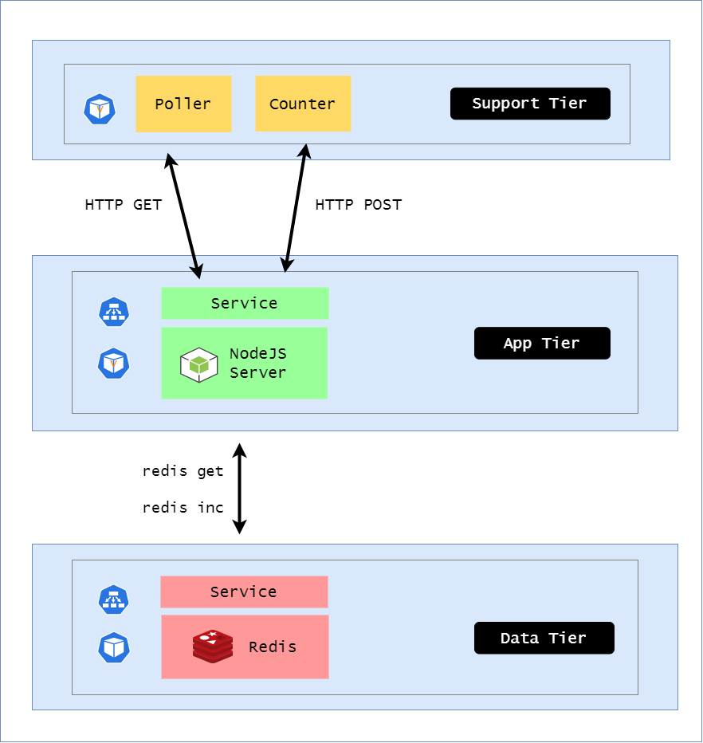

# Lab 046: Probes


  - [Pre-requisites](#pre-requisites)
  - [Introduction](#introduction)
  - [Launch a Simple EKS Cluster](#launch-a-simple-eks-cluster)
  - [Create the Namespace](#create-the-namespace)
  - [Support Tier](#support-tier)
  - [Data Tier](#data-tier)
  - [App Tier](#app-tier)
  - [Next Steps](#next-steps)


## Pre-requisites

- [Basic Understanding of Kubernetes](../../README.md#kubernetes)
- [AWS account](../../pages/01-Pre-requisites/labs-optional-tools/README.md#create-an-aws-account)
- [AWS IAM Requirements](../../pages/01-Pre-requisites/labs-optional-tools/01-AWS-IAM-requirements.md)
- [AWS CLI, kubectl, and eksctl](../../pages/01-Pre-requisites/labs-kubernetes-pre-requisites/README.md#install-cli-tools) 


## Introduction

In this lab, we'll get to learn how probes helps in detecting if Pods are ready or if Pods needs to be restarted. We'll be using the same application architecture from the previous [labs](../../Lab_043_Deployments/README.md).

We'll modify it a bit by adding probes to the Data tier (Redis):

- Liveness probe - container is alive if it accepts TCP connections

- Readiness probe - container is ready is it responds to redis-cli ping command

Similarly, the  App Tier will have:

- Liveness probe - api server is alive if it accepts HTTP requests (HTTP GET /probe/liveness)

- Readiness probe - api server is ready if it is online and has a connection to Redis (HTTP GET /probe/readiness)

<p align=center>

</p>

To learn more about probes, check out this [page](../../pages/04-Kubernetes/020-Probes.md).

## Launch a Simple EKS Cluster

Before we start, let's first verify if we're using the correct IAM user's access keys. This should be the user we created from the **pre-requisites** section above.

```bash
$ aws sts get-caller-identity 
```
```bash
{
    "UserId": "AIDxxxxxxxxxxxxxx",
    "Account": "1234567890",
    "Arn": "arn:aws:iam::1234567890:user/k8s-admin"
} 
```

For the cluster, we can reuse the **eksops.yml** file from the previous labs.

<details><summary> eksops.yml </summary>
 
```bash
apiVersion: eksctl.io/v1alpha5
# apiVersion: client.authentication.k8s.io/v1beta1
kind: ClusterConfig

metadata:
    version: "1.23"
    name: eksops
    region: ap-southeast-1 
nodeGroups:
    -   name: ng-dover
        instanceType: t3.large
        minSize: 1
        maxSize: 5
        desiredCapacity: 1
        ssh: 
            publicKeyName: "k8s-kp"
```
 
</details>

Launch the cluster.

```bash
time eksctl create cluster -f eksops.yml 
```

Check the nodes and pods.

```bash
kubectl get nodes 
```

Save the cluster, region, and AWS account ID in a variable. We'll be using these in a lot of the commands later.

```bash
MYREGION=ap-southeast-1
MYCLUSTER=eksops 
MYAWSID=$(aws sts get-caller-identity | python3 -c "import sys,json; print (json.load(sys.stdin)['Account'])")
```

## Create the Namespace

We'll use [namespace-probes.yml](manifests/namespace-probes.yml) to create **probes** namespace.

```bash
apiVersion: v1
kind: Namespace
metadata:
  name: probes
  labels:
    app: counter
```

Apply.

```bash
kubectl apply -f namespace-probes.yml 
```

Verify.

```bash
$ kubectl get ns
NAME                STATUS   AGE
default             Active   8h
probes         Active   18s 
```


## Support Tier 

We'll use the same [deployment-support.yml](manifests/deployment-support.yml) from the previous labs. Create the resource.


```bash
kubectl apply -f deployment-support.yml 
```


## Data Tier 

We'll use the [deployment-data.yml](manifests/deployment-data.yml). Open the manifest and scroll down to the bottom. Here we can see the probes declared for the Redis.

```bash
        livenessProbe:
          tcpSocket:
            port: redis # named port
          initialDelaySeconds: 15
        readinessProbe:
          exec:
            command:
            - redis-cli
            - ping
          initialDelaySeconds: 5 
```

Note that three sequential probes need to fail before the probe is marked as failed. This ensures that we have some buffer for the health checks.

Apply the manifest, and immediately get the deployments to watch the checking of probes.

```bash
kubectl apply -f deployment-data.yml; kubectl get deployments -n probes -w 
```

With the "-w" watch parameter, we can see the updates being appended at the bottom of the output.

```bash
service/data-tier created
deployment.apps/data-tier created
NAME        READY   UP-TO-DATE   AVAILABLE   AGE
data-tier   0/1     1            0           1s
data-tier   1/1     1            1           2s 
```

If there are some issues, it will appear in the output. As we can see, there's not much of an output here since its a simple Redis pod. 


## App Tier 

We'll use the [deployment-app.yml](manifests/deployment-app.yml) here. Notice that we've added a DEBUG envionment variable which ensures all incoming requests are logged. 

The liveness and readiness probes are declare din the same way, but here out probe will be checking if the requests are hitting the endpoints or "paths" that are specifically built for health checks.

```bash
          - name: DEBUG
            value: express:*
        livenessProbe:
          httpGet:
            path: /probe/liveness
            port: server
          initialDelaySeconds: 5
        readinessProbe:
          httpGet:
            path: /probe/readiness
            port: server
          initialDelaySeconds: 3 
```

Note that the liveness probe doesn't communicate with Redis and it will always return a "200 OK" status whenever the endpoints are hit.

The readiness probe endpoint checks if the data tier is available.

Apply the manifest.

```bash
kubectl apply -f deployment-app.yml; kubectl get deployments -n probes app-tier -w
```

Let's check the Pods and the logs.

```bash
$ kubectl get pods -n probes

NAME                         READY   STATUS    RESTARTS   AGE
app-tier-9b646b444-ptqrm     1/1     Running   0          78s
data-tier-6c8f55b94f-gvkrg   1/1     Running   0          18m
```
```bash
$ kubectl logs -f app-tier-9b646b444-ptqrm -n probes

npm info it worked if it ends with ok
npm info using npm@3.10.10
npm info using node@v6.11.0
npm info lifecycle server@1.0.0~prestart: server@1.0.0
npm info lifecycle server@1.0.0~start: server@1.0.0

> server@1.0.0 start /usr/src/app
> node server.js

Mon, 03 Oct 2022 12:02:50 GMT express:application set "x-powered-by" to true
Mon, 03 Oct 2022 12:02:50 GMT express:application set "etag" to 'weak'
Mon, 03 Oct 2022 12:02:50 GMT express:application set "etag fn" to [Function: wetag]
Mon, 03 Oct 2022 12:02:50 GMT express:application set "env" to 'development' 
```


## Next Steps 

Remember that probes only run AFTER the containers are started. To learn more on how to tests before the containers start, jump onto the next [lab](../../Lab_047_Init_Containers/README.md)!


