# Lab 052: EKS and CloudWatch Logging

  - [Pre-requisites](#pre-requisites)
  - [Introduction](#introduction)
  - [Enabling CloudWatch Logging through the Manifest](#enabling-cloudwatch-logging-through-the-manifest)
  - [Enabling CloudWatch Logging through the Console](#enabling-cloudwatch-logging-through-the-console)
  - [Disable CloudWatch Logging](#disable-cloudwatch-logging)
  - [CloudWatch Metrics - Container Insights](#cloudwatch-metrics---container-insights)
      - [Attach IAM Policy to Nodegroup Role](#attach-iam-policy-to-nodegroup-role)
      - [Deploy the CloudWatch Agent](#deploy-the-cloudwatch-agent)
      - [View the Metrics](#view-the-metrics)
      - [Generate Load](#generate-load)
  - [Cleanup](#cleanup)


## Pre-requisites

- [Basic Understanding of Kubernetes](../../README.md#kubernetes)
- [AWS account](../../pages/01-Pre-requisites/labs-optional-tools/README.md#create-an-aws-account)
- [AWS IAM Requirements](../../pages/01-Pre-requisites/labs-optional-tools/01-AWS-IAM-requirements.md)
- [AWS CLI, kubectl, and eksctl](../../pages/01-Pre-requisites/labs-kubernetes-pre-requisites/README.md#install-cli-tools) 


## Introduction

Since the Control Plane is managed by AWS, we don't have access to the hosts that are serve the Control Plane and manages the logs. 

We can access these logs thru CloudWatch by enabling which log type to send. To learn more, check out this [page](../../README.md##kubernetes).

For this lab, we'll be using ap-southeast-1 region (Singapore).

## Enabling CloudWatch Logging through the Manifest

Let's reuse the **eksops.yml** from Lab50 in this repo. 

```yaml
apiVersion: eksctl.io/v1alpha5
kind: ClusterConfig

metadata:
    version: "1.22"
    name: eksops
    region: ap-southeast-1 

nodeGroups:
    -   name: ng-dover
        instanceType: t2.small
        desiredCapacity: 3
        ssh: 
            publicKeyName: "k8s-kp"
```


Let's first create the cluster.

```bash
$ eksctl create cluster -f eksops.yml 
```

Save the cluster-name and region in variables becase we'll use them for the rest of this lab.

```bash
$ export MYCLUSTER=eksops
$ export MYREGION=ap-southeast-1 
```

We'll add the <code>cloudwatch</code> block that enables three log types.

```yaml
cloudWatch:
    clusterLogging:
        enableTypes:
            - "api"
            - "audit"
            - "authenticator"        
```

Note that if you want to enable all logtypes, simply put an '*" in <code>enableTypes</code>

```yaml
cloudWatch:
    clusterlogging:
        enableTypes: ["*"]
```

The new **eksops.yml** should now look like this:

```yaml
apiVersion: eksctl.io/v1alpha5
kind: ClusterConfig

metadata:
    version: "1.22"
    name: eksops
    region: ap-southeast-1 

nodeGroups:
    -   name: ng-dover
        instanceType: t2.small
        desiredCapacity: 3
        # minSize: 2  
        # maxSize: 5
        ssh: 
            publicKeyName: "k8s-kp"
            
cloudWatch:
    clusterLogging:
        enableTypes:
            - "api"
            - "audit"
            - "authenticator"        
```

To update the cluster, run the command below. Add the "--approve" to apply the changes. If this not specified, it will do a dry-run of the changes but will not apply them.

```bash
$ eksctl utils update-cluster-logging \
    --config-file eksops.yml \
    --approve
``` 

This should return the following output.

```bash
2022-08-25 08:56:35 [ℹ]  will update CloudWatch logging for cluster "eksops" in "ap-southeast-1" (enable types: api, audit, authenticator & disable types: controllerManager, scheduler)
2022-08-25 08:57:07 [✔]  configured CloudWatch logging for cluster "eksops" in "ap-southeast-1" (enabled types: api, audit, authenticator & disabled types: controllerManager, scheduler)
```

Switch over to the CloudWatch dashboard in the AWS Management Console and go to Log groups. Click the newly create log group.

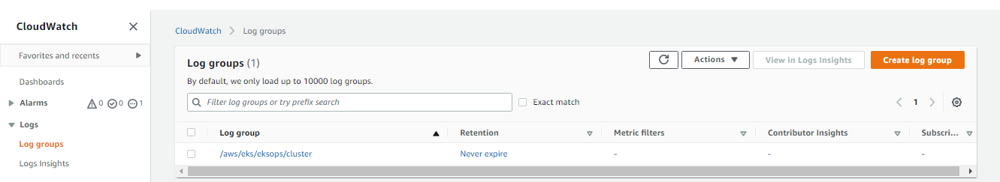  

Inside this log group, we can see that the log streams have been created. Click the <code>kube-api-server-xxxx</code> log stream.

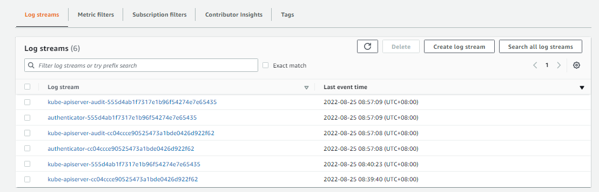  

Scroll down to view the most recent event. Click the event to view it in JSON format.


## Enabling CloudWatch Logging through the Console

The logging can also be enabled through the AWS Management Console. 

1. Go to the EKS dashboard
2. Click **Clusters** in the left menu.
3. Select the cluster name.
4. Scroll down to the **Logging** sections
5. Enable specific log types by clicking **Update**

Here's a sample.

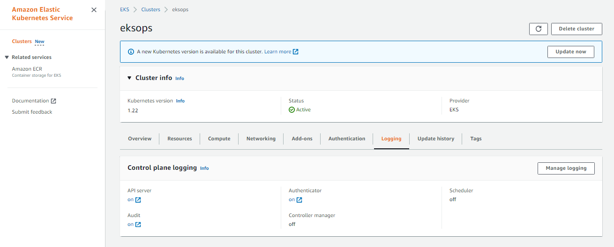  

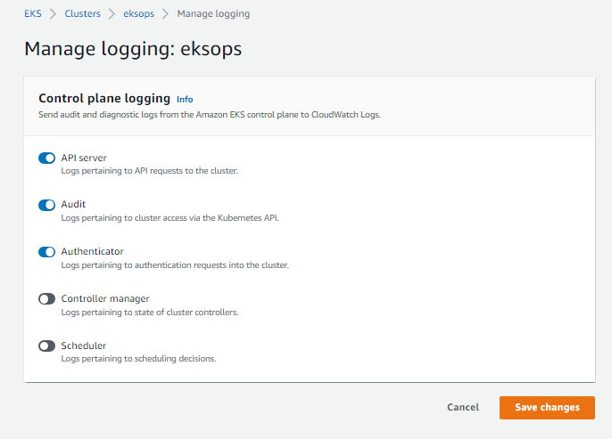  

As a reminder, CloudWatch logging adds costs on top of your EKS resources costs.


## Disable CloudWatch Logging 

Disabling the CloudWatch logging can be done through the CLI or the console.

```bash
$ eksctl utils update-cluster-logging \
    --name=eksops \
    --disable-types all \
    --approve
```

## CloudWatch Metrics - Container Insights

Let's now add container sights in CloudWatch metrics. Here are the steps to follow:

1. Add IAM policy to access the CW agent to nodegroup roles
2. Deploy the CloudWatch agent on each node
3. View the metrics
4. Generate load.

To learn more about Container Insights, check out the [Using Container Insights](https://docs.aws.amazon.com/AmazonCloudWatch/latest/monitoring/ContainerInsights.html) page.

### Attach IAM Policy to Nodegroup Role 

Similar with CloudWatch logging, enabling the metrics also adds costs to your bill for storage and collection.

To start with, go to IAM the dashboard and click **Roles** on the left menu. Search for "eksctl". Select the <code>NodeInstanceRole.</code>

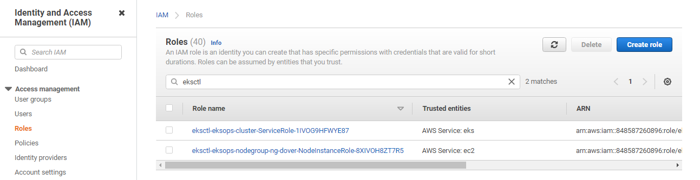  

Notice that there's a role for this node group. A role is created for each node group. If you have three node groups, then you'll see three NodeInstanceRole here.

This is important to know because we need to attach the policy to each node group. In our case, we only have one existing nodegroup so we'll only need to attach the IAM policy to the node group's role.

In the **Permisions** tab, click **Add permissions**.

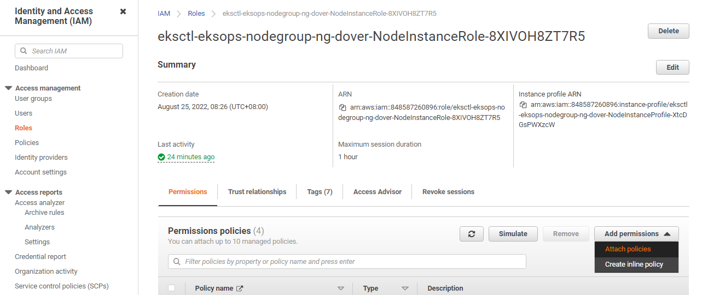  

Search for "cloudwatchagentserver", select the permission and click **Attach policies.**

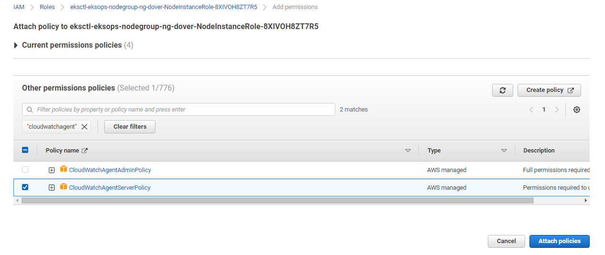  


### Deploy the CloudWatch Agent

We'll use the quickstart sample file from AWS and we'll replace the cluster-name and region with our own. To learn more, read the [Quick Start with the CloudWatch agent and Fluent Bit](https://docs.aws.amazon.com/AmazonCloudWatch/latest/monitoring/Container-Insights-setup-EKS-quickstart.html).

Set the variables first.

```bash
ClusterName=$MYCLUSTER
LogRegion=$MYREGION
FluentBitHttpPort='2020'
FluentBitReadFromHead='Off'
```

Pull the image down to our cluster and deploy the agent.

```bash
[[ ${FluentBitReadFromHead} = 'On' ]] && FluentBitReadFromTail='Off'|| FluentBitReadFromTail='On'

[[ -z ${FluentBitHttpPort} ]] && FluentBitHttpServer='Off' || FluentBitHttpServer='On'

curl https://raw.githubusercontent.com/aws-samples/amazon-cloudwatch-container-insights/latest/k8s-deployment-manifest-templates/deployment-mode/daemonset/container-insights-monitoring/quickstart/cwagent-fluent-bit-quickstart.yaml | sed 's/{{cluster_name}}/'${ClusterName}'/;s/{{region_name}}/'${LogRegion}'/;s/{{http_server_toggle}}/"'${FluentBitHttpServer}'"/;s/{{http_server_port}}/"'${FluentBitHttpPort}'"/;s/{{read_from_head}}/"'${FluentBitReadFromHead}'"/;s/{{read_from_tail}}/"'${FluentBitReadFromTail}'"/' | kubectl apply -f -
```

It should return the following output. It created a new namespace, **amazon-cloudwatch** and other resources in it.

```bash
namespace/amazon-cloudwatch created
serviceaccount/cloudwatch-agent created
clusterrole.rbac.authorization.k8s.io/cloudwatch-agent-role unchanged
clusterrolebinding.rbac.authorization.k8s.io/cloudwatch-agent-role-binding unchanged
configmap/cwagentconfig created
daemonset.apps/cloudwatch-agent created
configmap/fluent-bit-cluster-info created
serviceaccount/fluent-bit created
clusterrole.rbac.authorization.k8s.io/fluent-bit-role unchanged
clusterrolebinding.rbac.authorization.k8s.io/fluent-bit-role-binding unchanged
configmap/fluent-bit-config created
daemonset.apps/fluent-bit created 
```

Let's check the resources that's been generate for this namespace. 

```bash
$ kubectl get all -n amazon-cloudwatch
```
```bash
NAME                         READY   STATUS    RESTARTS   AGE
pod/cloudwatch-agent-4cthc   1/1     Running   0          2m28s
pod/cloudwatch-agent-c6rp8   1/1     Running   0          2m28s
pod/cloudwatch-agent-z2kvs   1/1     Running   0          2m28s
pod/fluent-bit-chfxm         1/1     Running   0          2m27s
pod/fluent-bit-d9w55         1/1     Running   0          2m27s
pod/fluent-bit-llff8         1/1     Pending   0          2m28s

NAME                              DESIRED   CURRENT   READY   UP-TO-DATE   AVAILABLE   NODE SELECTOR   AGE
daemonset.apps/cloudwatch-agent   3         3         3       3            3           <none>          2m29s
daemonset.apps/fluent-bit         3         3         2       3            3           <none>          2m29s 
```

From the output above, we can see that 6 pods were created, and the CloudWatch agent and fluent-bit is installed on all 3 nodes.

We can also verify this from the AWS Management Console. Go to the EKS dashboard, click the **Clusters** on the left menu, and select your cluster. Click the **Resources** tab and from the **All Namespace** dropdown bar, select **amazon-cloudwatch**.

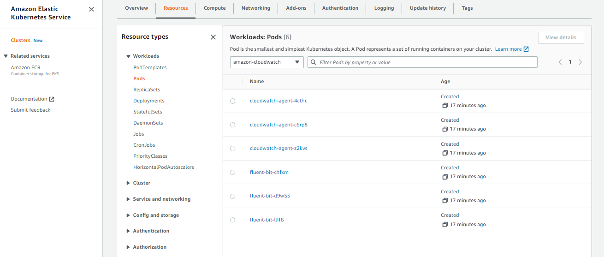  

### View the Metrics

In the AWS Management Console, go to the CloudWatch dashboard. Select **Metrics** > **All metrics**. Click the **ContainerInsights** metrics.

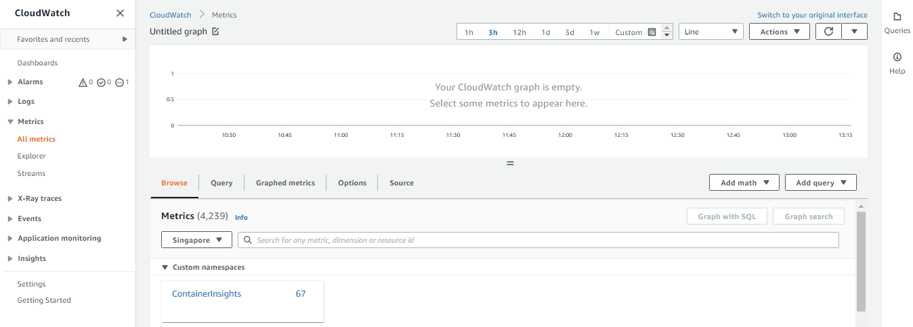  

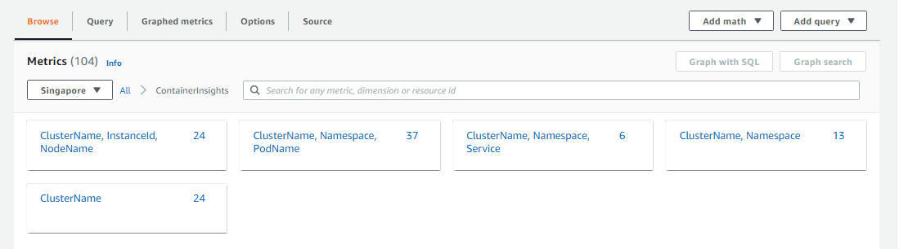  

In the left menu, click **Dashboards** > **Automatic dashboards** > **EKS cluster**.

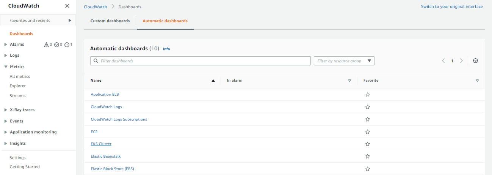  

This dashboard gives us a general overview of the cluster state. 

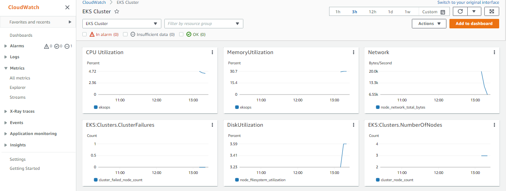  


### Generate Load 

To make sure that the Container Insights is working, we'll deploy a [HorizontalPodAutoscaler](https://kubernetes.io/docs/tasks/run-application/horizontal-pod-autoscale/) automatically scales the workload resource to match the demand. For this section, we'll follow the [HorizontalPodAutoscaler Walkthrough](https://kubernetes.io/docs/tasks/run-application/horizontal-pod-autoscale-walkthrough/) guide.

#### Install the Metrics Server 

Before we proceed, recall that we've been using Kubernetes version 1.22 since the start of this lab. We will need to install the [Kubernetes Metrics Server](https://github.com/kubernetes-sigs/metrics-server) which will collect resource metrics from Kubelets and exposes them in Kubernetes apiserver through Metrics API for use by **Horizontal Pod Autoscaler** and **Vertical Pod Autoscaler**.

```bash
$ kubectl apply -f https://github.com/kubernetes-sigs/metrics-server/releases/latest/download/components.yaml 
```

This should return the following output.

```bash
serviceaccount/metrics-server created
clusterrole.rbac.authorization.k8s.io/system:aggregated-metrics-reader created
clusterrole.rbac.authorization.k8s.io/system:metrics-server created
^[[Orolebinding.rbac.authorization.k8s.io/metrics-server-auth-reader created
clusterrolebinding.rbac.authorization.k8s.io/metrics-server:system:auth-delegator created
clusterrolebinding.rbac.authorization.k8s.io/system:metrics-server created
service/metrics-server created
deployment.apps/metrics-server created
apiservice.apiregistration.k8s.io/v1beta1.metrics.k8s.io created 
```

#### Run and expose php-apache server

Once the metrics server is installed, we can proceed with following the [HorizontalPodAutoscaler Walkthrough guide](https://kubernetes.io/docs/tasks/run-application/horizontal-pod-autoscale-walkthrough/). 

Let's use this manifest which will pull the **hpa-example** image and expose it as a Service.

<details><summary> php-apache.yml </summary>
 
```yaml
apiVersion: apps/v1
kind: Deployment
metadata:
  name: php-apache
spec:
  selector:
    matchLabels:
      run: php-apache
  replicas: 1
  template:
    metadata:
      labels:
        run: php-apache
    spec:
      containers:
      - name: php-apache
        image: registry.k8s.io/hpa-example
        ports:
        - containerPort: 80
        resources:
          limits:
            cpu: 500m
          requests:
            cpu: 200m
---
apiVersion: v1
kind: Service
metadata:
  name: php-apache
  labels:
    run: php-apache
spec:
  ports:
  - port: 80
  selector:
    run: php-apache
```
 
</details>
</br>

Apply the manifest.

```bash
$ kubectl apply -f php-apache.yml 
```
```bash
deployment.apps/php-apache created
service/php-apache created 
```

#### Create the HorizontalPodAutoscaler

The HPA maintains the number of replicas to 10, and scales the replicas to maintain an average CPU utilization across all Pods of 50%.

```bash
$ kubectl autoscale deployment php-apache --cpu-percent=50 --min=1 --max=10 
```
```bash
horizontalpodautoscaler.autoscaling/php-apache autoscaled 
```

Check the status.

```bash
$ kubectl get hpa 
```

To see more details about the HPA,

```bash
$ kubectl describe hpa 
```

#### Increase the Load 

Open a second terminal and run a client Pod that continuously sends queries to the php-apache service.

```bash
$ kubectl run -i --tty load-generator \
    --rm --image=busybox:1.28 \
    --restart=Never \
    -- /bin/sh -c "while sleep 0.01; do wget -q -O- http://php-apache; done" 
```

Inside the first terminal, run the command below a few times and see the CPU load increase.

```bash
$ kubectl get hpa php-apache --watch 
```

In the example below, we can see the CPU consumption increasing and replicas being added.

```bash
$ kubectl get hpa
NAME         REFERENCE               TARGETS   MINPODS   MAXPODS   REPLICAS   AGE
php-apache   Deployment/php-apache   0%/50%    1         10        1          32m

$ kubectl get hpa
NAME         REFERENCE               TARGETS    MINPODS   MAXPODS   REPLICAS   AGE
php-apache   Deployment/php-apache   109%/50%   1         10        1          32m

$ kubectl get hpa
NAME         REFERENCE               TARGETS    MINPODS   MAXPODS   REPLICAS   AGE
php-apache   Deployment/php-apache   162%/50%   1         10        1          60m

$ kubectl get hpa
^[[ONAME         REFERENCE               TARGETS    MINPODS   MAXPODS   REPLICAS   AGE
php-apache   Deployment/php-apache   250%/50%   1         10        4          60m
```

To stop generating the load, go back to the second terminal and hit Ctrl-C.

Next, go to the CloudWatch dashboard. We can see that the metrics are reporting the utilization of our cluster.

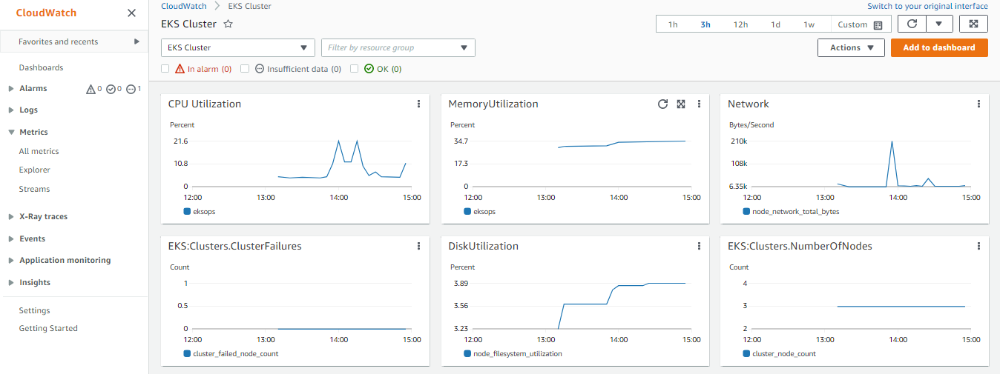  

## Cleanup

Whew, that was a lot!

Before we officially close this lab, make sure to destroy all resources to prevent incurring additional costs.

```bash
$ time eksctl delete cluster -f eksops.yml 
```

Note that when you delete your cluster, make sure to double check the AWS Console and check the Cloudformation stacks (which we created by eksctl) are dropped cleanly.


