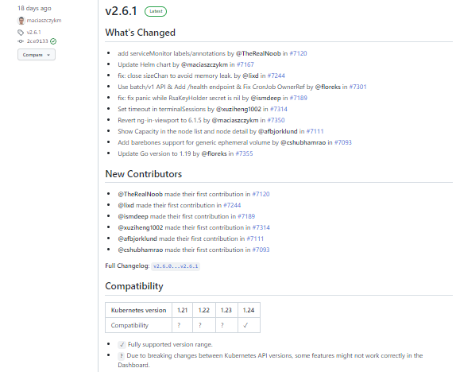
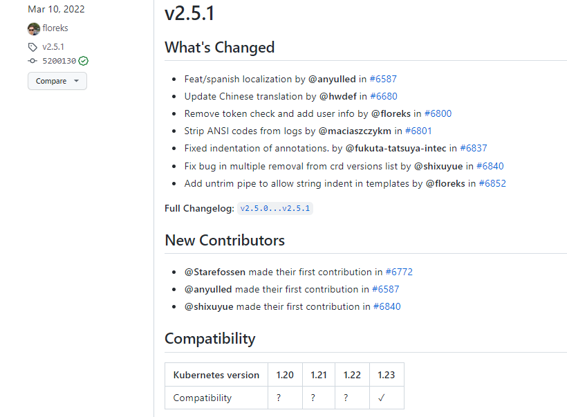
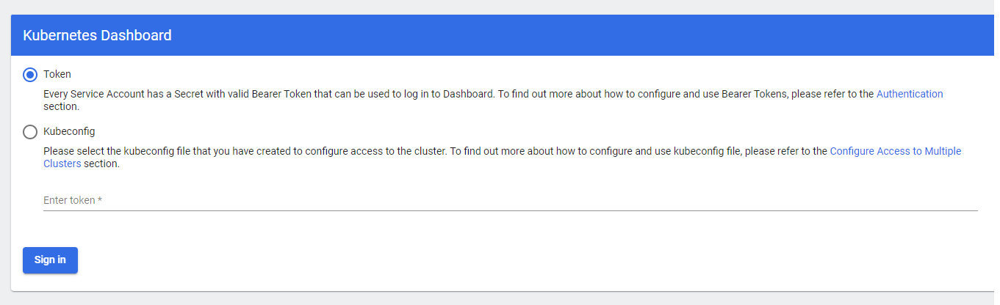
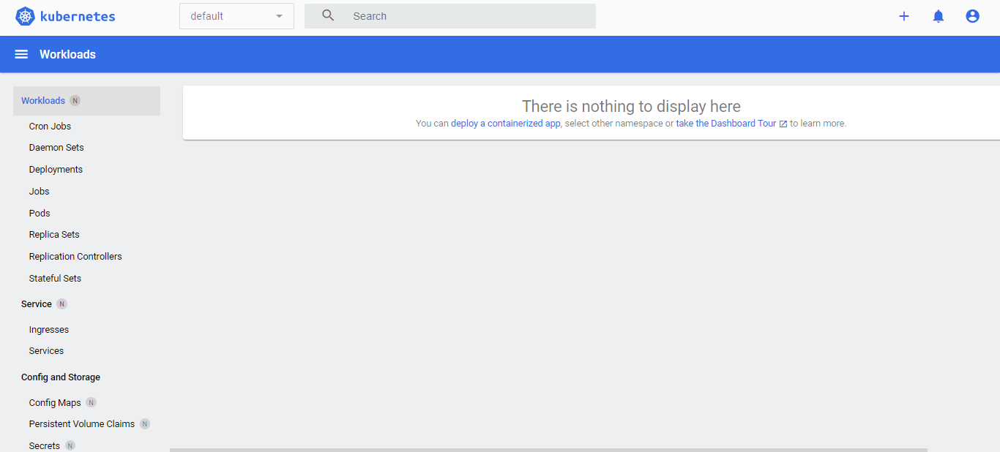
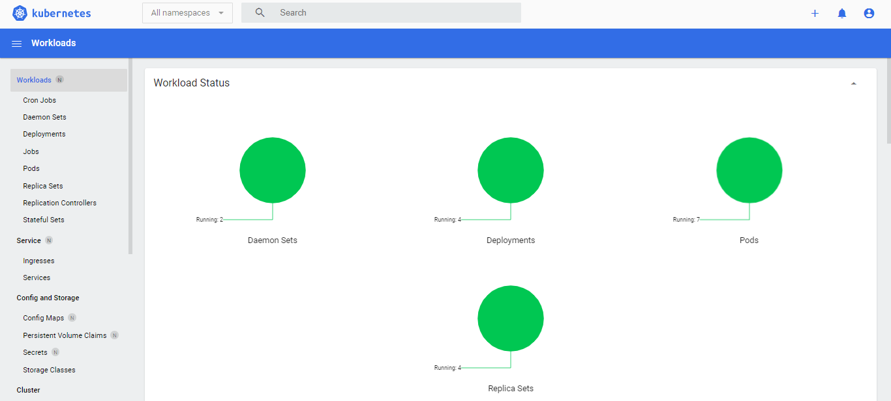
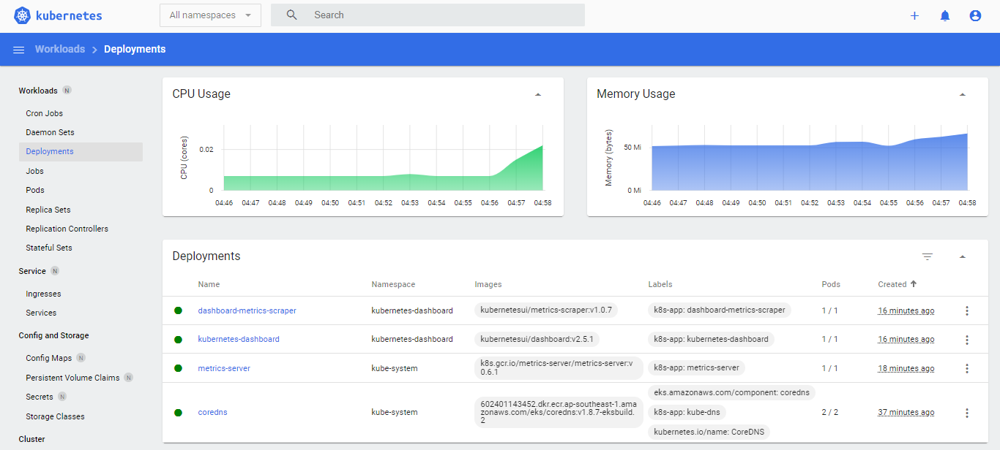
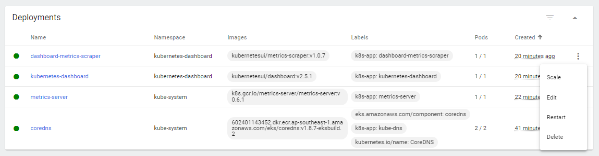

# Lab 055: Kubernetes Dashboard on EKS


## Pre-requisites

- [Basic Understanding of Kubernetes](../../README.md#kubernetes)
- [AWS account](../../pages/01-Pre-requisites/labs-optional-tools/README.md#create-an-aws-account)
- [AWS IAM Requirements](../../pages/01-Pre-requisites/labs-optional-tools/01-AWS-IAM-requirements.md)
- [AWS CLI, kubectl, and eksctl](../../pages/01-Pre-requisites/labs-kubernetes-pre-requisites/README.md#install-cli-tools) 
- [JQ and Curl](../../pages/01-Pre-requisites/labs-optional-tools/README.md#other-simple-cli-utilities) 

Here's a breakdown of sections for this lab.


- [Introduction](#introduction)
- [Launch a Simple EKS Cluster](#launch-a-simple-eks-cluster)
- [Install the Metrics Server](#install-the-metrics-server)
- [Deploy the Kubernetes Dashboard](#deploy-the-kubernetes-dashboard)
- [Create the Service Account](#create-the-service-account)
- [Explore the Kubernetes Dashboard](#explore-the-kubernetes-dashboard)
- [Cleanup](#cleanup)


We will be using **ap-southeast-1** region (Singapore).


## Introduction

In this lab, we'll be setting up the Kubernetes Dashboard on our Amazon EKS cluster. 

## Launch a Simple EKS Cluster

Before we start, let's first verify if we're using the correct IAM user's access keys. This should be the user we created from the [pre-requisites section above.](#lab-55-kubernetes-dashboard-on-eks)

```bash
$ aws sts get-caller-identity 
```
```bash
{
    "UserId": "AIDxxxxxxxxxxxxxx",
    "Account": "1234567890",
    "Arn": "arn:aws:iam::1234567890:user/k8s-admin"
} 
```

For the cluster, we can reuse the **eksops.yml** file from the previous labs.

<details><summary> eksops.yml </summary>
 
```bash
apiVersion: eksctl.io/v1alpha5
kind: ClusterConfig

metadata:
    version: "1.23"
    name: eksops
    region: ap-southeast-1 

nodeGroups:
    -   name: ng-dover
        instanceType: t3.large
        desiredCapacity: 2
        ssh: 
            publicKeyName: "k8s-kp"
```
 
</details>

Launch the cluster.

```bash
$ time eksctl create cluster -f eksops.yml 
```

Check the nodes and pods.

```bash
$ kubectl get nodes 
```

## Install the Metrics Server

<!-- First, make sure that we have the **jq** and **curl** utilities installed.

```bash
$ sudo apt install -y jq curl 
``` -->
<!-- 
Export the variables for the URL of the Kubernetes Dashboard and version.

```bash
MS_URL=$(curl --silent "https://api.github.com/repos/kubernetes-sigs/metrics-server/releases/latest" | jq -r .tarball_url) 
MS_VER=$(grep -o '[^/v]*$' <<< $MS_URL)
```

Download the latest version of the metrics server.

```bash
curl -Ls $MS_URL -o metrics-server-$MS_VER.tar.gz
```

Create a subdirectory and extract the archive file there. Remove the tarfile afterwards.

```bash
mkdir metrics-server 
```

```bash
tar xzf metrics-server-$MS_VER.tar.gz \
    --directory metrics-server \
    --strip-components 1
```
```bash
rm -f metrics-server-$MS_VER.tar.gz 
```

Finally, apply all the YAML files extracted from the archive.

```bash
kubectl apply -f metrics-server/deploy/1.8+
``` -->

Download the [metrics server v0.6.1](https://github.com/kubernetes-sigs/metrics-server/releases/tag/v0.6.1).

```bash
kubectl apply -f https://github.com/kubernetes-sigs/metrics-server/releases/download/v0.6.1/components.yaml
```

It should return the following output:

```bash
serviceaccount/metrics-server created
clusterrole.rbac.authorization.k8s.io/system:aggregated-metrics-reader created
clusterrole.rbac.authorization.k8s.io/system:metrics-server created
rolebinding.rbac.authorization.k8s.io/metrics-server-auth-reader created
clusterrolebinding.rbac.authorization.k8s.io/metrics-server:system:auth-delegator created
clusterrolebinding.rbac.authorization.k8s.io/system:metrics-server created
service/metrics-server created
deployment.apps/metrics-server created
apiservice.apiregistration.k8s.io/v1beta1.metrics.k8s.io created 
```

Verify the state of deployment.

```bash
kubectl get deployment metrics-server -n kube-system 
```
```bash
NAME             READY   UP-TO-DATE   AVAILABLE   AGE
metrics-server   1/1     1            1           91s
```

## Deploy the Kubernetes Dashboard

For the rest of this lab, we are using Kubernetes **version 1.23**. You might be using a different one so make sure to check the [Kubernetes dashboard releases](https://github.com/kubernetes/dashboard/releases?page=1) 
and search for the *Compatibility* table which shows the Kubernetes version that the particular release is compatible with.

As an example, we can't use the dashboard version 2.6.1 because it may have compatibility issues with Kubernetes version 1.23.

<p align=center>

</p>

So we'll need to search for another older version that's compatible with Kubernetes 1.23. We'll use the Kubernetes dashboard **[v2.5.1](https://github.com/kubernetes/dashboard/releases/tag/v2.5.1)**.

<p align=center>

</p>

If in case you can't find a compatible release, you can opt for Kubernetes dashboard version that's compatible to an older Kubernetes version (Let's say you have Kubernetes v1.22, you can try the Kubernetes dashboard v2.4.0 which is compatible with Kubernetes v1.21)

Another option is to delete your cluster, modify the **eksops.yml** file, and change the version to the supported one. Afterwards, re-launch the cluster.

Export the version to a variable.

```bash
export KB_VER=v2.5.1
```

Let's now deploy the dashboard.

```bash
kubectl apply -f https://raw.githubusercontent.com/kubernetes/dashboard/$KB_VER/aio/deploy/recommended.yaml 
```

It should return the following output.

```bash
namespace/kubernetes-dashboard created
serviceaccount/kubernetes-dashboard created
service/kubernetes-dashboard created
secret/kubernetes-dashboard-certs created
secret/kubernetes-dashboard-csrf created
secret/kubernetes-dashboard-key-holder created
configmap/kubernetes-dashboard-settings created
role.rbac.authorization.k8s.io/kubernetes-dashboard created
clusterrole.rbac.authorization.k8s.io/kubernetes-dashboard created
rolebinding.rbac.authorization.k8s.io/kubernetes-dashboard created
clusterrolebinding.rbac.authorization.k8s.io/kubernetes-dashboard created
deployment.apps/kubernetes-dashboard created
service/dashboard-metrics-scraper created
deployment.apps/dashboard-metrics-scraper created
```

## Create the Service Account

To login to the Kubernetes dashboard, we need to create a service account.

```bash
vim kb-admin-svc.yml 
```
```bash
apiVersion: v1
kind: ServiceAccount
metadata:
  name: kb-admin-svc
  namespace: kube-system
---
apiVersion: rbac.authorization.k8s.io/v1
kind: ClusterRoleBinding
metadata:
  name: kb-admin-svc
  namespace: kube-system
roleRef:
  apiGroup: rbac.authorization.k8s.io
  kind: ClusterRole
  name: cluster-admin
subjects:
  - kind: ServiceAccount
    name: kb-admin-svc
    namespace: kube-system
```

Apply the resources.

```bash
kubectl apply -f kb-admin-svc.yml
```
```bash
serviceaccount/kb-admin-svc unchanged
clusterrolebinding.rbac.authorization.k8s.io/kb-admin-svc created 
```

## Explore the Kubernetes Dashboard

Get the bearer token of the service account that we just created.

```bash
kubectl -n kube-system describe secret \
$(kubectl -n kube-system get secret | grep kb-admin-svc | awk '{print $1}') 
```

This should return the following output. Copy the token.

```bash
Name:         kb-admin-svc-token-txfbq
Namespace:    kube-system
Labels:       <none>
Annotations:  kubernetes.io/service-account.name: kb-admin-svc
              kubernetes.io/service-account.uid: 8aedd8de-ff95-4a20-8827-7995bab13638

Type:  kubernetes.io/service-account-token

Data
====
ca.crt:     1099 bytes
namespace:  11 bytes
token:      abcdefghijklmnopqrstuvwxyz1234567890abcdefghijklmnopqrstuvwxyz1234567890abcdefghijklmnopqrstuvwxyz1234567890abcdefghijklmnopqrstuvwxyz1234567890abcdefghijklmnopqrstuvwxyz1234567890abcdefghijklmnopqrstuvwxyz1234567890abcdefghijklmnopqrstuvwxyz1234567890abcdefghijklmnopqrstuvwxyz1234567890abcdefghijklmnopqrstuvwxyz1234567890abcdefghijklmnopqrstuvwxyz1234567890abcdefghijklmnopqrstuvwxyz1234567890abcdefghijklmnopqrstuvwxyz1234567890abcdefghijklmnopqrstuvwxyz1234567890abcdefghijklmnopqrstuvwxyz1234567890abcdefghijklmnopqrstuvwxyz1234567890abcdefghijklmnopqrstuvwxyz1234567890abcdefghijklmnopqrstuvwxyz1234567890abcdefghijklmnopqrstuvwxyz1234567890abcdefghijklmnopqrstuvwxyz1234567890abcdefghijklmnopqrstuvwxyz1234567890abcdefghijklmnopqrstuvwxyz1234567890abcdefghijklmnopqrstuvwxyz1234567890
```

Run this command to access Dashboard from your local workstation.

```bash
kubectl proxy 
```

You should see this returned. 

```bash
Starting to serve on 127.0.0.1:8001 
```

Open a web browser and paste this URL.

```bash
http://localhost:8001/api/v1/namespaces/kubernetes-dashboard/services/https:kubernetes-dashboard:/proxy/#/login 
```

It should now display the login screen. Enter the bearer token and click **Sign-in.**

  

You should be able to see the Kubernetes dashboard overview page. Note that there maybe some differences in the UI since it may get updated from time to time.

  

In the dropdown bar, change **default** to **All namespaces**.

  

Let's check the current deployments.

  

We can also scale and edit the deployments by clicking the three vertical dots at the right.

  


## Cleanup

Before we officially close this lab, make sure to destroy all resources to prevent incurring additional costs.

```bash
time eksctl delete cluster -f eksops.yml 
```

Note that when you delete your cluster, make sure to double-check the AWS Console and Cloudformation stacks (which we created by eksctl) are dropped cleanly.

