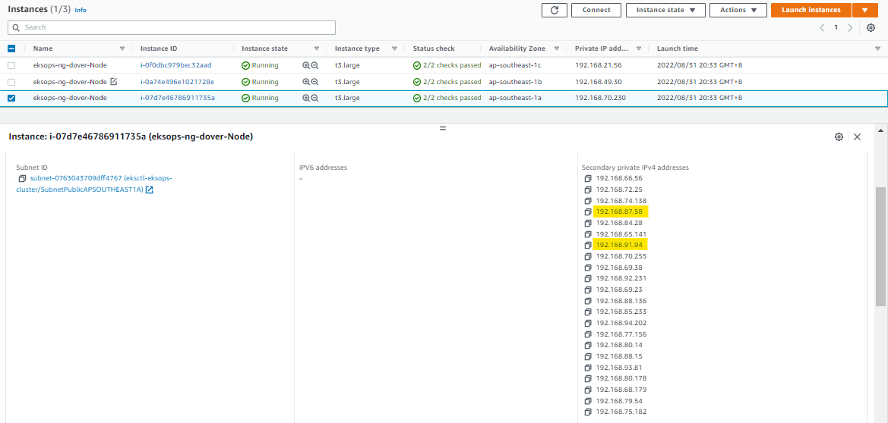
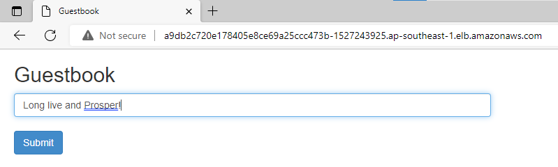

# Lab 056: Deploy a Stateless Guestbook Application


- [Pre-requisites](#pre-requisites)
- [Introduction](#introduction)
- [The Application Architecture](#the-application-architecture)
- [Launch a Simple EKS Cluster](#launch-a-simple-eks-cluster)
- [Deploy the Backend Resources](#deploy-the-backend-resources)
- [Deploy the Frontend Resources](#deploy-the-frontend-resources)
- [Setup the Kubernetes Dashboard](#setup-the-kubernetes-dashboard)
- [Scaling the Pods](#scaling-the-pods)
- [Perform some Chaos Testing](#perform-some-chaos-testing)
- [Cleanup](#cleanup)


## Pre-requisites

- [Basic Understanding of Kubernetes](../../README.md#kubernetes)
- [AWS account](../../pages/01-Pre-requisites/labs-optional-tools/README.md#create-an-aws-account)
- [AWS IAM Requirements](../../pages/01-Pre-requisites/labs-optional-tools/01-AWS-IAM-requirements.md)
- [AWS CLI, kubectl, and eksctl](../../pages/01-Pre-requisites/labs-kubernetes-pre-requisites/README.md#install-cli-tools) 


## Introduction

In this lab, we'll deploy an EKS cluster and then deploy a simple guestbook application that uses a Redis database. We'll also scale up and down our Pods and see the results. 

Lastly, we will also get to use and test a publicly accesible AWS LoadBalancer with our Kubernetes cluster.

For this lab, we'll **ap-southeast-1** region (Singapore).


## The Application Architecture 

<p align=center>

</p>


**Backend: Redis**
- single master (writes)
- multi slaves (reads)
- loadbalancing done internally between slaves
- slaves sync continuously with master

**Frontend: PHP App**  
- uses AWS ELB to loadbalance between the Pods
- "Read" balanced over multiple slave DBs
- "Writes" done on the single machine Redis DB

To learn more about the sample application, check out [Guestbook application on Kubernetes.](https://github.com/kubernetes/examples/tree/master/guestbook)

## Launch a Simple EKS Cluster

Before we start, let's first verify if we're using the correct IAM user's access keys. This should be the user we created from the **pre-requisites** section above.

```bash
$ aws sts get-caller-identity 
```
```bash
{
    "UserId": "AIDxxxxxxxxxxxxxx",
    "Account": "1234567890",
    "Arn": "arn:aws:iam::1234567890:user/k8s-admin"
} 
```

For the cluster, we can reuse the **eksops.yml** file from the previous labs.

<details><summary> eksops.yml </summary>
 
```bash
apiVersion: eksctl.io/v1alpha5
# apiVersion: client.authentication.k8s.io/v1beta1
kind: ClusterConfig

metadata:
    version: "1.23"
    name: eksops
    region: ap-southeast-1 
nodeGroups:
    -   name: ng-dover
        instanceType: t3.large
        minSize: 1
        maxSize: 5
        desiredCapacity: 1
        ssh: 
            publicKeyName: "k8s-kp"
```
 
</details>

Launch the cluster.

```bash
$ time eksctl create cluster -f eksops.yml 
```

Check the nodes and pods.

```bash
$ kubectl get nodes 
```

## Deploy the Backend Resources 

Let's start with creating the backend resources composed of:

- Redis Master Pod
- Redis Master Service (provides accesible fixed URL)
- Redis Slave Pods
- Redis Slave Service (performs the loadbalancing)

Create the **redis-master.yml**. In this manifest, we're creating two resources: a deployment and a service.

```bash
vim redis-master.yml 
```

<details><summary> redis-master.yml </summary>
 
```bash
# SOURCE: https://cloud.google.com/kubernetes-engine/docs/tutorials/guestbook

apiVersion: apps/v1
kind: Deployment
metadata:
  name: redis-master
  labels:
    app: redis
    # role: master
    # tier: backend
spec:
  replicas: 1
  selector:
    matchLabels:
      app: redis
      role: master
      tier: backend
  template:
    metadata:
      labels:
        app: redis
        role: master
        tier: backend
    spec:
      containers:
      - name: master
        image: "docker.io/redis:6.0.5"
        resources:
          requests:
            cpu: 100m
            memory: 100Mi
        ports:
        - containerPort: 6379 
---
apiVersion: v1
kind: Service
metadata:
  name: redis-master
  labels:
    app: redis
    role: master
    tier: backend
spec:
  ports:
  - port: 6379
    targetPort: 6379
  selector:
    app: redis
    role: master
    tier: backend        
```

</details>

In the **Deployment**, we can see the specifications. The *selector* tells kubectl to apply the deployment on instances and assign them the three labels: *app, role,* and *tier*.

The container image used is the Redis image available from Docker. We're also specifying limits for the CPU and memory, along with the port to use.

In the **Service** resource, we also specified the specifications and the labels for the Redis service. This will from the Redis master Pod
Deploy the Redis service.

Deploy the resources.

```bash
kubectl apply -f redis-master.yml 
```
```bash
deployment.apps/redis-master created
service/redis-master created 
```

Check if the Pod is created.

```bash
kubectl get pods 
```
```bash
NAME                            READY   STATUS    RESTARTS   AGE
redis-master-7fb7b4d7c5-xvdsb   1/1     Running   0          16m 
```

Also check the service. Notice that the redis-master was assigned a cluster IP, which is only accesible from within the cluster.

```bash
kubectl get svc  
```
```bash
NAME           TYPE        CLUSTER-IP      EXTERNAL-IP   PORT(S)    AGE
kubernetes     ClusterIP   10.100.0.1      <none>        443/TCP    59m
redis-master   ClusterIP   10.100.186.99   <none>        6379/TCP   34m
```

Let's now create the **redis-slave.yml**.

```bash
vim redis-slave.yml 
```
<details><summary> redis-slave.yml </summary>
 
```bash
 # SOURCE: https://cloud.google.com/kubernetes-engine/docs/tutorials/guestbook

apiVersion: apps/v1
kind: Deployment
metadata:
  name: redis-slave
  labels:
    app: redis
    role: slave
    tier: backend
spec:
  replicas: 2
  selector:
    matchLabels:
      app: redis
  template:
    metadata:
      labels:
        app: redis
        role: slave
        tier: backend
    spec:
      containers:
      - name: slave
        image: gcr.io/google_samples/gb-redisslave:v1
        resources:
          requests:
            cpu: 100m
            memory: 100Mi
        ports:
        - containerPort: 6379
        # defines how the followers can talk to the Redis master
        env:
        - name: GET_HOSTS_FROM
          value: dns
--- 

apiVersion: v1
kind: Service
metadata:
  name: redis-slave
  labels:
    app: redis
    role: slave
    tier: backend
spec:
  ports:
    # the port that this service should serve on
  - port: 6379
  selector:
    app: redis
    role: slave
    tier: backend
```
 
</details>

Deploy the slave resources.

```bash
kubectl apply -f redis-slave.yml 
```
```bash
deployment.apps/redis-slave created
service/redis-slave created 
```

Check if the Pods and services are created. As we can see, all the Pods have beeb assigned a private IP address.

```bash
kubectl get pods  
kubectl get svc
```

We can also get more information about the Pods by adding the the "- wide" parameter. Notice the IP addres in the **Node** column. These are IP address of the instances in which the Pod is currently deployed on.

```bash
kubectl get pods -o wide 
```
```bash
NAME                            READY   STATUS    RESTARTS   AGE   IP              NODE                                                NOMINATED NODE   READINESS GATES
redis-master-7fb7b4d7c5-xvdsb   1/1     Running   0          33m   192.168.87.58   ip-192-168-70-230.ap-southeast-1.compute.internal   <none>           <none>
redis-slave-566774f44b-2nb58    1/1     Running   0          24s   192.168.7.123   ip-192-168-21-56.ap-southeast-1.compute.internal    <none>           <none>
redis-slave-566774f44b-hhpqn    1/1     Running   0          24s   192.168.91.94   ip-192-168-70-230.ap-southeast-1.compute.internal   <none>           <none> 
```

Notice that the Redis Master and *redis-slave-566774f44b-hhpqn* are both running in the same node, based on Node IP. We can also confirm this on the EC2 dashboard.

<!--    -->

  

We can see that an instance has multiple secondary IP addresses attached to the Elastic Network Interfaces (ENI), which in turn is attached to the EC2 instance.

Note that depending on the instance-type that you choose, there is a [limitation in the ENI](https://docs.aws.amazon.com/AWSEC2/latest/UserGuide/using-eni.html) that can be attached to the instance, which means the smaller the instance type, the fewer the ENIs that can be attached, the fewer the IP addresses that can be used, and the fewer the Pods that can be ran in the node.

To learn more about a node,

```bash
kubectl describe node <node-ip> 
```


## Deploy the Frontend Resources

Now that our backend is ready, wee can now deploy the frontend resources:

- Guestbook Pods
- Guestbook Service (internet-facing AWS LoadBalancer)

After this, we'll inspect the underlying resources:

- Elastic LoadBalancer
- Security Groups 
- Elastic Network Interfaces (ENI)

Let's create the **frontend-app.yml**.

```bash
vim frontend-app.yml  
```
<details><summary> frontend-app.yml </summary>
 
```bash
# SOURCE: https://cloud.google.com/kubernetes-engine/docs/tutorials/guestbook

apiVersion: apps/v1
kind: Deployment
metadata:
  name: frontend
spec:
  replicas: 3
  selector:
    matchLabels:
        app: guestbook
        tier: frontend
  template:
    metadata:
      labels:
        app: guestbook
        tier: frontend
    spec:
      containers:
      - name: php-redis
        image: gcr.io/google_samples/gb-frontend:v5
        env:
        - name: GET_HOSTS_FROM
          value: "dns"
        resources:
          requests:
            cpu: 100m
            memory: 100Mi
        ports:
        - containerPort: 80
--- 

apiVersion: v1
kind: Service
metadata:
  name: frontend
  labels:
    app: guestbook
    tier: frontend
spec:
  # if your cluster supports it, uncomment the following to automatically create
  # an external load-balanced IP for the frontend service.
  # type: LoadBalancer
  type: LoadBalancer
  ports:
    # the port that this service should serve on
  - port: 80
  selector:
    app: guestbook
    tier: frontend
```
 
</details>

Deploy the frontend app.

```bash
kubectl apply -f frontend-app.yml 
```

Check the Pods. 

```bash
kubectl get pods 
```
```bash
NAME                            READY   STATUS    RESTARTS   AGE
frontend-57df59b89c-7css6       1/1     Running   0          53s
frontend-57df59b89c-chcfx       1/1     Running   0          53s
frontend-57df59b89c-t9xcr       1/1     Running   0          53s
redis-master-7fb7b4d7c5-xvdsb   1/1     Running   0          67m
redis-slave-566774f44b-2nb58    1/1     Running   0          34m
redis-slave-566774f44b-hhpqn    1/1     Running   0          34m 
```

Then check the running services. Notice that the frontend service (with type *LoadBalancer*) has an external-IP. This allows the LoadBalancer to be accesible from the web.

```
kubectl get svc 
```
```bash
NAME           TYPE           CLUSTER-IP      EXTERNAL-IP                                                                    PORT(S)        AGE
frontend       LoadBalancer   10.100.151.42   a9db2c720e178405e8ce69a25ccc473b-1527243925.ap-southeast-1.elb.amazonaws.com   80:30694/TCP   79s
kubernetes     ClusterIP      10.100.0.1      <none>                                                                         443/TCP        93m
redis-master   ClusterIP      10.100.186.99   <none>                                                                         6379/TCP       68m
redis-slave    ClusterIP      10.100.115.57   <none>                                                                         6379/TCP       34m 
```

To see full DNS name of the LoadBalancer, run the command below and search for the **LoadBalancer Ingress.**

```bash
kubectl describe service frontend 
```

We can also see this LoadBalancer created in **EC2** > **LoadBalancers**. In the **Description**, copy the **DNS Name.**


Open a new browser tab and paste the DNS name. You should now see the guestbook app. Type a message and click **Submit.**

  


## Setup the Kubernetes Dashboard 

The [previous lab](../Lab_055_EKS_Kubernetes_Dashboard/README.md) explained the concept and uses of Kubernetes Dashboard so we'll not be diving into that here. I do recommend that you check it out since the Kubernetes dashboard is one helpful utility tool which you can use when managing your Kubernetes clusters.

Here's a summary of commands that we need to run:

Download the metrics server.

```bash
kubectl apply -f https://github.com/kubernetes-sigs/metrics-server/releases/download/v0.6.1/components.yaml
```

Deploy the Kubernetes dashboard.

```bash
export KB_VER=v2.5.1
kubectl apply -f https://raw.githubusercontent.com/kubernetes/dashboard/$KB_VER/aio/deploy/recommended.yaml  
```

Create the service account that we'll use to authenticate to the Kubernetes dashboard.

```bash
vim kb-admin-svc.yml 
```

<details><summary> kb-admin-svc.yml </summary>
 
```bash
apiVersion: v1
kind: ServiceAccount
metadata:
  name: kb-admin-svc
  namespace: kube-system
---
apiVersion: rbac.authorization.k8s.io/v1
kind: ClusterRoleBinding
metadata:
  name: kb-admin-svc
  namespace: kube-system
roleRef:
  apiGroup: rbac.authorization.k8s.io
  kind: ClusterRole
  name: cluster-admin
subjects:
  - kind: ServiceAccount
    name: kb-admin-svc
    namespace: kube-system
```
 
</details>

Apply the YAML file.

```bash
kubectl apply -f kb-admin-svc.yml
```

Get the bearer token of the service account that we just created.

```bash
kubectl -n kube-system describe secret \
$(kubectl -n kube-system get secret | grep kb-admin-svc | awk '{print $1}') 
```

Run this command to access Dashboard from your local workstation.

```bash
kubectl proxy 
```

Open a web browser and paste this URL. Enter the token that we just copied.

```bash
http://localhost:8001/api/v1/namespaces/kubernetes-dashboard/services/https:kubernetes-dashboard:/proxy/#/login 
```


## Scaling the Pods

To check the Replicasets that we have for each resources, run the command below.

```bash
$ kubectl get rs
NAME                      DESIRED   CURRENT   READY   AGE
frontend-57df59b89c       3         3         3       17m
redis-master-7fb7b4d7c5   1         1         1       17m
redis-slave-566774f44b    2         2         2       17m 
```

We can also check for a specific deployment. As we can see, the frontend resource has 3 Pods currently running.

```bash
$ kubectl get deployment frontend
NAME       READY   UP-TO-DATE   AVAILABLE   AGE
frontend   3/3     3            3           20m 
```

Let's scale the replicas for the frontend Pods from 3 to 5.

```bash
kubectl scale --replicas 5 deployment frontend  
```

If we try to check again,

```bash
$ kubectl get deployment frontend
NAME       READY   UP-TO-DATE   AVAILABLE   AGE
frontend   5/5     5            5           21m 
```

Check the Pods. We should now see 5 Pods for the frontend resource.

```bash
$ kubectl get pods
NAME                            READY   STATUS    RESTARTS   AGE
frontend-57df59b89c-brnp5       1/1     Running   0          42s
frontend-57df59b89c-cc274       1/1     Running   0          42s
frontend-57df59b89c-pfzhd       1/1     Running   0          22m
frontend-57df59b89c-srndd       1/1     Running   0          22m
frontend-57df59b89c-tpt2n       1/1     Running   0          22m
redis-master-7fb7b4d7c5-rf8ht   1/1     Running   0          22m
redis-slave-566774f44b-2vmfp    1/1     Running   0          22m
redis-slave-566774f44b-7wq8t    1/1     Running   0          22m 
```

Let's try to scale the frontend Pods to 2.

```bash
kubectl scale --replicas 2 deployment frontend  
```

The replicas can be scaled in the CLI but it can also be done by editing the YAML file. Modify the **frontend-app.yml** and set the *replicas* to 8.

```bash
vim frontend-app.yml 
```
```bash
replicas: 8 
```

Apply the changes.

```bash
kubectl apply -f frontend-app.yml 
```

Going back to the Kubernetes dashboard that's opened in our web browser, click the **Deployments** tab. We should see here the three resources that we created and their Pods.

<!--    -->

  

**NOTE:** We should only edit the Replicas, not the ReplicaSets.

```bash
kubectl scale --replicas 2 deployment frontend  
```

If we try to run the command below, it will scale the ReplicaSet but it will not immediately update the number of running Pods. This is because it will have some conflict with what the Controller knows.

```bash
kubectl scale --replicas 2 rs deployment frontend  
```

The Controller defines the number of Pods based on the **Replicas** that are defined, so it will continuously overwrite any changes done on the ReplicaSets.

We can also scale the number of Pods through Kubernetes dashboard. In the **Deployment** section, click the three vertical dots in the right and click **Scale.**

  

Let's try to scale the **redis-slave** Pods to 5.

  

  

Back at the terminal, we could see that the changes have been applied.

```bash
$ kubectl get deployment
NAME           READY   UP-TO-DATE   AVAILABLE   AGE
frontend       10/10   10           10          49m
redis-master   1/1     1            1           49m
redis-slave    5/5     5            5           49m 
```

Let's now scale the frontend Pods and the redis-slave Pods for the next section.

```bash
$ kubectl scale --replicas 3 deployment frontend 
$ kubectl scale --replicas 3 deployment redis-slave 
```

## Perform some Chaos Testing

[Chaos Monkey](https://netflix.github.io/chaosmonkey/) is a term coined by Netflix to test the stability of a system by pseudo-randomly rebooting and terminating instances at any given time, which enforces failures. This helps in determining the weakness in the architecture and craft a working automated remediation strategy that could gracefully handle future failures.


In ths section, we'll observe the self-healing mechanism of Kubernetes by randomly killing Pods and stopping worker nodes. Let's check the running nodes and Pods.

```bash
$ kubectl get nodes
NAME                                               STATUS   ROLES    AGE    VERSION
ip-192-168-28-17.ap-southeast-1.compute.internal   Ready    <none>   170m   v1.23.9-eks-ba74326
ip-192-168-48-37.ap-southeast-1.compute.internal   Ready    <none>   170m   v1.23.9-eks-ba74326
ip-192-168-68-36.ap-southeast-1.compute.internal   Ready    <none>   170m   v1.23.9-eks-ba74326 
```

```bash
$ kubectl get pods
NAME                            READY   STATUS    RESTARTS   AGE
frontend-57df59b89c-lvw9v       1/1     Running   0          98m
frontend-57df59b89c-pjv4f       1/1     Running   0          98m
frontend-57df59b89c-qtbzf       1/1     Running   0          98m
redis-master-7fb7b4d7c5-rf8ht   1/1     Running   0          129m
redis-slave-566774f44b-2qgf9    1/1     Running   0          82m
redis-slave-566774f44b-2vmfp    1/1     Running   0          129m
redis-slave-566774f44b-jmjql    1/1     Running   0          82m
```

Let's simulate a failure by deleting 1 of the frontend Pods.

```bash
$ kubectl delete pod frontend-57df59b89c-pjv4f
```

However, if we check the Pods again, we see that it is immediately replaced by a new Pod.

```bash
$ kubectl get pods
NAME                            READY   STATUS    RESTARTS   AGE
frontend-57df59b89c-9gxvz       1/1     Running   0          39s
frontend-57df59b89c-bwv2k       1/1     Running   0          4s
frontend-57df59b89c-qtbzf       1/1     Running   0          99m
redis-master-7fb7b4d7c5-rf8ht   1/1     Running   0          131m
redis-slave-566774f44b-2qgf9    1/1     Running   0          83m
redis-slave-566774f44b-2vmfp    1/1     Running   0          131m
redis-slave-566774f44b-jmjql    1/1     Running   0          83m 
```

Let's try to delete all the frontend pods.

```bash
kubectl delete pod frontend-57df59b89c-29rnv
kubectl delete pod frontend-57df59b89c-bwv2k
kubectl delete pod frontend-57df59b89c-qtbzf
```

If we check the Pods again, they are now replaced by new ones. We can also see the all three frontend Pods and redis-slave Pods are equally distributed between the 3 nodes. 

```bash
$ kubectl get pods
$ kubectl get pods -o wide
NAME                            READY   STATUS    RESTARTS   AGE    IP               NODE                                               NOMINATED NODE   READINESS GATES
frontend-57df59b89c-h2xmt       1/1     Running   0          40s    192.168.8.147    ip-192-168-28-17.ap-southeast-1.compute.internal   <none>           <none>
frontend-57df59b89c-j8vj9       1/1     Running   0          50s    192.168.44.81    ip-192-168-48-37.ap-southeast-1.compute.internal   <none>           <none>
frontend-57df59b89c-m2nbs       1/1     Running   0          47s    192.168.83.184   ip-192-168-68-36.ap-southeast-1.compute.internal   <none>           <none>
redis-master-7fb7b4d7c5-rf8ht   1/1     Running   0          134m   192.168.27.104   ip-192-168-28-17.ap-southeast-1.compute.internal   <none>           <none>
redis-slave-566774f44b-2qgf9    1/1     Running   0          87m    192.168.59.39    ip-192-168-48-37.ap-southeast-1.compute.internal   <none>           <none>
redis-slave-566774f44b-2vmfp    1/1     Running   0          134m   192.168.23.97    ip-192-168-28-17.ap-southeast-1.compute.internal   <none>           <none>
redis-slave-566774f44b-jmjql    1/1     Running   0          87m    192.168.70.130   ip-192-168-68-36.ap-southeast-1.compute.internal   <none>           <none>
```

The redis-master Pod is launched in the node with an IP address of "192.168.28.17" along with 1 frontend Pod and 1 redis-slave Pod. Let's try to kill this node by stopping the EC2 instance through the EC2 dashboard in the AWS Console.

  

Back at the terminal, we can now see that the Pods are now redistributed to the two remaining nodes.

```bash
$ kubectl get pods -o wide
NAME                            READY   STATUS    RESTARTS   AGE     IP               NODE                                               NOMINATED NODE   READINESS GATES
frontend-57df59b89c-h2xmt       1/1     Running   0          9m5s    192.168.8.147    ip-192-168-28-17.ap-southeast-1.compute.internal   <none>           <none>
frontend-57df59b89c-j8vj9       1/1     Running   0          9m15s   192.168.44.81    ip-192-168-48-37.ap-southeast-1.compute.internal   <none>           <none>
frontend-57df59b89c-m2nbs       1/1     Running   0          9m12s   192.168.83.184   ip-192-168-68-36.ap-southeast-1.compute.internal   <none>           <none>
redis-master-7fb7b4d7c5-rf8ht   1/1     Running   0          143m    192.168.27.104   ip-192-168-28-17.ap-southeast-1.compute.internal   <none>           <none>
redis-slave-566774f44b-2qgf9    1/1     Running   0          95m     192.168.59.39    ip-192-168-48-37.ap-southeast-1.compute.internal   <none>           <none>
redis-slave-566774f44b-2vmfp    1/1     Running   0          143m    192.168.23.97    ip-192-168-28-17.ap-southeast-1.compute.internal   <none>           <none>
redis-slave-566774f44b-jmjql    1/1     Running   0          95m     192.168.70.130   ip-192-168-68-36.ap-southeast-1.compute.internal   <none>           <none> 
```

Checking the nodes, we see that the "192.168.28.17" is in a **NotReady** state. If we run the command a few more time, it will change to **Ready**.

```bash
$ kubectl get nodes
NAME                                               STATUS     ROLES    AGE     VERSION
ip-192-168-28-17.ap-southeast-1.compute.internal   Ready      <none>   3h12m   v1.23.9-eks-ba74326
ip-192-168-48-37.ap-southeast-1.compute.internal   NotReady   <none>   3h12m   v1.23.9-eks-ba74326
ip-192-168-68-36.ap-southeast-1.compute.internal   Ready      <none>   3h12m   v1.23.9-eks-ba74326 
```

It may appear that Kubernetes restarted the node when we stopped it. However, if we check the EC2 console again, we now see four nodes. The instance we stopped is not terminated by Kubernetes and a new one was launched as a replacement. Notice also that the new instance took over the same IP of the killed instance.

  

Checking the terminal again, we see that the Pods are redistributed to the three worker nodes once again.

```bash
$ kubectl get pods -o wide
NAME                            READY   STATUS    RESTARTS   AGE     IP               NODE                                               NOMINATED NODE   READINESS GATES
frontend-57df59b89c-h2xmt       1/1     Running   0          15m     192.168.8.147    ip-192-168-28-17.ap-southeast-1.compute.internal   <none>           <none>
frontend-57df59b89c-m2nbs       1/1     Running   0          15m     192.168.83.184   ip-192-168-68-36.ap-southeast-1.compute.internal   <none>           <none>
frontend-57df59b89c-n7vs9       1/1     Running   0          4m52s   192.168.87.19    ip-192-168-68-36.ap-southeast-1.compute.internal   <none>           <none>
redis-master-7fb7b4d7c5-rf8ht   1/1     Running   0          149m    192.168.27.104   ip-192-168-28-17.ap-southeast-1.compute.internal   <none>           <none>
redis-slave-566774f44b-2vmfp    1/1     Running   0          149m    192.168.23.97    ip-192-168-28-17.ap-southeast-1.compute.internal   <none>           <none>
redis-slave-566774f44b-jmjql    1/1     Running   0          102m    192.168.70.130   ip-192-168-68-36.ap-southeast-1.compute.internal   <none>           <none>
redis-slave-566774f44b-js8vm    1/1     Running   0          4m52s   192.168.28.73    ip-192-168-28-17.ap-southeast-1.compute.internal   <none>           <none> 
```

## Cleanup

Before we officially close this lab, make sure to destroy all resources to prevent incurring additional costs.

```bash
$ time eksctl delete cluster -f  
```

Note that when you delete your cluster, make sure to double-check the AWS Console and check the Cloudformation stacks (which we created by eksctl) are dropped cleanly.


