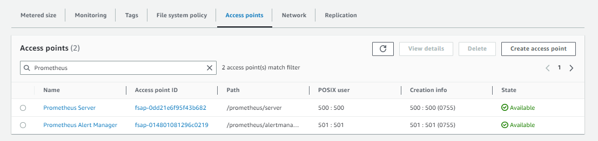
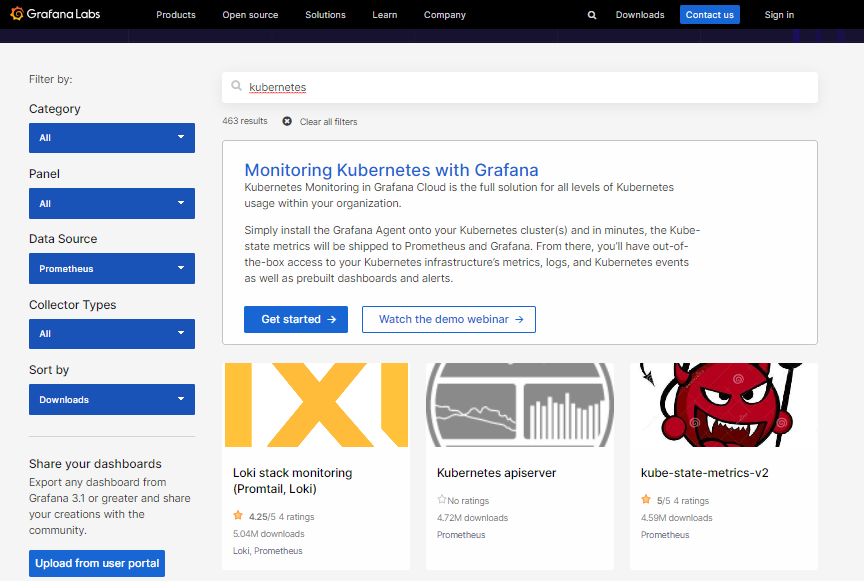
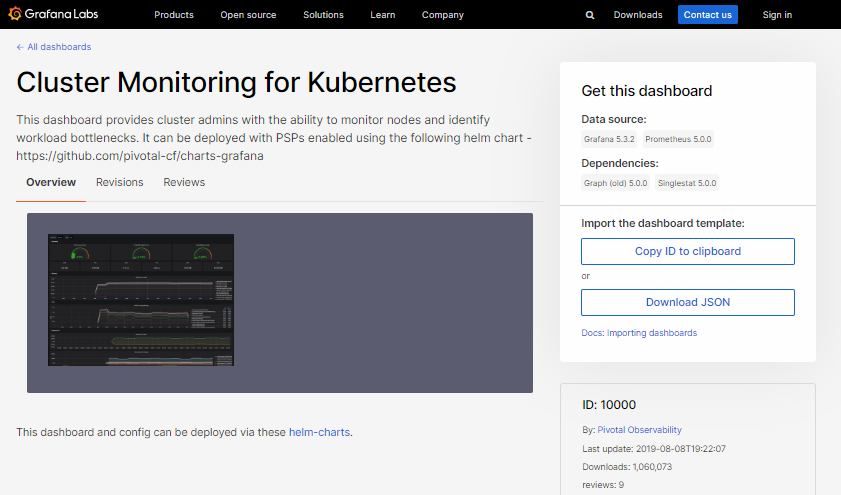

# Lab 059 - Deploy Prometheus and Grafana using Helm

## Pre-requisites

- [Basic Understanding of Kubernetes](../../README.md#kubernetes)
- [AWS account](../../pages/01-Pre-requisites/labs-optional-tools/README.md#create-an-aws-account)
- [AWS IAM Requirements](../../pages/01-Pre-requisites/labs-optional-tools/01-AWS-IAM-requirements.md)
- [AWS CLI, kubectl, and eksct installed](../../pages/01-Pre-requisites/labs-kubernetes-pre-requisites/README.md#install-cli-tools) 
<!-- - Helm -->

## Sections 

- [Introduction](#introduction)
- [Launch an EKS Cluster](#launch-an-eks-cluster)
- [Create the Persistent Storage](#create-the-persistent-storage)
    - [Using EFS as Prometheus storage](#using-efs-as-prometheus-storage)
    - [Using EBS as Prometheus storage](#using-ebs-as-prometheus-storage)
- [Create the Namespace](#create-the-namespace)
- [Setup Prometheus](#setup-prometheus)
- [Setup Grafana](#setup-grafana)
- [Importing a Public Dashboard](#importing-a-public-dashboard)
- [Troubleshooting](#troubleshooting)
        - [Removing Prometheus](#removing-prometheus)
        - [Prometheus stuck in Pending](#prometheus-stuck-in-pending)
- [Resources](#resources)


## Introduction

**Prometheus** serves as a system monitor which allows us the ability to analyze what's happening to our system resources at any given time. Within a Kubernetes environment, it is possible to expose the _metrics/_ endpoint, allowing Prometheus to fetch metrics from said endpoint.

**Grafana** serves as a tool for visualizing data in user-friendly and easily understandable dashboards. While it is possible to view data directly in Prometheus, the data becomes more readily interpretable and actionable when monitored through Grafana's dashboards.

The combinatiopn of these two tools can be used to manage workload outside Kubernetes clusters but they also work well with containerized applications.

A few notes:

- This lab will use **Helm** to setup both tools
- The EKS cluster and EFS filesystem will also be created 
- The necessary YAML files are in the **manifests** directory

## Launch an EKS Cluster

Before we setup the cluster, ensure that we have the correct IAM user's access keys. 
This should be the user created from the **pre-requisites** section above.

```bash
aws sts get-caller-identity 
```
```bash
{
    "UserId": "AIDxxxxxxxxxxxxxx",
    "Account": "1234567890",
    "Arn": "arn:aws:iam::1234567890:user/k8s-admin"
} 
```

For the cluster, we can reuse the [eksops.yml](./manifests/eksops.yml) file from the previous labs. Launch the cluster. Note that you must have generated an SSH key pair which can be used to SSH onto the nodes. The keypair I've used here is named "k8s-kp" and is specified in the manifest file.

```bash
time eksctl create cluster -f manifests/eksops.yml 
```

Check the nodes.

```bash
kubectl get nodes 
```

Save the cluster, region, and AWS account ID in a variable. We'll be using these in a lot of the commands later.

```bash
MYREGION=ap-southeast-1
MYCLUSTER=eksops 
MYAWSID=$(aws sts get-caller-identity | python3 -c "import sys,json; print (json.load(sys.stdin)['Account'])")
```

Verify in the AWS Management Console. We should be able to see the cluster and the nodegroup.

## Create the Persistent Storage 

I've found that most tutorials/resources online go straight into deploying the Prometheus and Grafana without mentioning that each Prometheus instance will need a persistent volume (PV) to store the recorded metrics. When we deploy Prometheus without setting up the persistent storage first, we'll have two of the Prometheus pods stuck in Pending state.

```bash
$ kubectl get pods -n prometheus | grep Pending 

pod/prometheus-alertmanager-0                           0/1     Pending   0          23s
pod/prometheus-server-6799c8f885-8b8fh                  0/2     Pending   0          23s 
```

Since we're using an Amazon EKS cluster, then the available persistent storage that we can use are:

- EBS
- EFS 

A basic Prometheus setup can work with an EBS volume for persisting the data but in the event that the EC2 instance goes down or we need to scale up the number of Prometheus servers, the EBS volume can only be accessed by instances launched in the same availability zone. This is because EBS volumes are zone specific and in addition to this, cannot be shared across multiple instances. 

On the other hand, an EFS Filesystem allows to mount the same storage across availability zones and can be accessed by multiple instances at the same time.


### Using EFS as Prometheus storage

> **NOTE:** 
> As of June 2023, Prometheus still doesn't work with NFS, especially EFS. 
> More details can be found here: https://prometheus.io/docs/prometheus/latest/storage/


There are some sources online that mentioned that they were able to make it work succesfully since Prometheus storage is now omptimized so well that it has little I/O strain. However, these sources did not provide any supporting links or instructions on how to implement EFS as the Prometheus storage. 

I'm hesitant to remove my notes on my attempt to use EFS so I'll just leave it here in case there will be a support for EFS in the distant future.

<details><summary> Using EFS as Prometheus storage (Unsuccessful) </summary>


~~We'll be using an EFS Filesystem for this lab~~. The detailed steps are provided in the [previous Lab 58](../../Lab_058_EKS_Deploy_a_Stateful_App_using_EFS_OUTDATED/README.md). Here's the summary:

```bash
### Verify that you an OIDC provider created. 
aws eks describe-cluster --name $MYCLUSTER --query "cluster.identity.oidc.issuer" --output text

### Create the IAM Policy and role.
aws iam create-policy \
    --policy-name AmazonEKS_EFS_CSI_Driver_Policy \
    --policy-document file://iam_policies/iam-policy.json

aws iam create-role \
  --role-name AmazonEKS_EFS_CSI_DriverRole \
  --assume-role-policy-document file://"iam_policies/trust-policy.json" 

aws iam attach-role-policy \
  --policy-arn arn:aws:iam::$MYAWSID:policy/AmazonEKS_EFS_CSI_Driver_Policy \
  --role-name AmazonEKS_EFS_CSI_DriverRole

### Create the service account.
kubectl apply -f manifests/efs-service-account.yml

### Install the EFS Driver 
helm repo add aws-efs-csi-driver https://kubernetes-sigs.github.io/aws-efs-csi-driver/
helm repo update

helm upgrade -i aws-efs-csi-driver aws-efs-csi-driver/aws-efs-csi-driver \
    --namespace kube-system \
    --set image.repository=602401143452.dkr.ecr.ap-southeast-1.amazonaws.com/eks/aws-efs-csi-driver \
    --set controller.serviceAccount.create=false \
    --set controller.serviceAccount.name=efs-csi-controller-sa 

kubectl get pod -n kube-system -l "app.kubernetes.io/name=aws-efs-csi-driver,app.kubernetes.io/instance=aws-efs-csi-driver"     
```

Next, create the EFS Filesystem. Since the console UI is changing from time to time, better to follow the [official AWS Documentation](https://docs.aws.amazon.com/efs/latest/ug/creating-using-create-fs.html) on how to create the EFS Filesystem. 

  


Next, create the access point by selecting the EFS filesystem and clicking the **Access Points** tab at the bottom. Click **Create access point** to create two access points:

Fields | Values | 
---------|----------|
 Filesystem | Select the filesystem you just created | 
 Name | Prometheus Server | 
 Root | /prometheus/server | 
 Posix User ID | 500 | 
 Posix Group ID | 500 | 
 Root directory creation permissions User ID | 500 | 
 Root directory creation permissions Group ID | 500 | 
 Access point permissions | 0755 | 


Fields | Values | 
---------|----------|
 Filesystem | Select the filesystem you just created | 
 Name | Prometheus Alert Manager | 
 Root | /prometheus/alertmanager | 
 Posix User ID | 501 | 
 Posix Group ID | 501 | 
 Root directory creation permissions User ID | 501 | 
 Root directory creation permissions Group ID | 501 | 
 Access point permissions | 0755 | 

Both access points should be in the "Available" state. Take note of the Access Point ID of each.



Once we have the EFS driver and EFS Filesystem set up, the next step is to create the persistent volumes. We can use the [storageclass-pvc.yml](manifests/storageclass-pvc.yml). Make sure to edit the YAML file first and replace the **volumeHandle** with the correct *fsap* (access point) ID.

```bash
volumeHandle: "fs-05f10ff5687745db0::fsap-014801081296c0219"  
```

```bash
kubectl apply -f manifests/storageclass-pvc.yml
```

</details>


### Using EBS as Prometheus storage

The detailed steps to install the EBS CSI provisioner can be found in the [previous Lab 057.](../../Lab_057_EKS_Deploy_a_Stateful_App_using_EBS/README.md). Here's the summary:

```bash
MYREGION=ap-southeast-1     # Specify the region here
MYCLUSTER=eksops            # Specify the cluster name here
MYAWSID=$(aws sts get-caller-identity | python3 -c "import sys,json; print (json.load(sys.stdin)['Account'])")
```
```bash
aws eks describe-cluster \
--name $MYCLUSTER \
--region $MYREGION \
--query "cluster.identity.oidc.issuer" --output text 
```

If the **describe** command did not return anything, you will need to [create the OIDC provider](../../Lab_057_EKS_Deploy_a_Stateful_App_using_EBS/README.md).

Create an IAM Policy and IAM role, and then attach the policy to the role.

```bash
aws iam create-policy \
--policy-name AmazonEKS_EBS_CSI_Driver_Policy \
--policy-document file://manifests/example-iam-policy.json 
```
```bash
aws iam create-role \
  --role-name AmazonEKS_EBS_CSI_DriverRole \
  --assume-role-policy-document file://"trust-policy.json" 
```
```bash
aws iam attach-role-policy \
--policy-arn arn:aws:iam::$MYAWSID:policy/AmazonEKS_EBS_CSI_Driver_Policy \
--role-name AmazonEKS_EBS_CSI_DriverRole 
```


To deploy the Amazon EBS CSI driver:

If you're based in a **non-China region**, run:

```bash
kubectl apply -k "github.com/kubernetes-sigs/aws-ebs-csi-driver/deploy/kubernetes/overlays/stable/?ref=master" 
```

If you're based in a **China region**, run:

```bash
kubectl apply -k "github.com/kubernetes-sigs/aws-ebs-csi-driver/deploy/kubernetes/overlays/stable-cn/?ref=master" 
```

The steps above will create a few resources, including the service account **ebs-csi-controller-sa.**
Annotate the Kubernetes service account with the Amazon Resource Name (ARN) of the IAM role. 

```bash
kubectl annotate serviceaccount ebs-csi-controller-sa \
-n kube-system \
eks.amazonaws.com/role-arn=arn:aws:iam::$MYAWSID:role/AmazonEKS_EBS_CSI_DriverRole 
```


## Create the Namespace
 
As Kubernetes best pratice, create the namespace for each. Use the [namespace.yml](manifests/namespace.yml)

```bash
kubectl apply -f manifests/namespace.yml  
```

## Setup Prometheus

Install the prometheus using Helm.

```bash
helm repo add prometheus-community https://prometheus-community.github.io/helm-charts  

helm install prometheus prometheus-community/prometheus \
    --namespace prometheus \
    --set alertmanager.persistentVolume.storageClass="ebs-sc" \
    --set server.persistentVolume.storageClass="ebs-sc" 
```

Take note of the endpoint that will be shown in the output.

```bash
The Prometheus PushGateway can be accessed via port 9091 on the following DNS name from within your cluster:
prometheus-prometheus-pushgateway.prometheus.svc.cluster.local 
```

Check if Prometheus is deployed.


```bash
$ kubectl get all -n prometheus  

NAME                                                    READY   STATUS    RESTARTS   AGE
pod/prometheus-alertmanager-0                           0/1     Pending   0          23s
pod/prometheus-kube-state-metrics-6fcf5978bf-h6m4l      1/1     Running   0          23s
pod/prometheus-prometheus-node-exporter-8ck4p           1/1     Running   0          23s
pod/prometheus-prometheus-node-exporter-scc7f           1/1     Running   0          24s
pod/prometheus-prometheus-node-exporter-w2p5d           1/1     Running   0          23s
pod/prometheus-prometheus-pushgateway-fdb75d75f-9twn8   1/1     Running   0          23s
pod/prometheus-server-6799c8f885-8b8fh                  0/2     Pending   0          23s

NAME                                          TYPE        CLUSTER-IP       EXTERNAL-IP   PORT(S)    AGE
service/prometheus-alertmanager               ClusterIP   10.100.200.40    <none>        9093/TCP   24s
service/prometheus-alertmanager-headless      ClusterIP   None             <none>        9093/TCP   24s
service/prometheus-kube-state-metrics         ClusterIP   10.100.243.162   <none>        8080/TCP   24s
service/prometheus-prometheus-node-exporter   ClusterIP   10.100.62.33     <none>        9100/TCP   24s
service/prometheus-prometheus-pushgateway     ClusterIP   10.100.47.210    <none>        9091/TCP   24s
service/prometheus-server                     ClusterIP   10.100.238.155   <none>        80/TCP     24s

NAME                                                 DESIRED   CURRENT   READY   UP-TO-DATE   AVAILABLE   NODE SELECTOR   AGE
daemonset.apps/prometheus-prometheus-node-exporter   3         3         3       3            3           <none>          25s

NAME                                                READY   UP-TO-DATE   AVAILABLE   AGE
deployment.apps/prometheus-kube-state-metrics       1/1     1            1           26s
deployment.apps/prometheus-prometheus-pushgateway   1/1     1            1           26s
deployment.apps/prometheus-server                   0/1     1            0           26s

NAME                                                          DESIRED   CURRENT   READY   AGE
replicaset.apps/prometheus-kube-state-metrics-6fcf5978bf      1         1         1       26s
replicaset.apps/prometheus-prometheus-pushgateway-fdb75d75f   1         1         1       26s
replicaset.apps/prometheus-server-6799c8f885                  1         1         0       26s

NAME                                       READY   AGE
statefulset.apps/prometheus-alertmanager   0/1     26s
```

To access the Prometheus in our local workstation, get the pod name and forward the traffic to a local port.

```bash
export POD_NAME=$(kubectl get pods --namespace prometheus -l "app=prometheus-pushgateway,component=pushgateway" -o jsonpath="{.items[0].metadata.name}")  

kubectl --namespace prometheus port-forward $POD_NAME 9093
```

Open a web browser and specify the URL to access the Prometheus UI.

```bash
  
```

Perform a sample query. Click the dropdown menu and select **kubectl_node_info** and then click **Execute.** The nodes infromation will appear below.


## Setup Grafana 

Use [grafana.yml](manifests/grafana.yml) to setup Grafana. Make sure to replace the **url** with the Prometheus endpoint from the previous step.

```python
helm install grafana grafana/grafana \
    --namespace grafana \
    --set persistence.storageClassName="efs-sc" \
    --set persistence.enabled=true \
    --set adminPassword='grafanaadmin' \
    --values manifests/grafana.yaml \
    --set service.type=LoadBalancer
```

Check the resources.

```bash
kubectl get all -n grafana
```

Retrive the username and password.

```bash
kubectl get secret --namespace grafana grafana -o jsonpath="{.data.admin-password}" | base64 --decode ; echo  
```

Get the Grafana ELB URL and paste it into the browser to access the Grafana web UI.

```bash
export ELB=$(kubectl get svc -n grafana grafana -o jsonpath='{.status.loadBalancer.ingress[0].hostname}')

echo "http://$ELB"
```

```bash
  
```


Login using the username admin the password retrieved from the previous step.

```bash
  
```

On the left panel, click the gear icon, click **Configuration** > **Data Sources**.
Here we can see that it's using the Prometheus as a data source.


## Importing a Public Dashboard 

Go to the Grafana website to access the catalog of pre-configured dashboards.

```bash
https://grafana.com/grafana/dashboards/ 
```

In the **Filter by** section, click the **Data Source** dropdown bar and select **Prometheus.**. In the search bar, type "Kubernetes". This will display all the available dashboards.



We'll use **Cluster Monitoring for Kubernetes** for this lab.



## Troubleshooting 

#### Removing Prometheus 

If you encountered some issues and you need to delete the Prometheus pod, simply run the following commands. Note that the **list** command may

```bash
helm list -n prometheus
helm uninstall prometheus -n prometheus  
```

#### Prometheus stuck in Pending 

You might find that two pods are stuck in Pending state 

```bash
NAME                                             READY   STATUS    RESTARTS   AGE
prometheus-alertmanager-7757d759b8-x6bd7         0/2     Pending   0          44m
prometheus-kube-state-metrics-7f85b5d86c-cq9kr   1/1     Running   0          44m
prometheus-node-exporter-5rz2k                   1/1     Running   0          44m
prometheus-pushgateway-5b8465d455-672d2          1/1     Running   0          44m
prometheus-server-7f8b5fc64b-w626v               0/2     Pending   0          44m  
```

If you have older installations, you will need to remove them. Check for other instances of Prometheus.

```bash
kubectl get pods --all-namespaces --selector=app.kubernetes.io/name=prometheus  
```

Prometheus pods will need to bind to a volume so confirm that you have created a persistent volume before deploying the chart, otherwise it will stay in Pending.

```bash
  
```

Prometheus will try to create PersiatentVolumeClaims with accessModes as ReadWriteOnce, PVC will get matched to PersistentVolume only if accessmodes are same. Change your accessmode of PV to **ReadWriteOnce.**


## Resources 

Prometheus:

- https://ngoyal16.medium.com/how-we-setup-prometheus-multi-az-persistent-storage-b6601fd1171a
- https://www.prometheusbook.com/
- https://prometheus.io/docs/introduction/overview/
- https://catalog.workshops.aws/running-batch-on-eks/en-US/exercises/calculate-pi/setup-prometheus-grafana
- https://medium.com/devops-dudes/install-prometheus-on-ubuntu-18-04-a51602c6256b

Prometheus not supporting EFS:

- https://github.com/prometheus-operator/prometheus-operator/issues/4631
- https://github.com/prometheus-operator/prometheus-operator/issues/3150
- https://prometheus.io/docs/prometheus/latest/storage/
- https://stackoverflow.com/questions/58106982/prometheus-and-nfs-storage
- https://www.reddit.com/r/sysadmin/comments/10k9tsq/prometheus_vs_efs_i_dont_know_who_to_believe/