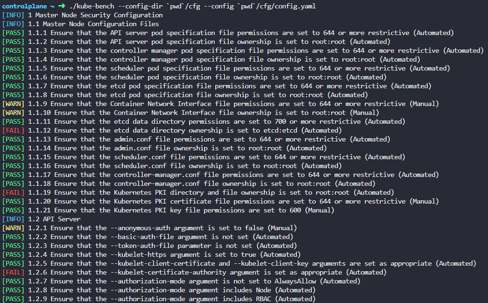
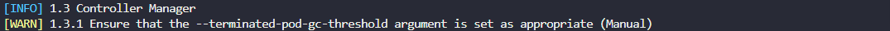
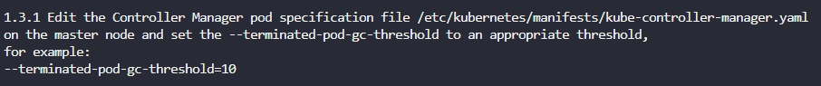
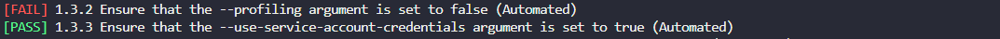
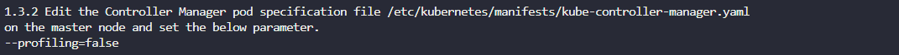
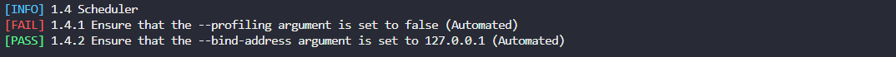
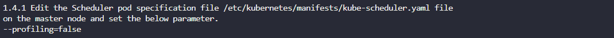
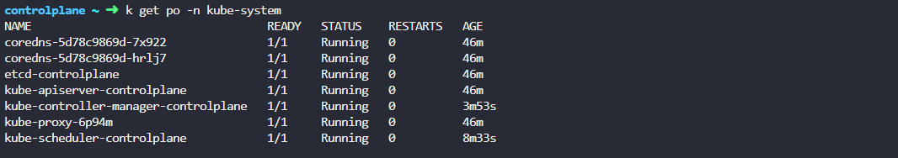
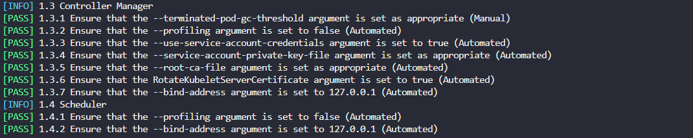

# Lab 150 - Kube-bench 


## Pre-requisites

- [Basic Understanding of Kubernetes](../../README.md#kubernetes)
<!-- - [AWS account](../../pages/01-Pre-requisites/labs-optional-tools/README.md#create-an-aws-account)
- [AWS IAM Requirements](../../pages/01-Pre-requisites/labs-optional-tools/01-AWS-IAM-requirements.md) -->
<!-- - [AWS CLI, kubectl, and eksctl](../../pages/01-Pre-requisites/labs-kubernetes-pre-requisites/README.md#install-cli-tools)  -->
- [kubectl](../../pages/01-Pre-requisites/labs-kubernetes-pre-requisites/README.md#install-cli-tools) 


## Introduction

Kube-bench is an open-source tool designed to help organizations and users assess the security configuration of their Kubernetes clusters. 

Link: https://github.com/aquasecurity/kube-bench

## Create the Kubernetes cluster 

This lab can be done on a self-managed Kubernetes cluster (via kubeadm, kops, k3s) or through managed Kubernetes (Amazon EKS, Azure Kubernetes Service, Google Kubernetes Engine). 

To learn more, check out the following links:

- [Create a Kubernetes Cluster using kubeadm](../Lab_020_Create_and_Manage_Cluster_using_kubeadm/README.md)

- [Create an EKS cluster using eksctl](../Lab_050_EKS_Operation_using_eksctl/README.md)

- [Creating an AKS Cluster](https://learn.microsoft.com/en-us/azure/aks/learn/quick-kubernetes-deploy-portal?tabs=azure-cli)

- [Create a GKE zonal cluster](https://cloud.google.com/kubernetes-engine/docs/how-to/creating-a-zonal-cluster)

## Install kube-bench 

Run the command below to install the package from the official Github repository.

```bash
curl -L https://github.com/aquasecurity/kube-bench/releases/download/v0.4.0/kube-bench_0.4.0_linux_amd64.tar.gz -o kube-bench_0.4.0_linux_amd64.tar.gz 
tar -xvf kube-bench_0.4.0_linux_amd64.tar.gz
```

## Run the test 

Run a simple kube-bench test.

```bash
./kube-bench --config-dir `pwd`/cfg --config `pwd`/cfg/config.yaml  
```

The output will look like this:



## Fix failed test 1.3.1 

As a sample, test 1.3.1 shows it failed.



<!-- ```bash
[WARN] 1.3.1 Ensure that the --terminated-pod-gc-threshold argument is set as appropriate 
``` -->

The remediation provided is this:



Edit the Controller Manager pod specification file /etc/kubernetes/manifests/kube-controller-manager.yaml on the master node and set the --terminated-pod-gc-threshold=10.

```yaml
##  /etc/kubernetes/manifests/kube-controller-manager.yaml 
apiVersion: v1
kind: Pod
metadata:
  creationTimestamp: null
  labels:
    component: kube-controller-manager
    tier: control-plane
  name: kube-controller-manager
  namespace: kube-system
spec:
  containers:
  - command:
    - kube-controller-manager
    - --allocate-node-cidrs=true
    - --authentication-kubeconfig=/etc/kubernetes/controller-manager.conf
    - --authorization-kubeconfig=/etc/kubernetes/controller-manager.conf
    - --bind-address=127.0.0.1
    - --client-ca-file=/etc/kubernetes/pki/ca.crt
    - --cluster-cidr=10.244.0.0/16
    - --cluster-name=kubernetes
    - --cluster-signing-cert-file=/etc/kubernetes/pki/ca.crt
    - --cluster-signing-key-file=/etc/kubernetes/pki/ca.key
    - --controllers=*,bootstrapsigner,tokencleaner
    - --kubeconfig=/etc/kubernetes/controller-manager.conf
    - --leader-elect=true
    - --requestheader-client-ca-file=/etc/kubernetes/pki/front-proxy-ca.crt
    - --root-ca-file=/etc/kubernetes/pki/ca.crt
    - --service-account-private-key-file=/etc/kubernetes/pki/sa.key
    - --service-cluster-ip-range=10.96.0.0/12
    - --use-service-account-credentials=true
    - --terminated-pod-gc-threshold=10
```

## Fix failed test 1.3.2

Failed test:



Recommended remediation:



Add the parameter:

```bash
##  /etc/kubernetes/manifests/kube-controller-manager.yaml 
apiVersion: v1
kind: Pod
metadata:
  creationTimestamp: null
  labels:
    component: kube-controller-manager
    tier: control-plane
  name: kube-controller-manager
  namespace: kube-system
spec:
  containers:
  - command:
    - kube-controller-manager
    - --allocate-node-cidrs=true
    - --authentication-kubeconfig=/etc/kubernetes/controller-manager.conf
    - --authorization-kubeconfig=/etc/kubernetes/controller-manager.conf
    - --bind-address=127.0.0.1
    - --client-ca-file=/etc/kubernetes/pki/ca.crt
    - --cluster-cidr=10.244.0.0/16
    - --cluster-name=kubernetes
    - --cluster-signing-cert-file=/etc/kubernetes/pki/ca.crt
    - --cluster-signing-key-file=/etc/kubernetes/pki/ca.key
    - --controllers=*,bootstrapsigner,tokencleaner
    - --kubeconfig=/etc/kubernetes/controller-manager.conf
    - --leader-elect=true
    - --requestheader-client-ca-file=/etc/kubernetes/pki/front-proxy-ca.crt
    - --root-ca-file=/etc/kubernetes/pki/ca.crt
    - --service-account-private-key-file=/etc/kubernetes/pki/sa.key
    - --service-cluster-ip-range=10.96.0.0/12
    - --use-service-account-credentials=true
    - --terminated-pod-gc-threshold=10
    - --profiling=false
```

## Fix failed test 1.3.6

Failed test:


Recommended remediation:


Edit the Controller Manager pod specification file /etc/kubernetes/manifests/kube-controller-manager.yaml on the master node and set the --feature-gates=RotateKubeletServerCertificate=true.

```yaml
##  /etc/kubernetes/manifests/kube-controller-manager.yaml 
apiVersion: v1
kind: Pod
metadata:
  creationTimestamp: null
  labels:
    component: kube-controller-manager
    tier: control-plane
  name: kube-controller-manager
  namespace: kube-system
spec:
  containers:
  - command:
    - kube-controller-manager
    - --allocate-node-cidrs=true
    - --authentication-kubeconfig=/etc/kubernetes/controller-manager.conf
    - --authorization-kubeconfig=/etc/kubernetes/controller-manager.conf
    - --bind-address=127.0.0.1
    - --client-ca-file=/etc/kubernetes/pki/ca.crt
    - --cluster-cidr=10.244.0.0/16
    - --cluster-name=kubernetes
    - --cluster-signing-cert-file=/etc/kubernetes/pki/ca.crt
    - --cluster-signing-key-file=/etc/kubernetes/pki/ca.key
    - --controllers=*,bootstrapsigner,tokencleaner
    - --kubeconfig=/etc/kubernetes/controller-manager.conf
    - --leader-elect=true
    - --requestheader-client-ca-file=/etc/kubernetes/pki/front-proxy-ca.crt
    - --root-ca-file=/etc/kubernetes/pki/ca.crt
    - --service-account-private-key-file=/etc/kubernetes/pki/sa.key
    - --service-cluster-ip-range=10.96.0.0/12
    - --use-service-account-credentials=true
    - --terminated-pod-gc-threshold=10
    - --feature-gates=RotateKubeletServerCertificate=true
```

## Fix failed test 1.4.1

Failed test: 



Recommended remediation:



Modify the kube-scheduler manifest:

```bash
## /etc/kubernetes/manifests/kube-scheduler.yaml
apiVersion: v1
kind: Pod
metadata:
  creationTimestamp: null
  labels:
    component: kube-scheduler
    tier: control-plane
  name: kube-scheduler
  namespace: kube-system
spec:
  containers:
  - command:
    - kube-scheduler
    - --authentication-kubeconfig=/etc/kubernetes/scheduler.conf
    - --authorization-kubeconfig=/etc/kubernetes/scheduler.conf
    - --bind-address=127.0.0.1
    - --kubeconfig=/etc/kubernetes/scheduler.conf
    - --leader-elect=true
    - --profiling=false
```

## Run the test once again 

Before anything else, make sure that the cluster components did not fail or restarted. 



There are still other failed tests, but we'll just fix some of them. Run the test once again and see if the previous tests we fixed now passed.

```bash
./kube-bench --config-dir `pwd`/cfg --config `pwd`/cfg/config.yaml 
```

