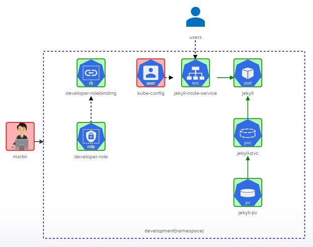

# Challenge 1

Deploy the given architecture diagram for implementing a Jekyll SSG.




Manifests:

- [developer-role](./manifests/developer-role.yml)
- [developer-rolebinding](./manifests/developer-rolebinding.yml)
- [jekyll-pod](./manifests/jekyll-pod.yml)
- [jekyll-pv](./manifests/jekyll-pv.yml)
- [jekyll-pvc](./manifests/jekyll-pvc.yml)
- [jekyll-svc](./manifests/jekyll-svc.yml)

To set the context:

```bash
controlplane ~ ➜  kubectl config set-context developer --user=martin --cluster=kubernetes
Context "developer" created.

controlplane ~ ➜  kubectl config use-context developer
Switched to context "developer".

controlplane ~ ➜  kubectl config get-contexts 
CURRENT   NAME                          CLUSTER      AUTHINFO           NAMESPACE
*         developer                     kubernetes   martin             
          kubernetes-admin@kubernetes   kubernetes   kubernetes-admin   
```